<properties pageTitle="Tutorial: Analyzing Sales Data from Excel and an OData feed" description="Tutorial: Analyzing Sales Data from Excel and an OData feed" services="powerbi" documentationCenter="" authors="v-anpasi" manager="mblythe" editor=""/>
<tags ms.service="powerbi" ms.devlang="NA" ms.topic="article" ms.tgt_pltfrm="NA" ms.workload="powerbi" ms.date="06/19/2015" ms.author="v-anpasi"/>
# Tutorial: Analyzing sales data from Excel and an OData feed

[← Power BI Designer](https://support.powerbi.com/knowledgebase/topics/68530-power-bi-designer)

In this tutorial, you'll learn how to combine data from two data sources. 

It's common to have data spread across multiple data sources such as product information in one database and sales information in another. The techniques you'll learn below are shown in the context of an Excel file and an OData feed but are general purpose techniques you can immediately apply to other data sources like SQL Server queries, CSV files, or any of the data sources Power BI supports.

You'll import data from a local Excel Workbook that contains Products information, and from an OData feed that contains Product Orders information. You'll perform transformation and aggregation steps, and combine data from both sources to produce a **Total Sales per Product and Year** report that includes interactive visualizations. 

Here's what the final report will look like:

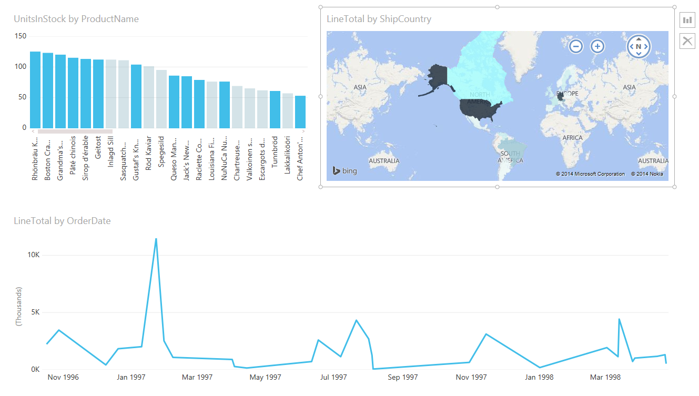

In order to perform this tutorial, you need the Products workbook which you can download [here](http://download.microsoft.com/download/1/4/E/14EDED28-6C58-4055-A65C-23B4DA81C4DE/Products.xlsx). In the **Save As** dialog box, name the file **Products.xlsx**.
 
## Task 1: Get product data from an Excel workbook

In this task, you import products from the Products.xlsx file into Power BI Designer. 

### Step 1: Connect to an Excel workbook

1.  Launch Power BI Designer..

2.  In the **Getting Started** dialog, click **Get Data**.

3.  In the **Get Data** dialog box, browse for Excel Workbook and click **Connect**

4.  In the **Open File** dialog box, select the Products.xlsx file.

5.  In the **Navigator** pane, click **Products** (the name of the Excel table object)** **and click **Edit Query**.

### Step 2: Remove other columns to only display columns of interest
In this step you remove all columns except **ProductID**, **ProductName**, **UnitsInStock**, and **QuantityPerUnit**.

1.  In the **Query View** , select the **ProductID**, **ProductName**, **QuantityPerUnit**, and **UnitsInStock** columns (use Ctrl+Click or Shift+Click).

2.  In the **Query Editor** ribbon, click **Remove Columns** \> **Remove Other Columns** or right-click on a column header, and click **Remove Other Columns**.  
 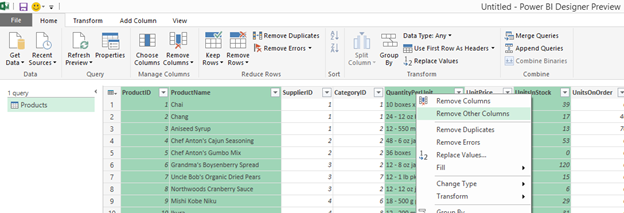

##Step 3: Change the data type of the UnitsInStock column

Power BI brings in numeric fields from Excel as decimal values. In this instance, we will only ever have whole numbers of products in stock, so in this step you change the **UnitsInStock** column’s datatype to be a whole number

1.    Select the **UnitsInStock** column

2.    Click the **Data Type** button in the **Home** ribbon

3.    Choose the **Whole Number** datatype from the drop down  
	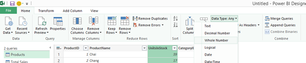      

### Power BI Designer steps created

As you perform query activities in the Query View, query steps are created and listed in the Query Settings pane on the right of the Designer, in the APPLIED STEPS list. Each query step has a corresponding formula, also known as the "M" language. For more information about the “M” formula language, see [Learn about Power BI formulas](https://support.office.com/en-US/Article/Learn-about-Power-Query-formulas-6bc50988-022b-4799-a709-f8aafdee2b2f).

|Task|Query step|Formula|
|---|---|---|
|Connect to an Excel workbook|Source|Source{[Name="Products"]}[Data]|
|Promote the first row to table column headers|FirstRowAsHeader|[Table.PromoteHeaders](https://support.office.com/en-US/Article/TablePromoteHeaders-b8eaeb95-042a-42e1-9164-6d3c646acadc "Table.PromoteHeaders")   (Products)|
|Remove other columns to only display columns of interest|RemovedOtherColumns|[Table.SelectColumns](https://support.office.com/en-US/Article/TableSelectColumns-20bb9e28-9fd3-4cd2-a21b-97972c82ec22 "Table.SelectColumns")  (FirstRowAsHeader,{"ProductID", "ProductName", "QuantityPerUnit", "UnitsInStock"})|
|Change datatype|Changed Type|Table.TransformColumnTypes(\#"Removed Other Columns",{{"UnitsInStock", Int64.Type}})|
## Task 2: Import order data from an OData feed

In this task, you'll bring in data on orders your company has taken for these products. This step represents connecting to a sales system. You import data into the Power BI Designer from the sample Northwind OData feed at: <http://services.odata.org/V3/Northwind/Northwind.svc/> 

### Step 1: Connect to an OData feed

1.  In the **Home** ribbon tab, click **Get Data**

2.  Browse to the **OData Feed** data source

3.  In the **OData Feed** dialog box, enter the **URL** for the Northwind OData feed.

4.  Click **OK**.

5.  In the **Navigator** pane click **Orders** and click **Edit Query**.

**Note:** You can click the item name once to see a preview  
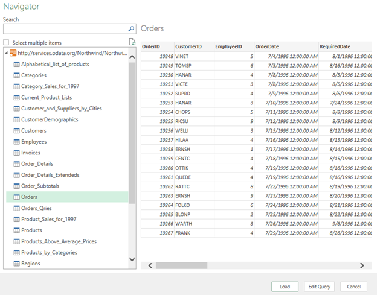    

### Step 2: Expand the Order\_Details table

The Orders table that you just connected to contains a reference to a Details table.This table contains the individual products that were included in each Order. If you are connecting to data sources with multiples tables (such as a relational database) you can use these references to build up your query. 

In this step, you expand the **Order\_Details** table that is related to the **Orders** table, to combine the **ProductID**, **UnitPrice**, and **Quantity** columns from **Order\_Details** into the **Orders** table. This is a representation of the data in these tables:

The **Expand** operation combines columns from a related table into a subject table. When the query runs, rows from the related table (**Order\_Details**) are combined into rows from the subject table (**Orders**).

After you expand the **Order\_Details** table, three new columns and additional rows are added to the **Orders** table, one for each row in the nested or related table.

1. In the **Query View**, scroll to the **Order\_Details** column.

2. In the **Order\_Details** column, click the expand icon ().

2. In the **Expand** drop-down:

	1.  Click **(Select All Columns)** to clear all columns.

	2.  Click **ProductID**, **UnitPrice**, and **Quantity**.

	3.  Click **OK**.  
    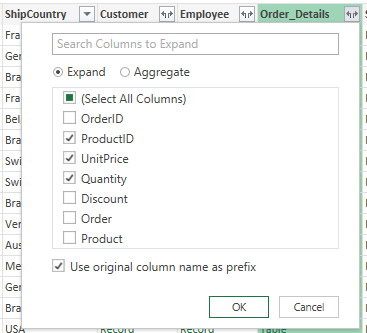
    
### Step 3: Remove other columns to only display columns of interest

In this step you remove all columns except **ShipCity**, **ShipCountry**, **OrderDate**, **ProductID**, **UnitPrice**, and **Quantity** columns. In the previous task, you used **Remove Other Columns**. For this task, you remove selected columns.

1. In the **Query View**, select all columns:

	1.  Click the first column (**OrderID**).

	2.  Shift+Click the last column (**Shipper**).

	3.  Ctrl+Click the **OrderDate**, **ShipCity**, **ShipCountry**, **Order\_Details.ProductID**, **Order\_Details.UnitPrice**, and **Order\_Details.Quantity** columns.

2. Right-click on a selected column header, and click **Remove Columns**.

### Step 4: Calculate the line total for each Order\_Details row

The Power BI Designer allows you to create calculations based on the columns you are importing, to enrich the data that you connect to. In this step, you create a **Custom Column** to calculate the line total for each **Order\_Details** row.

Calculate the line total for each Order\_Details row

1.  In the **Add Column** ribbon tab, click **Add** **Custom Column**.

2.  In the **Add Custom Column** dialog box, in the **Custom Column Formula** textbox, enter **[Order\_Details.UnitPrice] \* [Order\_Details.Quantity]**.

3.  In the **New column name** textbox, enter **LineTotal**.  
    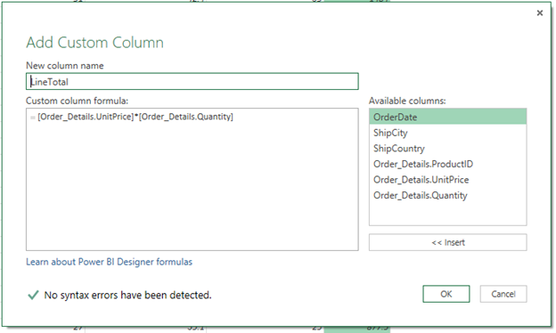
    

4.  Click **OK**.

### Step 5: Set the datatype of the LineTotal field

1.  Right click the **LineTotal** column.

2.  Select **Change Type** and choose **Decimal Number  
    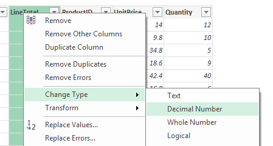
    **

### Step 6: Rename and reorder columns in the query

In this step, you finish making the model easy to work with when creating reports by renaming the final columns and changing their order.

1.  In the **Query View** grid, drag the LineTotal column to the left, after ShipCountry   
    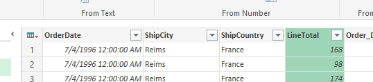

1.  Remove the ‘Order\_Details’ prefix from the **Order\_Details.ProductID**, **Order\_Details.UnitPrice** and **Order\_Details.Quantity** columns by double-clicking on each column header and deleting the text.

### Power BI Designer steps created

As you perform query activities in Query View, query steps are created and listed in the **Query Settings** pane, in the **APPLIED STEPS** list. Each query step has a corresponding Power Query formula, also known as the "M" language. For more information about this formula language, see [Learn about Power BI formulas](https://support.office.com/en-US/Article/Learn-about-Power-Query-formulas-6bc50988-022b-4799-a709-f8aafdee2b2f "Learn about Power Query formulas").

|Task|Query step|Formula|
|---|---|---|
|Connect to an OData feed|Source|Source{[Name="Orders"]}[Data]|
|Expand the Order\_Details table|Expand Order\_Details|[Table.ExpandTableColumn](https://support.office.com/en-US/Article/TableExpandTableColumn-54903f25-75a2-4a44-a9a3-52a9d895ee98 "Table.ExpandTableColumn")  (Orders, "Order\_Details", {"ProductID", "UnitPrice", "Quantity"}, {"Order\_Details.ProductID", "Order\_Details.UnitPrice", "Order\_Details.Quantity"})|
|Remove other columns to only display columns of interest|RemovedColumns|[Table.RemoveColumns](https://support.office.com/en-US/Article/TableRemoveColumns-6265190e-2f58-4300-85b8-df88fc1a67d3 "Table.RemoveColumns")  (\#"Expand Order\_Details",{"OrderID", "CustomerID", "EmployeeID", "RequiredDate", "ShippedDate", "ShipVia", "Freight", "ShipName", "ShipAddress", "ShipCity", "ShipRegion", "ShipPostalCode", "ShipCountry", "Customer", "Employee", "Shipper"})|
|Calculate the line total for each Order\_Details row|InsertedColumns|[Table.AddColumn](https://support.office.com/en-US/Article/TableAddColumn-6c64d0a5-9654-4d15-bfb6-9cc380aaf3c0 "Table.AddColumn")  (RemovedColumns, "Custom", each [Order\_Details.UnitPrice] \* [Order\_Details.Quantity])|

## Task 3: Combine the Products and Total Sales queries

Power BI Designer does not require you to combine queries to report on them. Instead, you can create **Relationships** between datasets. These relationships can be created on any column that is common to your datasets. For more information see [Create and manage relationships](http://support.powerbi.com/knowledgebase/articles/464155). In this tutorial, we have Orders and Products data that share a common 'ProductID' field, so we'll create a relationship using this. All you need to tell Power BI is the columns from each table that are related (i.e. those that have the same values). Power BI works out the direction and cardinality of the relationship for you. In some cases, it will even detect the relationships automatically.

In this task, you create a relationship between the **Products** and **Total Sales** queries. 

### Step 1: Create a relationship between Products and Total Sales

1. Swap to the Report View 

	1.  This will load the data from your two queries  
    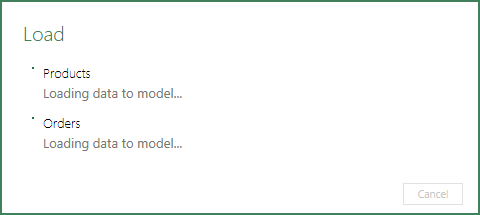       

2. Click the **Manage** button in the **Relationships** group on the  **Home** tab of the ribbon

3. Click the **New…** button

4. In the **From: Table** drop down, select **Products**

	1. The **Total Sales** table is automatically added to the **To: Table** drop down

5. Select **ProductID** in the **From: Column** list box

6. Select **ProductID** in the **To: Column** list box
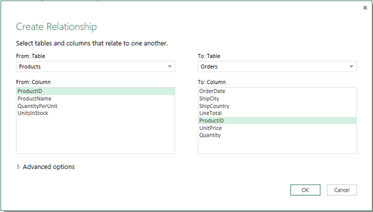

7.  Click **OK**.  
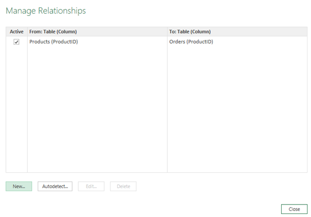

8.  Click **Close**
## Task 4: Build visuals using your data

Power BI Designer lets you create a variety of visualizations to gain insights from your data. You can build reports with multiple pages and each page can have multiple visuals. You can interact with your visualizations to help analyze and understand your data. For more information about editing reports, see [Edit a Report](http://support.powerbi.com/knowledgebase/articles/443094-edit-a-report "Combine multiple queries").

In this task, you create a report based on the data previously loaded. You use the Fields Pane to select the columns from which you create the visualizations.

### Step 1: Create charts showing Units in Stock by Product and Total Sales by Year

1. Drag **ProductName** from the Field List to the right of the screen onto a blank space in the top left of the canvas
	1.  Power BI Designer automatically selects the **UnitsInStock** field to be plotted with the Product Name

	2.  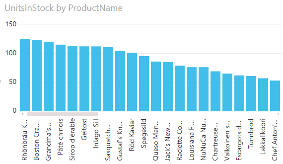 

	3.  We can see there are more units on hand of the Rhonbrau Klosterbier than anything else.

2. Drag **OrderDate** to the canvas beneath the UnitsInStock by ProductName chart

	1.  Because you selected a date field, a line chart was created automatically

3. Grab the resize handles on the right side of the chart and drag it to take up the full width of the canvas

	1.  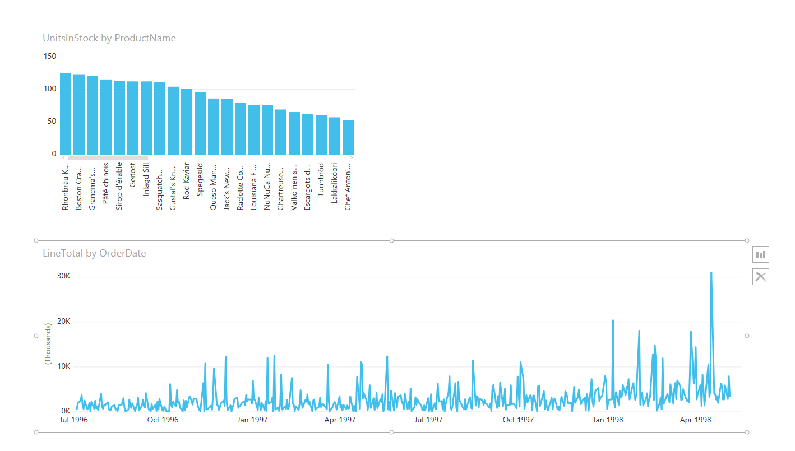       

4. Drag **ShipCountry** to a space on the canvas in the top right

	1.  Because you selected a geographic field, a map was created automatically

5. Expand the Visualize gallery in the ribbon and choose the **Filled Map** option

	1.  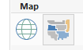 

	2.   The resulting map shows the outline of countries, shaded based on the sum of LineTotals. Darker colors represent higher order totals in that country.
	3.  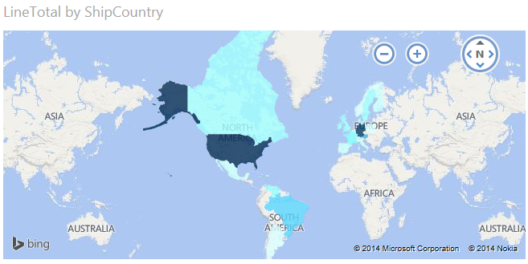

### Step 2: Interact with your report visuals to analyze further
The Power BI Designer lets you interact with visuals that cross-highlight and filter each other to uncover further trends. For more detail see [Filtering and Highlighting in Reports](http://support.powerbi.com/knowledgebase/articles/467092-about-filters-and-highlighting-in-reports)

1. Click on the light blue shape covering **Canada**

	1.         

	2.  Note how the other visuals are filtered to show Stock and Total Orders just for Canada.

## Complete Sales Analysis Report

After you perform all these steps, you will have a Sales Report that combines data from Products.xlsx file and Northwind OData feed. The report shows visuals that help analyze sales information from different countries. You can download a completed Power BI Designer file for this tutorial [here](http://download.microsoft.com/download/1/4/E/14EDED28-6C58-4055-A65C-23B4DA81C4DE/Analyzing_Sales_Data.pbix).

### Where else can I get more information?

[Read other Power BI Designer tutorials](http://go.microsoft.com/fwlink/?LinkID=521937).

[Watch Power BI Designer videos.](http://go.microsoft.com/fwlink/?LinkID=519322)

[Visit the Power BI Forum.](http://go.microsoft.com/fwlink/?LinkID=519326)

[Read the Power BI Blog.](http://go.microsoft.com/fwlink/?LinkID=519327)



