<properties pageTitle="Tutorial: Facebook Analytics using Power BI Designer" description="Tutorial: Facebook Analytics using Power BI Designer" services="powerbi" documentationCenter="" authors="v-anpasi" manager="mblythe" editor=""/>
<tags ms.service="powerbi" ms.devlang="NA" ms.topic="article" ms.tgt_pltfrm="NA" ms.workload="powerbi" ms.date="06/19/2015" ms.author="v-anpasi"/>
#Tutorial: Facebook analytics using Power BI Designer

[← Power BI Designer](https://support.powerbi.com/knowledgebase/topics/68530-power-bi-designer)

In this tutorial you learn how to import and visualize data from **Facebook**. During the tutorial you'll learn how to connect to a specific Facebook page (the Power BI page), apply data transformation steps, and create some visualizations.
Here are the steps you'll take:

**Task 1:** Connect to a Facebook Page

**Task 2**: Create visualizations using the Report view 

&nbsp;&nbsp;&nbsp;&nbsp;&nbsp;&nbsp;&nbsp;&nbsp;&nbsp;&nbsp;&nbsp;**Step 1**: Create a Treemap visualization

**Task 3**: Shape data in the Query view 

&nbsp;&nbsp;&nbsp;&nbsp;&nbsp;&nbsp;&nbsp;&nbsp;&nbsp;&nbsp;&nbsp;**Step 1**: Split the date-time column into two 

&nbsp;&nbsp;&nbsp;&nbsp;&nbsp;&nbsp;&nbsp;&nbsp;&nbsp;&nbsp;&nbsp;**Step 2**: Add an aggregate value from a related table

**Task 4**: Create additional visualizations using the Report view 

&nbsp;&nbsp;&nbsp;&nbsp;&nbsp;&nbsp;&nbsp;&nbsp;&nbsp;&nbsp;&nbsp;**Step 1**: Load the query to your report 

&nbsp;&nbsp;&nbsp;&nbsp;&nbsp;&nbsp;&nbsp;&nbsp;&nbsp;&nbsp;&nbsp;**Step 2**: Create a Line chart and a Bar chart

##Task 1: Connect to a Facebook page

In this task you import data from the [Microsoft Power BI Facebook](https://www.facebook.com/microsoftbi)site, which is found at the following URL: https://www.facebook.com/microsoftbi. 

Anyone can connect to that page, and follow these steps - no special credentials (other than your own Facebook account, which you use in this step) are required.

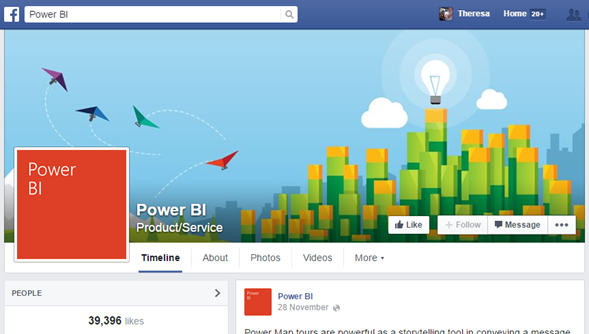

1.  In the **Getting Started** dialog or in the **Home ribbon tab**, select **Get Data.**

2.  The **Get Data** dialog appears, letting you select from all sorts of data sources. Select **Facebook** from the **All** or **Other** group.

3.  In the **Facebook** dialog box, paste the page name (**microsoftbi**) into the **Username** text box and select **Posts** from the **Connection** drop down.

	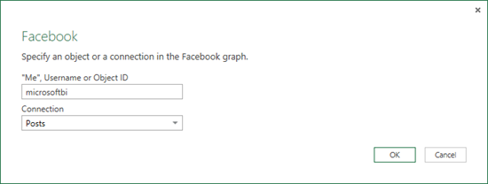

4.  Click **OK**.
5.  When prompted for credentials, sign in using your Facebook account and allow Power BI access through your account.

 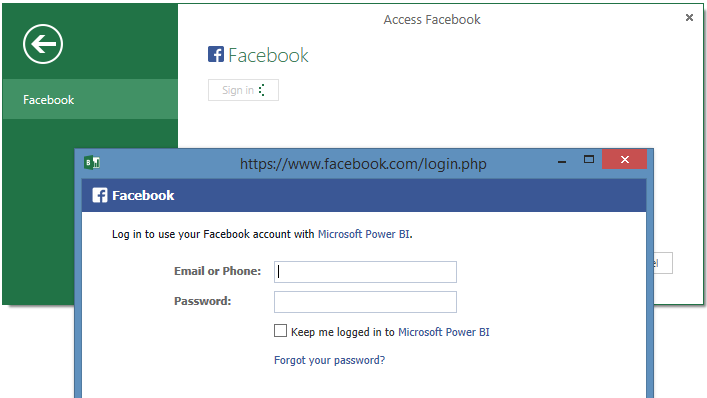

After establishing a connection to the page, you will see the data being loaded in the model.  

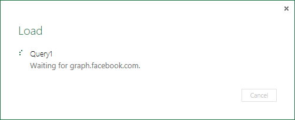

Once loaded, you’ll be taken to the **Report view** where the columns from the table are listed in the **Field list** on the right.

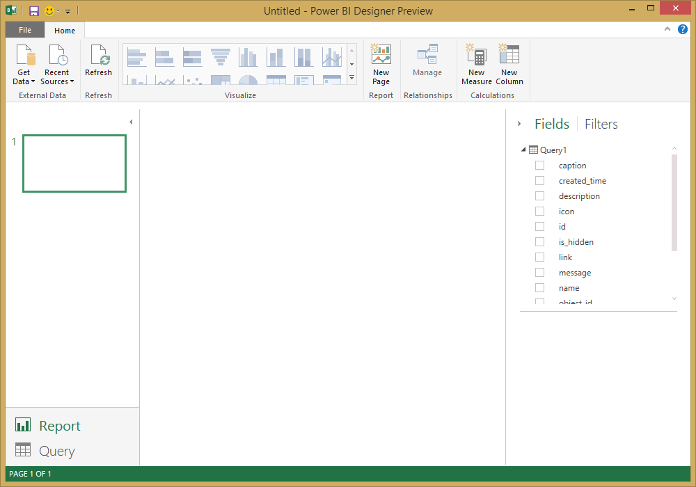

##Task 2: Create visualizations using the Report view

Now that you have landed the data from the page, you can quickly and easily gain insights about your data, using visualizations.

**Step 1:** Create a Treemap visualization

Creating a visualization is easy, we just drag a field from the **Field list** and drop it on the **Report canvas.**

Drag the **Type** field and drop it in the **Report** canvas. This creates a new visualization in the **Report canvas**. In this case, since we have a list of post types, it creates a **Column** visualization.

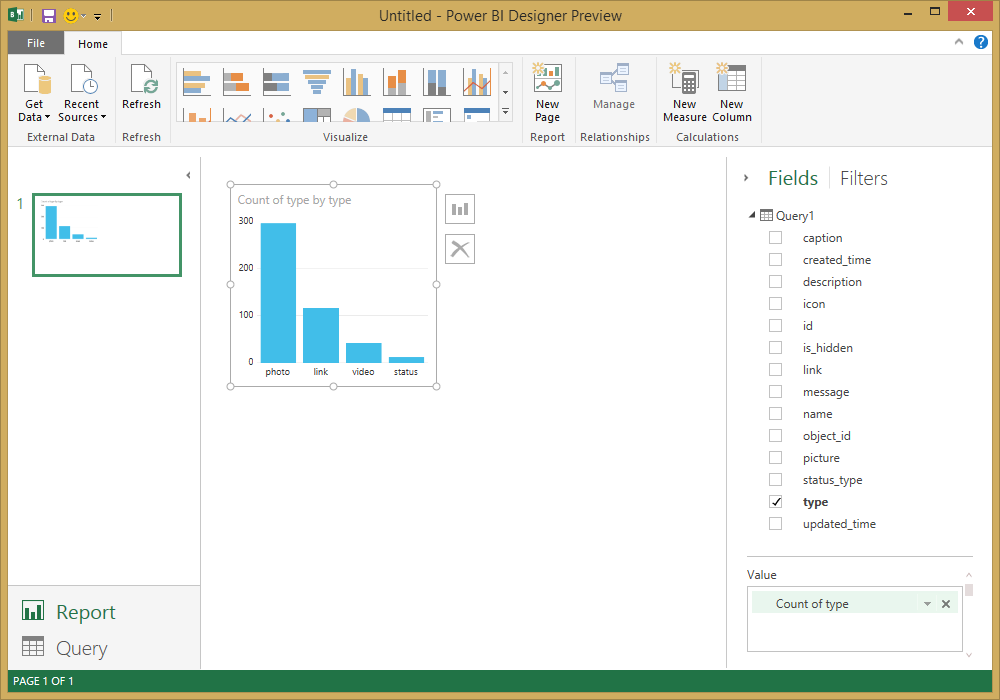

We can easily change the type of visualization by clicking on the **Change Visualization Type skittle**. Change the type to a **Treemap** which is in the second column, four from the bottom.

Drag the **id** field into the **Values** section.

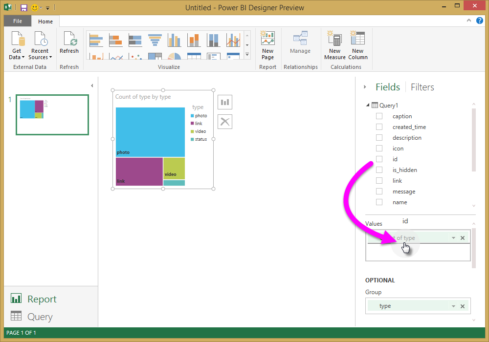

Move and resize the chart as necessary.

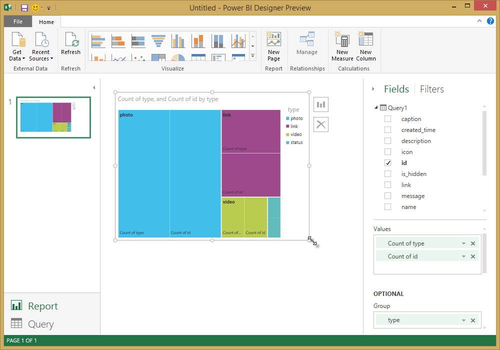

##Task 3: Shape data in the table

Now that you have imported the table selected and you start to visualize it, you may notice you need to perform various data shaping and cleansing steps in order to get the most out of your data.

Step 1: Split the date-time column into two

In this step, you will split the **created\_time** column to get both the date and time values. 

1.  In the **Query Preview** grid, scroll to the right until you find the **created\_time** column

2.  Right-click a column header in the **Query Preview** grid, and click **Split Column \> By Delimiter** to split the columns. Chose **Custom** in the delimiter drop down and enter **“T”** Note that this operation is also available in the **Home** ribbon tab, in the **Manage Columns** group.

	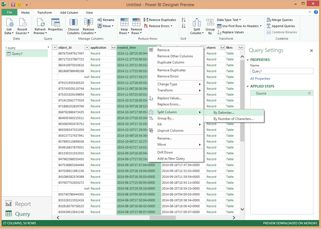

	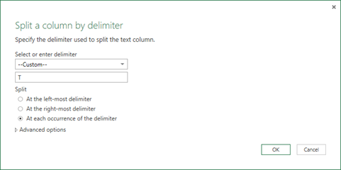

3.  Rename the created columns to **created\_date** and **created\_time** respectively. 

4.  Select the new column, **created\_time**,****and in the **Query view** ribbon, navigate to the **Add Column** tab and select **Time\>Hour** under the **From Date & Time** group. This will add a new column that is only the hour component of the time.

	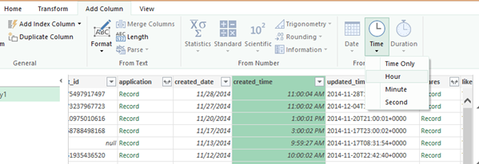

5.  Change the type of the new **Hour** column to **Whole Number**, by navigating to the **Home** tab and selecting the **Data Type** drop down or by right-clicking the column and selecting **Transform\>Whole Number**. 

	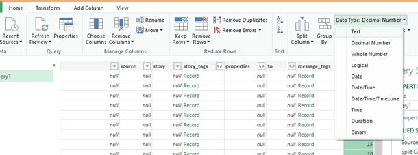

Step 2: Add an aggregate value from a related table

In this step, you add the count of shares from the nested value so that you can use it in the visualizations. 

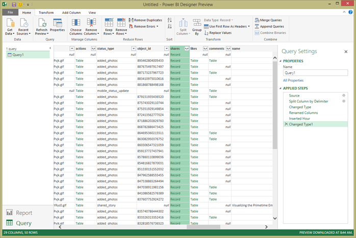

1.  Continue scrolling to the right until you see the **shares** column. The nested value indicates that we need to do another transform in order to get the actual values.

2.  In the top right of the column header, select the  icon to open the **Expand/Aggregate** builder. Select **count** and hit **OK**. This will add the count of the shares for each row in our table.

	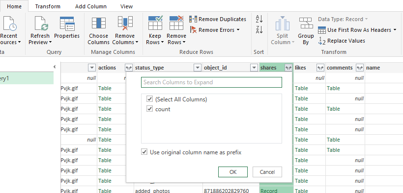

	After the data loads, rename the column to **shares** by double clicking on the column name, right clicking the column or in the **Query view** ribbon, select **Rename** under the **Transform** tab and **Any Column** group.

3.  Finally, change the type of the new **shares** column to **Whole Number**. With the column selected, the type can be changed by right-clicking the column and selecting **Transform\>Whole Number** or****by navigating to the **Home** tab and selecting the **Data Type** drop down or. 

Query steps created

As you perform transformations in the Query view, query steps are created and listed in the **Query Settings** pane, in the **APPLIED STEPS** list. Each query step has a corresponding Query formula, also known as the "M" language. 

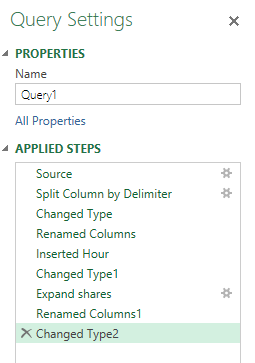

|Task|Query step|Formula|
|---|---|---|
|Connect to a Facebook source|Source|Facebook.Graph  (&quot;https://graph.facebook.com/microsoftbi/posts&quot;)|
|**Split Columns** to get the values you need|Split Column by Delimiter|Table.SplitColumn  (Source,&quot;created_time&quot;,Splitter.SplitTextByDelimiter(&quot;T&quot;),{&quot;created_time.1&quot;, &quot;created_time.2&quot;})|
|**Change Type** of the new columns (automatic step) |Changed Type|Table.TransformColumnTypes  (#&quot;Split Column by Delimiter&quot;,{{&quot;created_time.1&quot;, type date}, {&quot;created_time.2&quot;, type time}})|
|**Rename **a column****|Renamed Columns|Table.RenameColumns  (#&quot;Changed Type&quot;,{{&quot;created_time.1&quot;, &quot;created_date&quot;}, {&quot;created_time.2&quot;, &quot;created_time&quot;}})|
|**Insert **a column****|Inserted Hour|Table.AddColumn  (#&quot;Renamed Columns&quot;, &quot;Hour&quot;, each Time.Hour([created_time]), type number)|
|**Change Type **|Changed Type1|Table.TransformColumnTypes  (#&quot;Inserted Hour&quot;,{{&quot;Hour&quot;, type text}})|
|**Expand **values in a nested table****|Expand shares|Table.ExpandRecordColumn  (#&quot;Changed Type1&quot;, &quot;shares&quot;, {&quot;count&quot;}, {&quot;shares.count&quot;})|
|**Rename **the column****|Renamed Columns1|Table.RenameColumns  (#&quot; Expand shares&quot;,{{&quot;shares.count&quot;, &quot;shares&quot;}})|
|**Change Type**|Changed Type2|Table.TransformColumnTypes  (#&quot;Renamed Columns1&quot;,{{&quot;shares&quot;, Int64.Type}})|

##Task 4: Create additional visualizations using the Report view

Now that we have converted the data into the shape that we need for the rest of our analysis, we can load the resulting table into our Report and create additional visualizations.

Step 1: Load the query to your report

In order to load the query results to the report, we can switch to the **Report view**, using the view switcher at the bottom-left corner of the Power BI Designer window.

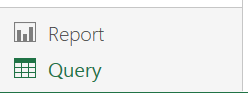

This will trigger evaluation of the query and load of the table output to the Report. You can check progress of this action in the **Load** dialog.

After the query finishes loading, you will see the updated fields in the **Fields pane** at the right of the **Report view**.

Step 2: Create a Line chart and a Bar chart

In order to create a visualization, we can drag fields from the **Field list** and drop them in the **Report canvas**.

1.  Drag the **created\_date** field and drop it in the **Report canvas**. This will create a new visualization in the **Report canvas**. In this case, it will also include the **shares** column since it’s a numeric value and create a **Line Chart**. 

	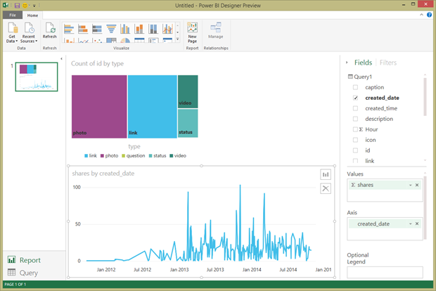

2.  Next, drag the **shares** field and drop it in the **Report canvas**. Now drag the **Hour** field into the **Axis** section under the **Field List**.

	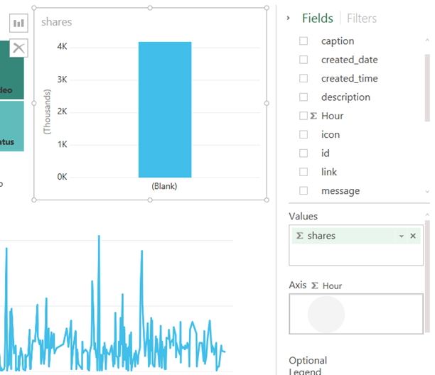

3.  We can easily change the type of visualization by clicking on the **Change Visualization Type skittle** in the top-right corner of the visualization. Alternatively, we can also change the visualization type using the **Visualize gallery** in the **Home** ribbon tab.

	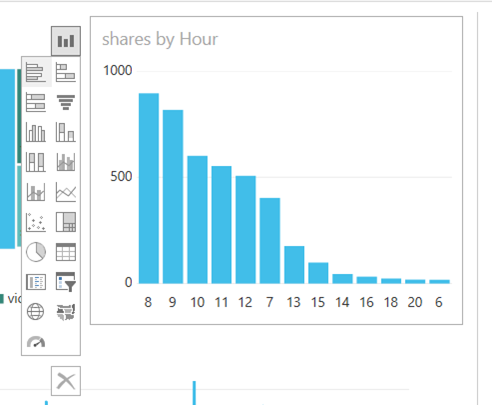

4.  We are going to change the visualization type to **Bar Chart**, using the first option in the list.

5.  Right click the chart to change the **Sort Order**, sort by **Hour**, **A-\>Z**

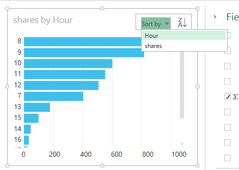

Update and resize the visualizations as needed. Hit refresh at any point to include the latest data in your report.

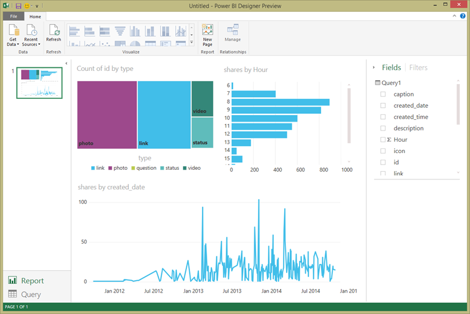

As you can see, it is very easy to customize visualizations in your report, in order to present the data in the way that you want. Power BI Designer provides a seamless end-to-end experience from getting data from a wide range of data sources and shaping it to meet your analysis needs to visualizing this data in rich and interactive ways. Once your report is ready, you can [upload it to Power BI](http://support.powerbi.com/knowledgebase/articles/461278-upload-power-bi-designer-files) and create dashboards based on it, which you can share with other Power BI users.

You can download the end result of this tutorial [here](http://download.microsoft.com/download/1/4/E/14EDED28-6C58-4055-A65C-23B4DA81C4DE/FacebookAnalytics.pbix)

### Where else can I get more information?

[Read other Power BI Designer tutorials](http://go.microsoft.com/fwlink/?LinkID=521937)

[Watch Power BI Designer videos.](http://go.microsoft.com/fwlink/?LinkID=519322)

[Visit the Power BI Forum.](http://go.microsoft.com/fwlink/?LinkID=519326)

[Read the Power BI Blog.](http://go.microsoft.com/fwlink/?LinkID=519327)



 

