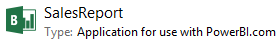

<properties pageTitle="Upload Power BI Designer files" description="Upload Power BI Designer files" services="powerbi" documentationCenter="" authors="v-anpasi" manager="mblythe" editor=""/>
<tags ms.service="powerbi" ms.devlang="NA" ms.topic="article" ms.tgt_pltfrm="NA" ms.workload="powerbi" ms.date="06/16/2015" ms.author="v-anpasi"/>
# Upload Power BI Designer files
[← Power BI Designer](https://support.powerbi.com/knowledgebase/topics/68530-power-bi-designer)

When you save a file created in the designer, it will have a **.pbix** extension. You can then upload your Power BI Designer files to your Power BI site.

> 

 **Important:** In Power BI Preview, the maximum size of a Power BI Designer file you can upload to your Power BI site is 250 megabytes.

## To upload a Power BI Designer file

1.  In Power BI, click Get data .

2.  In **Get data**, click **Power BI Designer File** > Connect.

3.  Browse to your report file, then click **Connect**.

Once uploaded to your Power BI page, your designer file’s report will appear under **Reports** in the navigator and the dataset will appear in **Datasets**. You can edit your report and pin visualizations to your dashboard right in Power BI.

> 

**Note:** Any changes you make in Power BI, for example, add, delete, or change visualizations in reports, will not be saved in the original Power BI Designer file. Changes to a Power BI Designer file can only be made in the designer.
