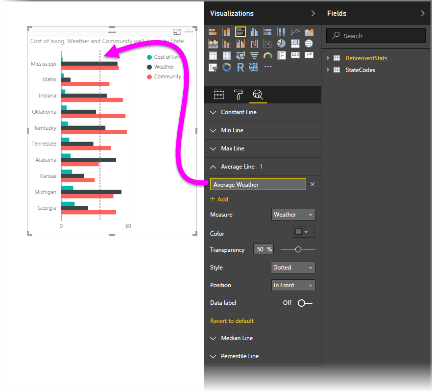

<properties
   pageTitle="Analytics pane in Power BI Desktop"
   description="Create dynamic reference lines for visuals in Power BI Desktop"
   services="powerbi"
   documentationCenter=""
   authors="davidiseminger"
   manager="mblythe"
   backup=""
   editor=""
   tags=""
   qualityFocus="no"
   qualityDate=""/>

<tags
   ms.service="powerbi"
   ms.devlang="NA"
   ms.topic="article"
   ms.tgt_pltfrm="NA"
   ms.workload="powerbi"
   ms.date="08/24/2016"
   ms.author="davidi"/>

# Analytics pane in Power BI Desktop

With features available in the **Analytics** pane in **Power BI Desktop**, you can add dynamic *reference lines* to visuals, and provide focus for important trends or insights. The **Analytics** pane is found in the **Visualizations** area of Power BI Desktop, beginning with the August 2016 release (version 2.37.4464.321 or later), as shown below.

>   Note: The **Analytics** pane only appears when you select a visual on the Power BI Desktop canvas.

With the **Analytics** pane, you can create the following types of dynamic reference lines (not all lines are available for all visual types):

-   X-Axis constant line
-   Y-Axis constant line
-   Min line
-   Max line
-   Average line
-   Median line
-   Percentile line

The following sections show how you can use the **Analytics** pane and dynamic reference lines in your visualizations.

## Using the Analytics pane

To view the available dynamic reference lines for a visual, follow these steps:

1.  Select or create a visual, then select the **Analytics** icon from the **Visualizations** section.

    

2.  Select the down arrow for the type of line you want to create to expand its options. In this case, we'll select **Average Line**.

    

3.  To create a new line, select **+ Add**. You can then specify a name for the line by double-clicking the text box, then typing in your name.

    You have all sorts of options for your line, such as selecting its *color*, *transparency*, *style* and *position* (relative to the visual's data elements), and whether to include the label. And importantly, you can select which **Measure** in the visual you want your line to be based upon by selecting the **Measure** drop down, which is automatically populated with data elements from the visual. In this case, we'll select *Weather* as the measure, label it *Average Weather*, and customize a few of the other options as shown below.

    

4.  If you want to have a data label appear, move the **Data label** slider on. When you do so, you get a whole host of additional options for your data label, as shown in the following image.

    

5.  Notice the number that appears next to the **Average line** item in the **Analytics** pane. That tells you how many dyanmic lines you currently have on your visual, and of which type. If we add a **Max line** for *Cost of Living*, you can see that the **Analytics** pane shows that we now also have a **Max line** dynamic reference line applied to this visual.

    

If the visual you've selected can't have dynamic reference lines applied to it (in this case, a **Map** visual), you'll see the following when you select the **Analytics** pane.

There are all sorts of interesting insights you can highlight by creating dynamic reference lines with the **Analytics** pane.

We're planning more features and capabilities, including expanding which visuals can have dynamic reference lines applied to them, so check back often for what's new.

## More Information

There are all sorts of things you can do with Power BI Desktop. For more information on its capabilities, check out the following resources:

-   [What's New in Power BI Desktop](powerbi-desktop-latest-update.md)
-   [Download Power BI Desktop](powerbi-desktop-get-the-desktop.md)
-   [Getting Started with Power BI Desktop](powerbi-desktop-getting-started.md)
-   [Query Overview with Power BI Desktop](powerbi-desktop-query-overview.md)
-   [Data Types in Power BI Desktop](powerbi-desktop-data-types.md)
-   [Shape and Combine Data with Power BI Desktop](powerbi-desktop-shape-and-combine-data.md)
-   [Common Query Tasks in Power BI Desktop](powerbi-desktop-common-query-tasks.md)    

 
