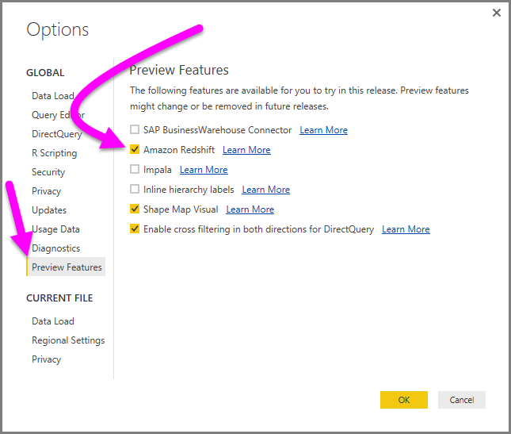
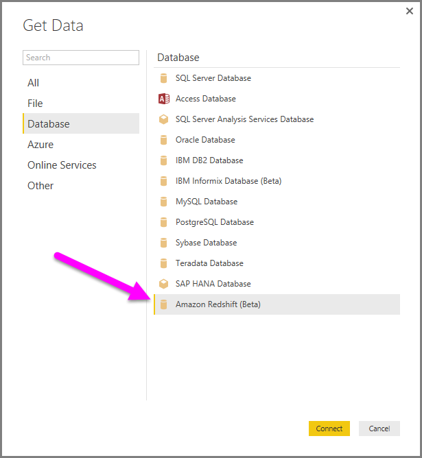
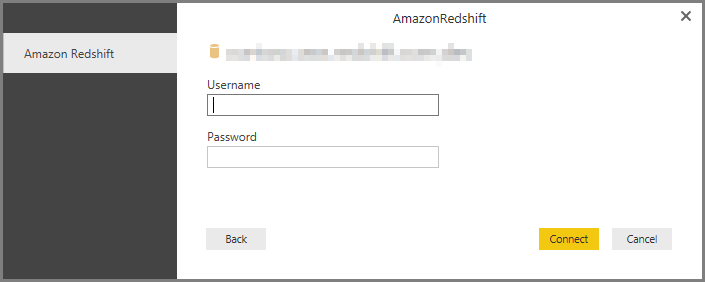

<properties
   pageTitle="Connect to an Amazon Redshift database in Power BI Desktop (Preview)"
   description="Easily connect to and use an Amazon Redshift database in Power BI Desktop"
   services="powerbi"
   documentationCenter=""
   authors="davidiseminger"
   manager="mblythe"
   backup=""
   editor=""
   tags=""
   qualityFocus="no"
   qualityDate=""/>

<tags
   ms.service="powerbi"
   ms.devlang="NA"
   ms.topic="article"
   ms.tgt_pltfrm="NA"
   ms.workload="powerbi"
   ms.date="11/10/2016"
   ms.author="davidi"/>

# Connect to an Amazon Redshift database in Power BI Desktop (Preview)

In Power BI Desktop, you can connect to an **Amazon Redshift** database and use the underlying data just like any other data source in Power BI Desktop. This release of the **Amazon Redshift** connector is in preview, and is subject to change.

## Enable the Amazon Redshift (Preview) feature

To get access to the **Amazon Redshift** connector, you first need to enable this preview feature. In **Power BI Desktop**, select **File > Options and settings > Option** then in the **Options** window, select the **Preview Features** section and enable **Amazon Redshift**, as shown below.

When you check that box, you turn on the **Amazon Redshift** preview feature. You'll need to restart Power BI Desktop for the change to take effect - that's the case whenever you enable or disable a preview feature.

Once you restart, the preview features is available.

## Connect to an Amazon Redshift database

Once you've enabled to preview feature, to connect to an **Amazon Redshift** database select **Get Data** from the **Home** ribbon in Power BI Desktop. Select **Database** from the categories on the left, and you see **Amazon Redshift (Beta)**.

In the **Amazon Redshift** window that appears, type or paste the name of your **Amazon Redshift** server and database into the box. As part of the *Server* field, users can specify a ort in the following format: *ServerURL:Port*

When prompted, put in your username and password.

Once you successfully connect, a **Navigator** window appears and displays the data available on the server, from which you can select one or multiple elements to import and use in **Power BI Desktop**.

Once you make selections from the **Navigator** window, you can either **Load** or **Edit** the data.

-   If you choose to **Load** data, you'll promted wither to use *Import* or *DirectQuery* mode to load the data. For more information, check out this [article that explains DirectQuery](powerbi-desktop-use-directquery.md).
-   If you select to **Edit** the data, **Query Editor** appears where you can apply all sorts of transformations and filters to the data, many of which are applied to the underlying **Amazon Redshift** database itself (if supported).

## More Information

There are all sorts of data you can connect to using Power BI Desktop. For more information on data sources, check out the following resources:

-   [Getting Started with Power BI Desktop](powerbi-desktop-getting-started.md)

-   [Data Sources in Power BI Desktop](powerbi-desktop-data-sources.md)

-   [Shape and Combine Data with Power BI Desktop](powerbi-desktop-shape-and-combine-data.md)

-   [Connect to Excel workbooks in Power BI Desktop](powerbi-desktop-connect-excel.md)   

-   [Enter data directly into Power BI Desktop](powerbi-desktop-enter-data-directly-into-desktop.md)   
