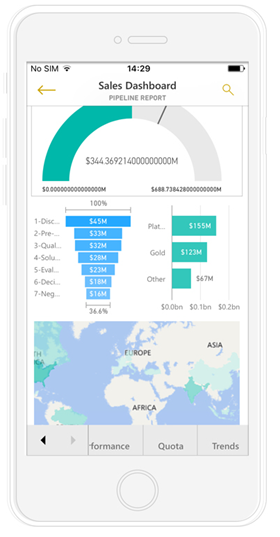
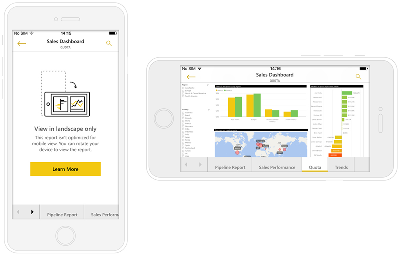

<properties 
   pageTitle="Create reports optimized for the Power BI phone apps"
   description="Learn how to optimize report pages in Power BI Desktop for the Power BI phone apps."
   services="powerbi" 
   documentationCenter="" 
   authors="maggiesMSFT" 
   manager="erikre" 
   backup=""
   editor=""
   tags=""
   qualityFocus="no"
   qualityDate=""/>
 
<tags
   ms.service="powerbi"
   ms.devlang="NA"
   ms.topic="article"
   ms.tgt_pltfrm="NA"
   ms.workload="powerbi"
   ms.date="03/02/2017"
   ms.author="maggies"/>

# Create reports optimized for the Power BI phone apps

When you [create a report in Power BI Desktop](powerbi-desktop-report-view.md), you can improve the experience of using it in the mobile apps on phones by creating a version of the report specifically for the phone. You adapt your report for the phone by rearranging and resizing visuals, maybe not including all of them, for an optimal experience.  

## Lay out a report page for the phone in Power BI Desktop

After you [create a report in Power BI Desktop](powerbi-desktop-report-view.md), you can optimize it for phones.

1. In Power BI Desktop, select **Report View** in the left navigation bar.

    

2. On the **View** tab, select **Change Layout**.  

    

    You see a blank phone canvas. All of the visuals on the original report page are listed in the Visualizations pane on the right.
 
2. To add a visual to the phone layout, drag it from the Visualizations pane to the phone canvas.

    Phone reports use a grid layout. As you drag visuals to the mobile canvas, they snap to that grid.

    

    You can add some or all the master report page visuals to the phone report page. You can add each visual only once.

3.	You can resize your visuals on the grid, as you would for tiles on dashboards and mobile dashboards.

    > [AZURE.NOTE] The phone report grid scales across phones of different sizes, so your report will look as good on small- and on large-screen phones.

    

## Notes about creating phone report layouts
- For reports with multiple pages, you can optimize all the pages or only a few. 
- On a phone, you move between pages by swiping from the side or tapping the page menu.
- You can’t modify formatting settings for just the phone. Formatting is consistent between master and mobile layouts. For example, font sizes will be the same.
- To change a visual, such as changing its formatting, dataset, filters, or any other attribute, return to the regular report authoring mode.

    > **Tip**: By default, Power BI provides titles and page names for phone reports in the mobile app. If you’ve created text visuals for titles and page names in your report, consider not adding them to your phone reports.     

## Remove a visual from the phone layout

-  To remove a visual, click the X in the top-right  of the visual on the phone canvas, or select it and press **Delete**.

    > [AZURE.NOTE] Removing a visual here only removes it from the Mobile canvas, the visual and the original report will not be effected.
    
    

## Enhance slicers to to work well in phone reports
Slicers offer on-canvas filtering of report data. When designing slicers in the regular report authoring mode, you can modify some slicer settings to make them more usable in phone reports:

- Decide if report readers can select only one or more than one item.
- Make the slicer vertical or horizontal. 
- Put a box around the slicer to make the report easier to scan.

Read more about [creating slicers in the Power BI service](powerbi-learning-3-4-create-slicers.md).

## Publish a phone report
- To publish the phone version of a report, you [publish the main report from Power BI Desktop to the Power BI service](powerbi-desktop-upload-desktop-files.md), and the phone version publishes at the same time.

    Read more about [sharing and permissions in Power BI](powerbi-service-how-should-i-share-my-dashboard.md).

## View optimized and unoptimized reports on a phone 

In the mobile apps on phones, Power BI automatically detects optimized and unoptimized phone reports. If a phone-optimized report exists, the Power BI phone app automatically opens the report in phone report mode.

If a phone-optimized report doesn’t exist, the report will open in the unoptimized, landscape view.  

When in a phone report, changing the phone’s orientation to landscape will open the report in the unoptimized view with the original report layout, whether you optimize the report or not.

If you only optimize some pages, readers will see a message in portrait view, indicating the report is available in landscape.

Report readers can turn their phones sideways to see the page in landscape mode.

## Interact with optimized phone reports on a phone

You can scroll in a phone report, cross-highlight and select visuals, and open visuals in focus mode. Read more about what it's like to [interact with Power BI reports optimized for your phone](powerbi-mobile-view-phone-report.md).

### Drill down in an optimized phone report

If hierarchy levels are defined in a visual, when you view it in the Power BI service you can drill down into the detailed information displayed in the visual, then back up. 

In general, you can't drill down in visuals when you view them on a phone, so another advantage of creating a phone report is that drill-down works. You [add drill-down to a visual](powerbi-service-drill-down-in-a-visualization.md), then add that visual to the phone report layout. Now when you view that visual on a phone, you can drill down.

Read more about engaging with a [phone report in a mobile app on a phone](powerbi-mobile-view-phone-report.md).

## How visuals scale in a phone report
Power BI phone reports use a concept called “virtual pixels” to ensure an optimized experience across various devices, screen sizes, and form factors.  

When creating a phone report, visuals are aligned to a grid. In the grid, some aspects such as square size are relative to the size of the screen, and other aspects such as side spacing are constant.
This allows the grid to scale correctly across different screen sizes.

For example, the size of a grid “square” on an iPhone SE will be ~xx pixels. The same square on an iPhone 6s Plus will be ~YY pixels. Thus, the phone report you create will scale well on all modern phones.    

### See also
- [Create a phone view of a dashboard in Power BI](powerbi-service-create-dashboard-phone-view.md)
- [View Power BI reports optimized for your phone](powerbi-mobile-view-phone-report.md)
- More questions? [Try asking the Power BI Community](http://community.powerbi.com/)
