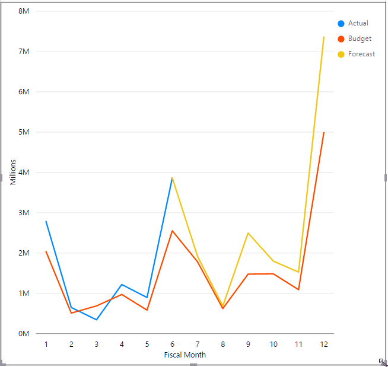
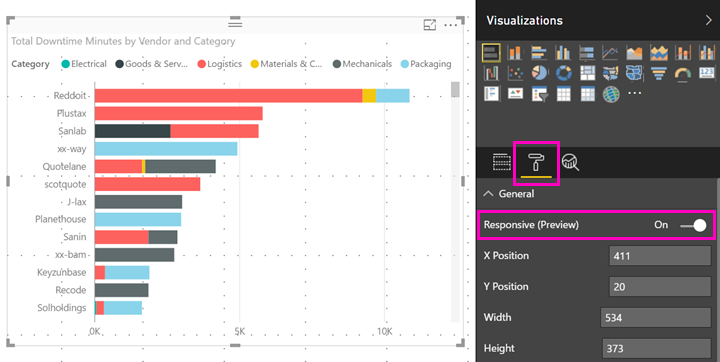

<properties 
   pageTitle="Optimize a visual for any size
   description="Learn how to optimize visuals in Power BI Desktop for the Power BI phone apps."
   services="powerbi" 
   documentationCenter="" 
   authors="maggiesMSFT" 
   manager="erikre" 
   backup=""
   editor=""
   tags=""
   qualityFocus="no"
   qualityDate=""/>
 
<tags
   ms.service="powerbi"
   ms.devlang="NA"
   ms.topic="article"
   ms.tgt_pltfrm="NA"
   ms.workload="powerbi"
   ms.date="08/15/2017"
   ms.author="maggies"/>

# Optimize a visual for any size

You can set the visuals in your dashboard or report to be *responsive*, to change dynamically to display the maximum amount of data and insight, no matter the screen size.

As a visual changes size, Power BI prioritizes the data view, for example removing padding and moving the legend to the top of the visual automatically, so the visual remains informative even as it gets smaller.

You choose whether to turn on responsiveness for each visual.

1. In Power BI Desktop, go back to **Desktop Layout**.

    

2. Select a visual, and in the **Visualizations** pane select the **Format** section.
3. Expand **General** > slide **Responsive** to **On**.

    

     Now when you add this visual to the phone or desktop layout, it resizes gracefully.

## Next steps
- [Create reports optimized for the Power BI phone apps](powerbi-desktop-create-phone-report.md)
- [Create a phone view of a dashboard in Power BI](powerbi-service-create-dashboard-phone-view.md)
- [View Power BI reports optimized for your phone](powerbi-mobile-view-phone-report.md)
- More questions? [Try asking the Power BI Community](http://community.powerbi.com/)
