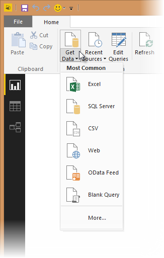
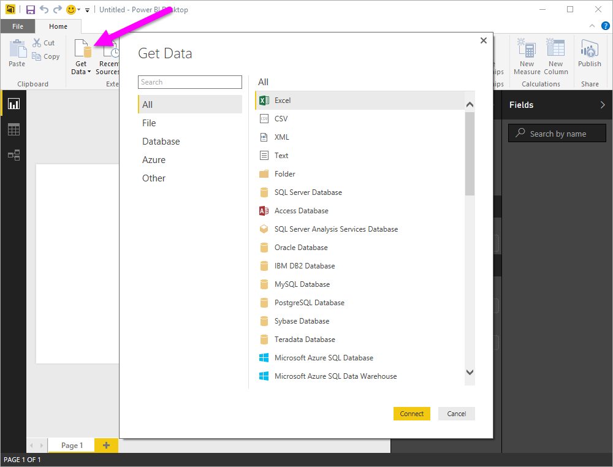
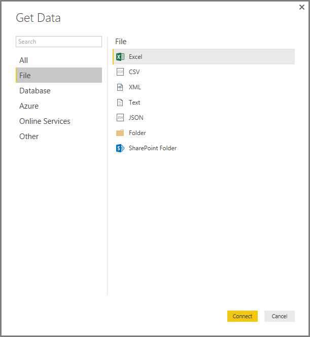
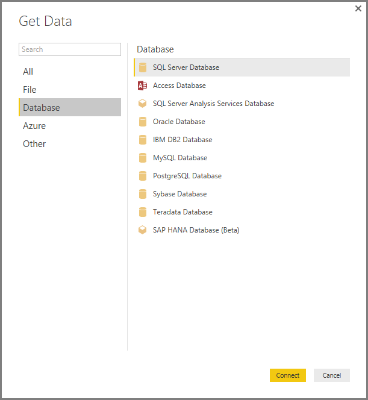
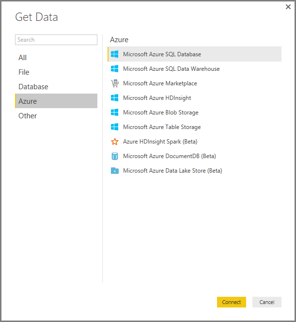
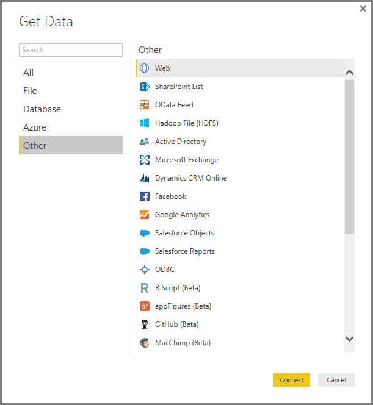
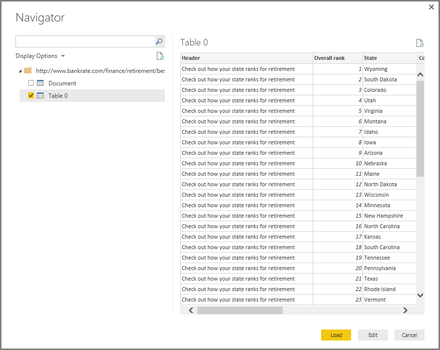

<properties
   pageTitle="Data sources in Power BI Desktop"
   description="Data sources in Power BI Desktop"
   services="powerbi"
   documentationCenter=""
   authors="davidiseminger"
   manager="mblythe"
   backup=""
   editor=""
   tags=""
   qualityFocus="monitoring"
   qualityDate="04/29/2016"/>

<tags
   ms.service="powerbi"
   ms.devlang="NA"
   ms.topic="article"
   ms.tgt_pltfrm="NA"
   ms.workload="powerbi"
   ms.date="05/31/2016"
   ms.author="davidi"/>
# Data sources in Power BI Desktop

With Power BI Desktop, you can connect to data from many different sources. A full list of available data sources is at the bottom of this page.

To connect to data, select **Get Data** from the **Home** ribbon. Selecting the down arrow, or the **Get Data** text on the button, shows the **Most Common** data types menu shown in the following image.

Selecting **More…** from the **Most Common** menu displays the **Get Data** window. You can also bring up the **Get Data** window (and bypass the **Most Common** menu) by selecting the **Get Data** **icon button** directly.

## Data Sources

Data types are organized in the following categories:

-   All
-   File
-   Database
-   Azure
-   Online Services
-   Other

The **All** category includes all data connection types from all categories.

The **File** category provides the following data connections:

-   Excel
-   CSV
-   XML
-   Text
-   JSON
-   Folder
-   SharePoint Folder

The following image shows the **Get Data** window for **File**.

 

The **Database** category provides the following data connections:

-   SQL Server Database
-   Access Database
-   SQL Server Analysis Services Database
-   Oracle Database
-   IBM DB2 Database
-   IBM Informix Database (Beta)
-   MySQL Database
-   PostgreSQL Database
-   Sybase Database
-   Teradata Database
-   SAP HANA Database

The following image shows the **Get Data** window for **Database**.

The **Azure** category provides the following data connections:

-   Microsoft Azure SQL Database
-   Microsoft Azure SQL Data Warehouse
-   Microsoft Azure Marketplace
-   Microsoft Azure HDInsight
-   Microsoft Azure Blob Storage
-   Microsoft Azure Table Storage
-   Azure HDInsight Spark (Beta)
-   Microsoft Azure DocumentDB (Beta)
-   Microsoft Azure Data Lake Store (Beta)

The following image shows the **Get Data** window for **Azure**.

The **Online Services** category provides the following data connections:

-   SharePoint Online List
-   Microsoft Exchange Online
-   Dynamics CRM Online
-   Facebook
-   Google Analytics
-   Salesforce Objects
-   Salesforce Reports
-   appFigures (Beta)
-   comScore Digital Analytix (Beta)
-   GitHub (Beta)
-   MailChimp (Beta)
-   Marketo (Beta)
-   Planview Enterprise (Beta)
-   QuickBooks Online (Beta)
-   SparkPost (Beta)
-   Smartsheet
-   SQL Sentry (Beta)
-   Stripe (Beta)
-   SweetIQ (Beta)
-   Troux (Beta)
-   Twilio (Beta)
-   tyGraph (Beta)
-   Webtrends (Beta)
-   Zendesk (Beta)

The following image shows the **Get Data** window for **Online Services**.

The **Other** category provides the following data connections:

-   Web
-   SharePoint List
-   OData Feed
-   Hadoop File (HDFS)
-   Active Directory
-   Microsoft Exchange
-   ODBC
-   R Script
-   Spark (Beta)
-   Blank Query

The following image shows the **Get Data** window for **Other**.

## Connecting to a Data Source

To connect to a data source, select the data source from the **Get Data** window and select **Connect**. In the following image, **Web** is selected from the **Other** data connection category.

A connection window is displayed, specific to the type of data connection. If credentials are required, you’ll be prompted to provide them. The following image shows a URL being entered to connect to a Web data source.

When the URL or resource connection information is entered, select **OK**. Power BI Desktop makes the connection to the data source, and presents the available data sources in the **Navigator**.

You can either load the data by selecting the **Load** button at the bottom of the **Navigator** pane, or edit the query before loading data by selecting the **Edit** button.

That’s all there is to connecting to data sources in Power BI Desktop! Try connecting to data from our growing list of data sources, and check back often - we continue to add to this list all the time.

## More Information

There are all sorts of things you can do with Power BI Desktop. For more information on its capabilities, check out the following resources:

-   [Getting Started with Power BI Desktop](powerbi-desktop-getting-started.md)
-   [Query Overview with Power BI Desktop](powerbi-desktop-query-overview.md)
-   [Data Types in Power BI Desktop](powerbi-desktop-data-types.md)
-   [Shape and Combine Data with Power BI Desktop](powerbi-desktop-shape-and-combine-data.md)
-   [Common Query Tasks in Power BI Desktop](powerbi-desktop-common-query-tasks.md)    

Want to give us feedback? Great – use the **Send Feedback** menu item in Power BI Desktop. We look forward to hearing from you!

 
