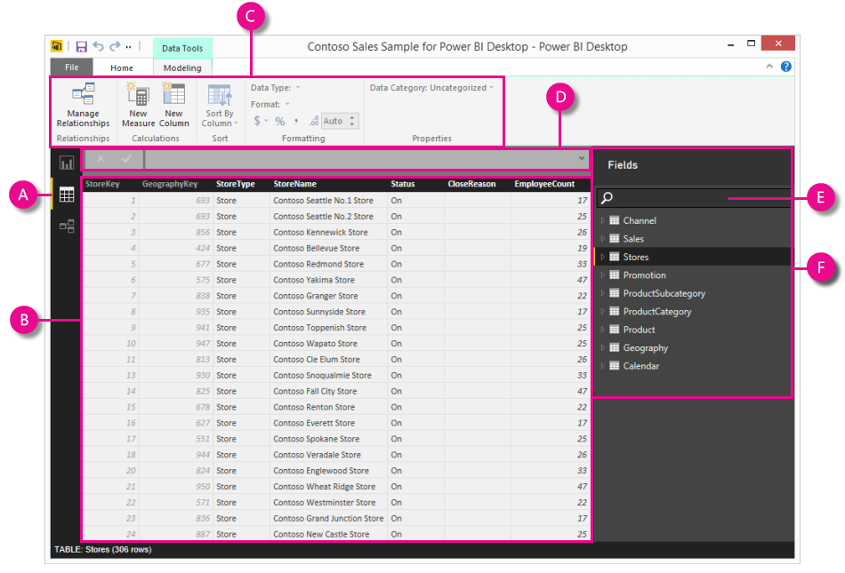

<properties
   pageTitle="Data View in Power BI Desktop"
   description="Data View in Power BI Desktop"
   services="powerbi"
   documentationCenter=""
   authors="davidiseminger"
   manager="mblythe"
   editor=""
   tags=""/>

<tags
   ms.service="powerbi"
   ms.devlang="NA"
   ms.topic="article"
   ms.tgt_pltfrm="NA"
   ms.workload="powerbi"
   ms.date="11/06/2015"
   ms.author="davidi"/>

# Data View in Power BI Desktop  

Data View helps you inspect, explore, and understand data in your Power BI Desktop model. It's different from how you view tables, columns, and data in Query Editor. With Data View, you’re looking at your data *after* it has been loaded into the model.

When you’re modeling your data, sometimes you want to see what’s actually in a table or column without creating a visual on the report canvas, often right down to the row level. This is especially true when you’re creating measures and calculated columns, or you need to identify a data type or data category.

Let’s take a closer look.

**A.** Data View icon – Click to enter Data View.

**B.** Data Grid – Shows the selected table and all columns and rows in it. Columns hidden from Report View are greyed out. You can  right-click on a column for options.

**C.** Modeling ribbon – Manage relationships, create calculations, change data type, format, data category for a column.

**D.** Formula bar – Enter DAX formulas for Measures and Calculated columns.

**E.** Search – Search for a table or column in your model.

**F.** Fields list – Select a table or column to view in the data grid.
