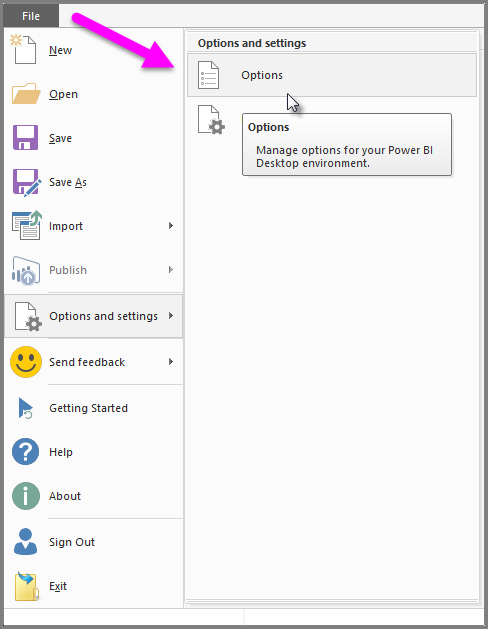
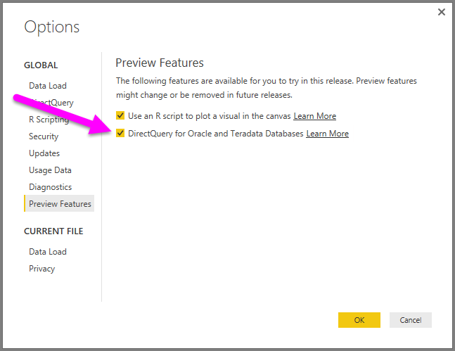

<properties
   pageTitle="DirectQuery for Oracle and Teradata databases (Preview)"
   description="DirectQuery for Oracle and Teradata databases (Preview)"
   services="powerbi"
   documentationCenter=""
   authors="davidiseminger"
   manager="mblythe"
   editor=""
   tags=""/>

<tags
   ms.service="powerbi"
   ms.devlang="NA"
   ms.topic="article"
   ms.tgt_pltfrm="NA"
   ms.workload="powerbi"
   ms.date="02/23/2016"
   ms.author="davidi"/>

# DirectQuery for Oracle and Teradata Databases (Preview)

With Power BI Desktop you can connect to Oracle and Teradata databases directly using DirectQuery.

>**Note:** This feature is provided as a preview, and may change in future releases. The experience and behavior could change with subsequent releases, so using this preview feature is not recommended for critical or production environments.

In this preview release, you can choose to connect to Oracle or Teradata databases using either **Import** or **DirectQuery**:

-   If you connect using DirectQuery, no data is imported or copied into Power BI Desktop. As you create or interact with a visualization, Power BI Desktop queries the underlying data source to get the necessary data to respond to your interaction, which means you’re always viewing current data. See [Use DirectQuery in Power BI Desktop](powerbi-desktop-use-directquery.md) for a description of DirectQuery.

-   If you connect with **Import**, data is imported into Power BI Desktop upon connection to the database, and interaction with the data is based on what was imported.

In this preview release, this DirectQuery for Oracle and Teradata databases feature is provided only for Power BI Desktop. It is not possible to publish the report to the Power BI service and have the report refresh. The ability to publish and share reports using DirectQuery using Oracle and Teradata is planned for a future release.

### Enabling DirectQuery for Oracle and Teradata (Preview)

1.   You need to enable this Preview feature in Power BI Desktop before you can use it. To enable it, select **File > Options and settings > Options**, as shown in the following image.

    

2.   From the **Options** window that appears, select **Preview Features > DirectQuery for Oracle and Teradata Databases**.

    

3.   For the changes to take effect, you must restart Power BI Desktop.
