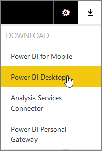

<properties 
   pageTitle="Get Power BI Desktop"
   description="Get Power BI Desktop"
   services="powerbi" 
   documentationCenter="" 
   authors="v-anpasi" 
   manager="mblythe" 
   editor=""
   tags=""/>
 
<tags
   ms.service="powerbi"
   ms.devlang="NA"
   ms.topic="article"
   ms.tgt_pltfrm="NA"
   ms.workload="powerbi"
   ms.date="06/18/2015"
   ms.author="v-anpasi"/>
# Get Power BI Desktop

[← Power BI Desktop](https://support.powerbi.com/knowledgebase/topics/68530-power-bi-desktop)

Before you can use some of the more advanced query, modeling, and report features in Power BI, you'll need to get Power BI Desktop.

## Minimum requirements

-   Windows 7 / Windows Server 2008 R2, or later

-   .NET 4.5

-   Internet Explorer 10 or later

## To download and install Power BI Desktop

Download and install the latest version of Power BI Desktop [here](http://go.microsoft.com/fwlink/?LinkID=521662).

Or, from Power BI, in Power BI, click the Downloads \> **Power BI Desktop**.

## With Power BI Desktop, you can...

### Get data

Power BI Desktop makes discovering data easy. You can import data from a wide variety of data sources. After you connect to a data source, you can shape the data before importing to match your analysis and reporting needs.

### Model data

Power BI Desktop provides advanced data modeling features like autodetect and manual relationships, custom measures, calculated columns, data categorization, and sort by column. [Data View](https://support.powerbi.com/knowledgebase/articles/663202-data-view-in-power-bi-desktop) makes seeing the data in your model easy, and with [Relationship View](https://support.powerbi.com/knowledgebase/articles/663229-relationship-view-in-power-bi-desktop), you get a customizable diagram view of all your tables and the relationships between them. 

### Create reports

Power BI Desktop includes [Report View](https://support.powerbi.com/knowledgebase/articles/461283-report-view-in-power-bi-desktop). Select the fields you want, add filters, choose from dozens of visuals. Report View gives you many of  the same great report and visualization tools just like when creating a report in the Power BI service 

### Save

With the Power BI Desktop, you can save your work as a Power BI Desktop file.
> 
> 

### Publish

In Power BI Desktop, you can publish and share your datasets and reports right to your Power BI site. To learn more, see [Publish from Power BI Desktop.](http://support.powerbi.com/knowledgebase/articles/461278-upload-power-bi-designer-reports).

