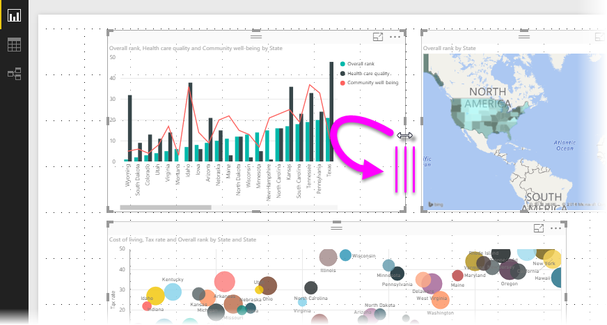

<properties
   pageTitle="Use gridlines and snap-to-grid in Power BI Desktop reports (Preview)"
   description="Use gridlines and snap-to-grid in Power BI Desktop reports"
   services="powerbi"
   documentationCenter=""
   authors="davidiseminger"
   manager="mblythe"
   backup=""
   editor=""
   tags=""
   qualityFocus="no"
   qualityDate=""/>

<tags
   ms.service="powerbi"
   ms.devlang="NA"
   ms.topic="article"
   ms.tgt_pltfrm="NA"
   ms.workload="powerbi"
   ms.date="10/31/2016"
   ms.author="davidi"/>

# Use gridlines and snap-to-grid in Power BI Desktop reports (Preview)

Beginning with the October 2016 release, the **Power BI Desktop** report canvas provides gridlines that let you neatly aligning visuals on a report page, and also provides snap-to-grid functionality so visuals in your reports look clean, aligned, and evenly spaced. This is a preview features, and may change in future releases.

### Enabling gridlines and snap-to-grid

To enable gridlines and snap-to-grid, you must first enable the preview feature. Go to **File > Options and settings > Options** and select **Preview features** from the left pane. There you'll see **Gridlines and Snap to Grid** as an option, which you must select to enable the feature. You'll need to restart **Power BI Desktop** for the change to take effect.

After you restart **Power BI Desktop**, select the **View** ribbon, then enable the checkboxes for **Show gridlines** and **Snap objects to grid.** You can select one or both boxes; they operate independently.

> Note: If **Show gridlines** and **Snap objects to grid** are disabled, connect to any data source and they become enabled.

### Using gridlines

Gridlines are visual guides that let you see whether two or more visuals are properly aligned. When you're trying to determine whether two (or more) visuals are aligned horizontally or vertically, you use the gridlines to visually determine whether their borders align.

You can use *CTRL+Click* to select more than one visual at a time, which displays all selected visuals' borders, easily letting you see whether the visuals are properly aligned.

### Using snap-to-grid

When you enable **Snap objects to grid**, all visuals on the **Power BI Desktop** canvas that you move (or resize) are automatically aligned to the nearest grid axis, making it much easier to ensure two or more visuals align to the same horizontal or vertical location or size.

And that's all there is to using **gridlines** and **snap-to-grid** to easily ensure the visuals in your reports are neatly aligned.
