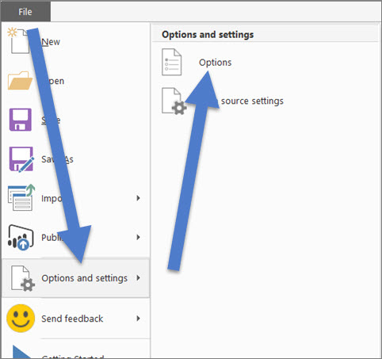
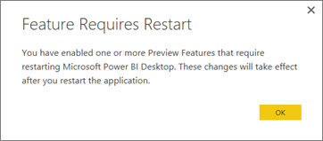

<properties
   pageTitle="Import and display KPIs (Preview)"
   description="Import and display KPIs (Preview)"
   services="powerbi"
   documentationCenter=""
   authors="davidiseminger"
   manager="mblythe"
   editor=""
   tags=""/>

<tags
   ms.service="powerbi"
   ms.devlang="NA"
   ms.topic="article"
   ms.tgt_pltfrm="NA"
   ms.workload="powerbi"
   ms.date="11/06/2015"
   ms.author="davidi"/>

# Import and display KPIs (Preview)  

Do you have KPIs in your Excel Power Pivot workbooks or SSAS Tabular models?  This preview feature lets you import and display KPIs in Power BI Desktop tables, matrixes, and cards. Because it's a Preview feature, the experience and behavior could change in the future. We don't recommend that you use it in critical or production,environments.

Let's see how it works.

1. Start with an Excel workbook that has a Power Pivot model and KPIs. This exercise uses a workbook named "KPIs". [Learn how to import workbooks](powerbi-desktop-import-excel-workbooks.md).  
2. Open the report and select the **Top Performers** tab.  The "Top Performers" matrix contains KPIs for 3 different sales measures by employee email address.  
  
3. The Fields list shows that this matrix uses the **Employees** and **Sales** tables.  In the **Employees** table, the **Email** field is selected  but in the **Sales** table, no fields are selected.  To see and work with the KPI fields, you need to enable the Preview Feature.  

	a.  Select **File** &gt; **Options and settings** &gt; **Options**  
      

	b.  Select **Preview Features** &gt; **Use KPIs from Power Pivot or SSAS Tabular**  

	c.  Restart Desktop and navigate back to this report page.  
      

	d.  The KPI fields are now showing up in the Fields list.    
    
