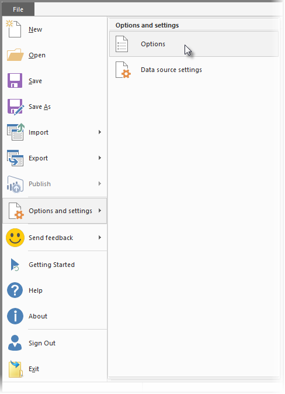
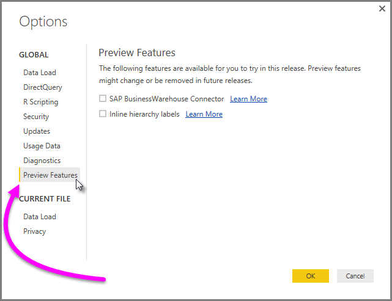
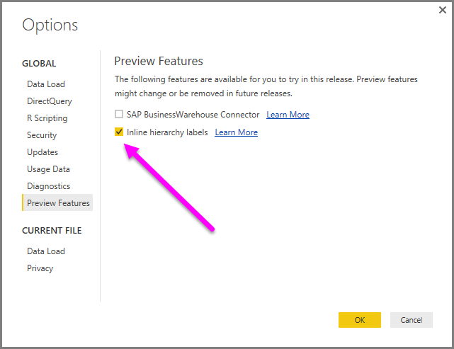
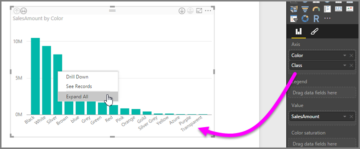
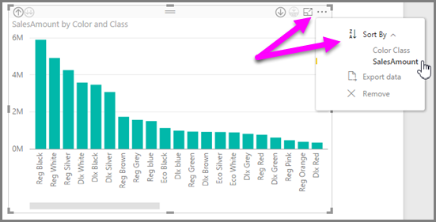
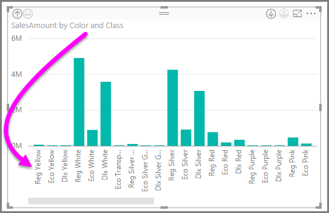

<properties
   pageTitle="Use inline hierarchy labels in Power BI Desktop (preview)"
   description="Use inline hierarchy labels in Power BI Desktop (preview)"
   services="powerbi"
   documentationCenter=""
   authors="davidiseminger"
   manager="mblythe"
   editor=""
   tags=""
   qualityFocus="no"
   qualityDate=""/>

<tags
   ms.service="powerbi"
   ms.devlang="NA"
   ms.topic="article"
   ms.tgt_pltfrm="NA"
   ms.workload="powerbi"
   ms.date="04/29/2016"
   ms.author="davidi"/>

# Use inline hierarchy labels in Power BI Desktop (preview)

**Power BI Desktop** now supports the use of **inline hierarchy labels**, which is the first of two features intended to enhance hierarchical drilling. The second feature, which is currently in development, is the ability to use nested hierarchy labels (stay tuned for that - our updates happen frequently). When inline and nested hierarchical labels are ready for general availability, they will be released together - but to provide an opportunity for customers to preview, inline hierarchy labels are now released as a preview feature.   

## How to use enable inline hierarchy labels

The following steps describe how to enable this preview of **inline hierarchy labels**:

1.  In Power BI Desktop, select **File > Options and settings > Options**.

    

2.  Select **Preview Features** from the **Global** section, in the left side of the **Options** window.

    

3.  Select the checkbox next to **Inline hierarchy labels** to enable the feature. Note that *you must restart Power BI Desktop* for the feature to be available. To disable the feature, uncheck the box and restart Power BI Desktop.

    

## How inline hierarchy labels work

With inline hierarchy labels, you can see hierarchy labels as you expand visuals using the **Expand All** feature. One great benefit to seeing these hierarchy labels is that you can also choose to **sort** by these different hierarchy labels as you expand your hierarchical data.

### Using the built-in Expand All feature (without sorting by hierarchy labels)

Before we see inline hierarchy labels in action, let's review how the default **Expand All** feature behavior. Doing so will help us understand (and appreciate) how useful inline hierarchy labels can be.

The following image shows a bar chart visual for annual sales. When you right-click, you can choose **Expand All**.

Once **Expand All** is selected, the visual expands the date hierarchy from *Year* to *Quarter*, as shown in the following image.

Notice that the *Year* and *Quarter* labels are shown inline together... this labeling scheme continues as you **Expand All** down to the bottom of the hierarchy.

This is how the built-in *Date* hierarchy, associated with fields that have a *date/time* data type, behaves. Let's head to the next section, and see how the new inline hierarchy labels feature is different.

### Using inline hierarchy labels

Now let's look at a different chart - using data that has informal hierarchies. In the following visual, we have a bar chart with **Sales Amount**, using *Color* as the axis. In this data, *Color* and *Class* form an informal hierarchy. From here, you can again select *Expand All* to drill down into the hierarchy.

Selecting **Expand All** shows the next level with the inline display of hierarchy labels. By default, inline hierarchies are sorted by the measure value – in this case, **SalesAmount**. With inline hierarchy labels enabled, you can choose to sort this data by the hierarchy too, by selecting the ellipses in the upper right corner (the **...**), then selecting **Sort By > Color Class** as shown in the following image.

Once **Color Class** is selected, the data is sorted based on the informal hierarchy selection, as shown in the following image.

>**Note**: The inline hierarchy label feature doesn't yet allow for the built-in time hierarchy to be sorted by value; it's only sorted by hierarchy order.

## Troubleshooting

It's possible for your visuals to get stuck in an expanded inline hierarchy level state. In some cases, you might find that some of your visuals are stuck in the mode where they were expanded, in which case drilling up doesn't work. This can happen if you happened to take the following steps (the fix for this is *below* these steps):

Steps that might get your visuals stuck in an expanded state:

1.  You enable the **inline hierarchy label** feature
2.  You create some visuals with hierarchies
3.  Then you **Expand All** and save your file
4.  You then *disable* the **inline hierarchy label** feature, and restart Power BI Desktop
5.  Then you re-open your file

If you happen to take those steps, and your visuals are stuck in expanded mode, you can do the following to troubleshoot them:

1.	Re-enable the **inline hierarchy label** feature, then restart Power BI Desktop
2.	Re-open your file, and drill back up to top of your affected visual(s)
3.	Save your file
4.	Disable the **inline hierarchy label** feature, then restart Power BI Desktop
5.	Re-open your file

Alternatively, you can just delete your visual and recreate it.
