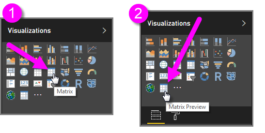
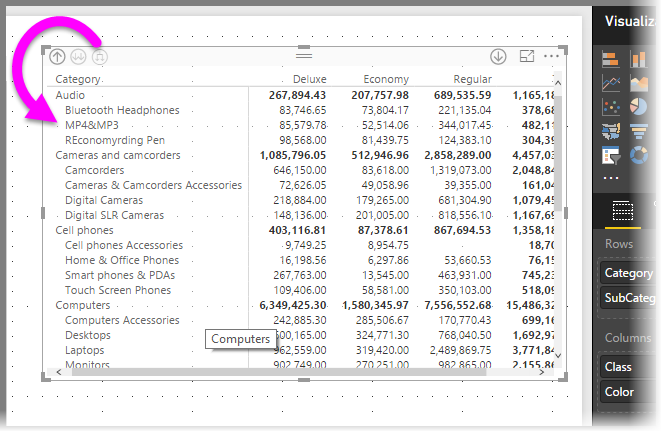
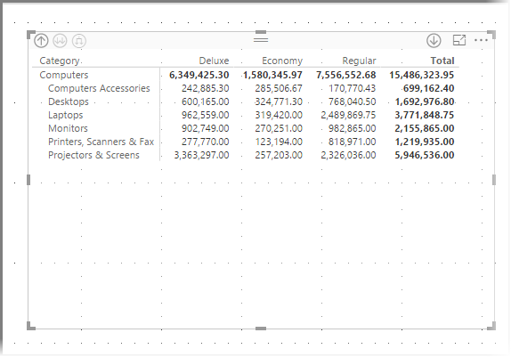
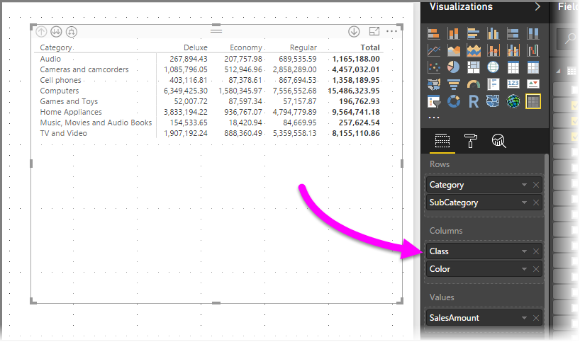
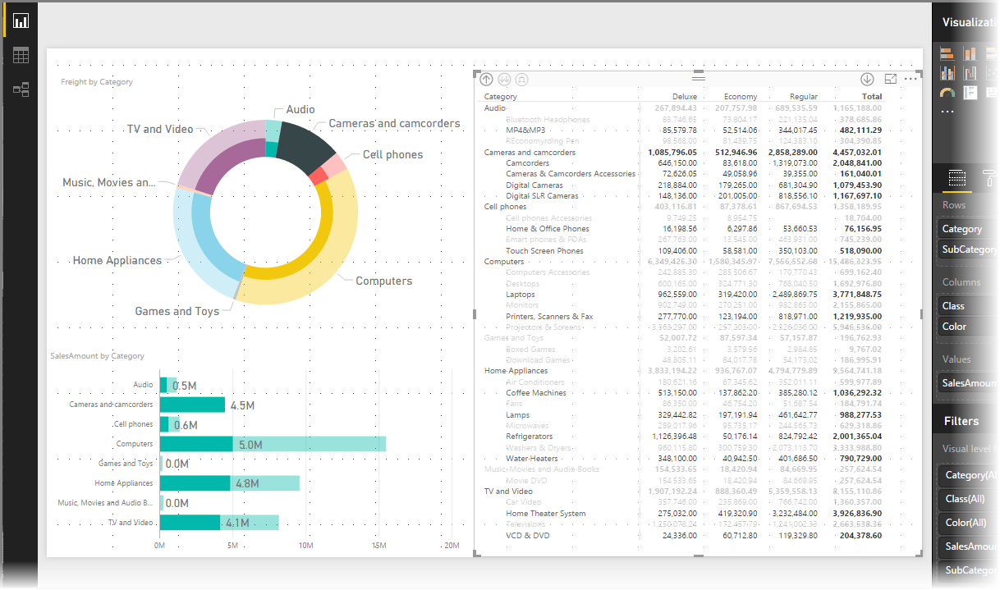

<properties
   pageTitle="Use the matrix visual in Power BI Desktop (Preview)"
   description="Learn how the matrix visual enables step layouts and granular highlighting in Power BI Desktop"
   services="powerbi"
   documentationCenter=""
   authors="davidiseminger"
   manager="erikre"
   backup=""
   editor=""
   tags=""
   qualityFocus="no"
   qualityDate=""/>

<tags
   ms.service="powerbi"
   ms.devlang="NA"
   ms.topic="article"
   ms.tgt_pltfrm="NA"
   ms.workload="powerbi"
   ms.date="03/08/2017"
   ms.author="davidi"/>

# Use the new Matrix visual in Power BI Desktop (Preview)

With the new **Matrix** visual, you can create matrix visuals (sometimes also referred to as *tables*) in **Power BI Desktop** reports, and cross-highlight elements within the matrix with other visuals. In addition, you can select rows, columns, and even individual cells and cross-highlight. Lastly, to make better use of layout space, the new matrix visual supports a stepped layout.

There are many new features associated with the matrix, and we'll go through them in the following sections of this article. But first, you need to enable the **Matrix Preview** feature to see it in your **Visualizations** pane.

### Enable the Matrix Preview visual

You can try the new **Matrix Preview** visual beginning with the **March 2017** release of **Power BI Desktop**. To enable this preview feature, select **File > Options and Settings > Options > Preview Features**, then select the checkbox beside **New matrix visual**. You'll need to restart Power BI Desktop after you make the selection.

The original version of the matrix visual continues to be available, to ensure your existing reports aren't affected by the new version of the matrix. In the image below, you'll see that the original matrix is called **Matrix** (1, in the image below, when hovered over), and the new matrix is called **Matrix Preview** (2, in the image below).

## Using drill-down with the Matrix Preview visual

With the **Matrix Preview** visual, you can do all sorts of interesting drill-down activities that weren't available before. This includes the ability to drill-down using rows, columns, and even into individual sections and cells. Let's take a look at how each of these work.

### Drill-down on row headers

In the **Visualizations** pane, when you add multiple fields to the **Rows** section of the **Fields** well, you enable drill-down on the rows of the matrix visual. This is similar to creating a hierarchy, which then allows you to drill-down (and then back up) through that hierarchy, and analyze the data at each level.

In the following image, the **Rows** section contains *Category* and *SubCategory*, creating a grouping (or hierarchy) in the rows that we can drill through.

When the visual has grouping created in the **Rows** section, the visual itself displays the *drill* and *expand* icons in the top-left corner of the visual.

Similar to the drill and expand behavior in other visuals, selecting those buttons lets us drill-down (or back up) through the hierarchy. In this case we can drill down from *Category* to *SubCategory*, as shown in the following image, where the drill-down one level icon (the pitchfork) has been selected.

In addition to using those icons, you can right-click on any of those row headers, and drill down by selecting from the menu that appears.

Notice there are a few options from the menu that appears, which generates different results:

Selecting **Drill Down** expands the matrix for *that* row level, *excluding* all other row headings except the row header that was right-clicked. In the following image, *Computers* was right-clicked, and **Drill Down** was selected. Notice that other top-level rows no longer appear in the matrix. This is a useful feature, and becomes especially cool when we get to the **cross-highlighting** section.

We can click the **Drill up** icon to get back to the previous top-level view. If we then select **Show Next Level** from the right-click menu, we get an alphabetical listing of all the next-level items (in this case, the *SubCategory* field), without the higher-level hierarchy categorization.

When we click on the **Drill up** icon in the upper-left corner to have the matrix show all top-level categories, then right-click again and select **Expand to next level**, we see the following:

You can also use the **Include** and **Exclude** menu items to keep (or remove, respectively) the right-clicked row (and any subcategories) from the matrix.

### Drill-down on column headers

Similar to the ability to drill-down on Rows, you can also drill-down on **Columns**. In the following image, you can see that there are two fields in the **Columns** field well, creating a hierarchy similar to what we used for the rows earlier in this article. In the **Columns** field well, we have *Class* and *Color*.

In the **Matrix Preview** visual, when we right-click a column, we see the option to drill-down. In the following image, we right-click on *Deluxe* and select **Drill Down**.

When **Drill Down** is selected, the next level of the column hierarchy for *Deluxe* is displayed, which in this case is *Color*.

The rest of the right-click menu items work on Columns in the same way they do for rows (see the previous section, **Drill-down on row headers**). You can **Show Next Level**, **Expand to next level**, and **Include** or **Exclude** your columns just as you can with rows.

> **Note:** The icons drill-down and drill-up icons in the upper left of the matrix visual only apply to rows. In order to drill-down on columns, you must use the right-click menu.

## Stepped layout with matrix visuals

The **Matrix Preview** visual automatically indents subcategories in a hierarchy beneath each parent, which is called a **stepped layout**.

In the *original* version of the matrix visual, subcategories were shown in an entirely different column, taking up much more space in the visual. The following image shows the table in original **matrix** visual; notice the subcategories in a completely separate column.

In the following image, you see a **Matrix Preview** visual, with **stepped layout** in action. Notice the category *Computers* has its subcategories (Computers Accessories, Desktops, Laptops, Monitors, and so on) slightly indented, providing a cleaner and much more condensed visual.

You can easily adjust the **stepped layout** settings. With the **Matrix Preview** visual selected, in the **Format** section (the paint roller icon) of the **Visualizations** pane, expand the **Row headers** section. In there are two options: the **Stepped layout** toggle (which turns it off or on), and the **Stepped layout indentation** (specifies the indentation amount, in pixels).

If you turn off **Stepped layout**, the subcategories are shown in another column rather than indented beneath the parent category.

## Cross-highlighting with matrix visuals

With the **Matrix Preview** visual, any elements in the matrix can be selected as the basis for cross-highlighting. Select a column in a **Matrix Preview** and that column is highlighted, as are any other visuals on the report page. This has been a common feature of other visuals and the selection of a data point, and now the **Matrix Preview** visual can participate.

In addition, using CTRL+Click also works for cross-highlighting. For example, in the following image a collection of subcategories were selected from the **Matrix Preview** visual. Notice how items that weren't selected from the visual are grayed out, and how the other visuals on the page reflect the selections made in the **Matrix Preview** visual.

## Limitations and considerations

In this preview release of the **Matrix Preview** visual, there are a few limitations and considerations to keep in mind.

-   Drill on columns can only be done by using the right-click menu, and there's currently no indication on the visual that you can drill into row or column groups
-   You can only expand all items in a level at once, rather than expanding one category at a time
-   **See Records** may appear on a menu when right-clicking a column headers, but it is not operational
-   You cannot sort by clicking on column headers (expected to be enabled for General Availability)
-   There currently is no *Grand total* row
-   Turning off the subtotal row in stepped layout doesn't have any effect
-   Resizing of columns is not available (expected to be enabled for General Availability)
-   Column headers may be truncated if inner groups have shorter text than the outer group
-   Changing the stepped layout indentation shouldn't indent the outermost row group's indent

We're always eager to hear your thoughts. We're currently conducting a **survey** on this **Matrix Preview** visual, so if you have a few minutes, please [take the survey](https://www.instant.ly/s/PYXT1).
