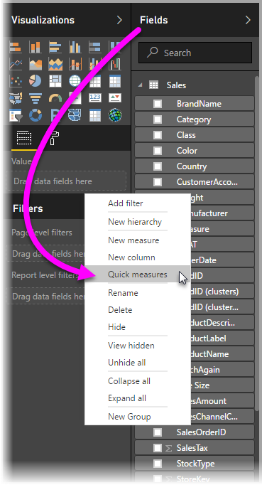
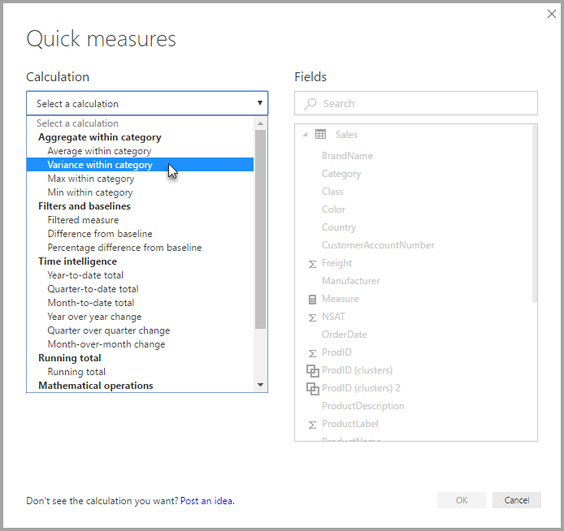
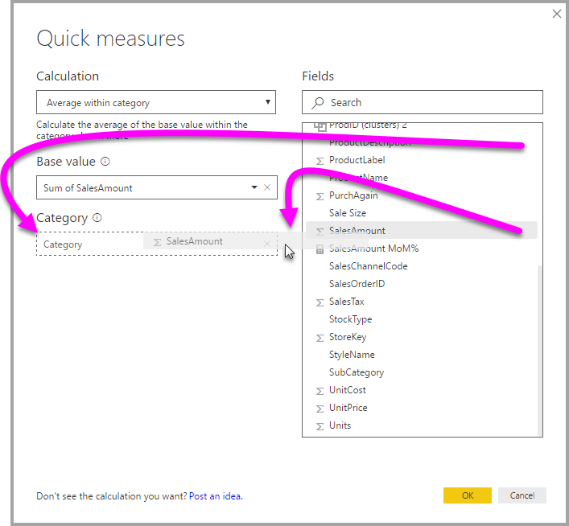
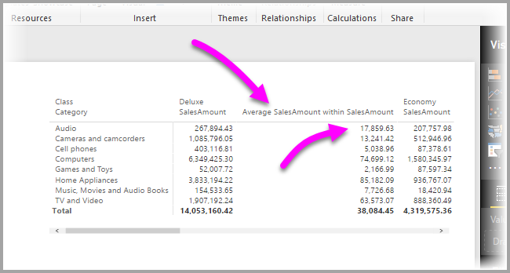
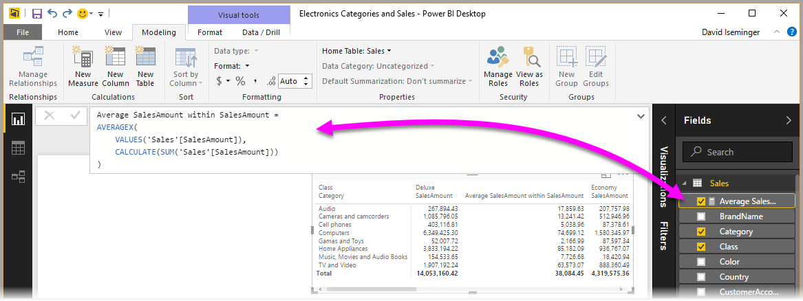

<properties
   pageTitle="Use Quick measures to easily perform common and powerful calculations (Preview)"
   description="Quick measures provide ready-made DAX formulas that make quick work of common calculations"
   services="powerbi"
   documentationCenter=""
   authors="davidiseminger"
   manager="erikre"
   backup=""
   editor=""
   tags=""
   qualityFocus="no"
   qualityDate=""/>

<tags
   ms.service="powerbi"
   ms.devlang="NA"
   ms.topic="article"
   ms.tgt_pltfrm="NA"
   ms.workload="powerbi"
   ms.date="04/03/2017"
   ms.author="davidi"/>

# Use Quick measures to easily perform common and powerful calculations (Preview)

Starting with the April 2017 release of **Power BI Desktop**, you can use **Quick measures** to quickly and easily perform common, powerful calculations. A **Quick measure** runs a set of DAX commands behind the scenes (you don’t have to write the DAX – it’s done for you) based input you provide in a dialog box, then presents the results for you to use in your report. Best of all, you can see the DAX that’s executed by the Quick measure, and jump-start or expand your own DAX knowledge.

You create **Quick measures** by right-clicking a field in the **Fields** well, then selecting **Quick measures** from the menu that appears. You can also right-click any value in the **Values** pane of an existing visual (such as the *Values* field in a *Bar chart* visual). There are many available categories of calculations, and ways to modify each calculation to fit your needs.

### Enable the Quick measures preview

You can try the new **Quick measures** feature beginning with the **April 2017** release of **Power BI Desktop**. To enable this preview feature, select **File > Options and Settings > Options > Preview Features**, then select the checkbox beside **Quick measures**. You'll need to restart Power BI Desktop after you make the selection.

You'll need to restart **Power BI Desktop** after you make the selection.

## Using Quick measures

To create a **Quick measure**, right-click on a field (any field) in the **Fields** well in **Power BI Desktop** and select **Quick measure** from the menu that appears.

> **Note:** Modeling must be available on the dataset currently loaded in order for **Quick measures** to be available. As such, live connections (such as a connection to a Power BI service dataset) will not display the **Quick measures** menu item when the **Fields** list is right-clicked.

When selected from the right-click menu, the following **Quick measures** window appears, allowing you to select the calculation you want, and the fields against which you want to calculation to be run.

When you select the drop-down menu, you're presented with the long list of available **Quick measures**.

There are five distinct groups of Quick measure calculation types, each with a collection of calculations. Those groups and calculations are the following:

-   **Aggregate within a category**
    -   Average within category
    -   Variance within category
    -   Max within category
    -   Min within category
-   **Filters and baselines**
    -   Filtered measure
    -   Difference from baseline
    -   Percentage difference from baseline
-   **Time intelligence**
    -   Year-to-date total
    -   Quarter-to-date total
    -   Month-to-date total
    -   Year over year change
    -   Quarter over quarter change
    -   Month-over-month change
-   **Running total**
    -   Running total
-   **Mathematical operations**
    -   Addition
    -   Subtraction
    -   Multiplication
    -   Division
    -   Percentage difference

We anticipate adding to these calculations, and want to hear from you about which **Quick measures** you'd like to see, and if you have ideas (including underlying DAX formulas) for **Quick measures** that you'd like to submit for consideration. More on that at the end of this article.

## Example of Quick measures

Let's take a look at an example of these **Quick measures** in action.

The following **Matrix** visual shows a table of sales for various electronics products. It's a basic table that includes the total for each category.

When we right-click the **Values** field well and select **Quick measures**, we can select *Average within category* as the *Calculation*, then select *Sum of SalesAmount* as the *Base value*, then specify *SalesAmount* by dragging that field from the *Fields* box on the right pane, into the *Category* section on the left.

When we select **OK**, we see a few interesting things occur, as shown in the image following this list:

1.  The **Matrix** visual now has a new column that shows our calculation (in this case, *Average SalesAmount within SalesAmount*).
2.  A new **measure** has been created and is available in the **Fields** well, and it's highlighted (Power BI puts a yellow box is around it). This measure is available to any other visual in the report, not just the visual for which it was originally created.
3.  The DAX formula that was created for the **Quick measure** is displayed in the Formula bar.

To start with the first item, notice that the **Quick measure** was applied to the visual. There's a new column and associated value, both of which are based on the **Quick measure** that was created.

Second, the **Quick measure** shows up in the **Fields** well of the data model, and can be used like any other field in the model, for any other visual. In the following image, a quick **bar chart** visual was created by using the new field created by the **Quick measure**.

Let's head to the next section to discuss that third item, DAX formulas.

## Learn DAX using Quick measures

Another great advantage of the **Quick measures** feature is that it directly shows you the DAX formula that was created to implement the measure. In the following image, we've selected the measure that was created by the **Quick measure** (it's now in the **Fields** well, so we just have to click it). When we do so, the **Formula bar** appears, showing the DAX formula that Power BI created to implement the measure.

This is nice by itself, since it shows you the formula behind the measure. But more importantly, perhaps, it lets you use **Quick measures** to see how the underlying DAX formulas should be created.

Imagine you need to do a year-over-year calculation, but you're not quite sure how to structure the DAX formula (or, you have no idea where to start!). Instead of banging your head on the desk, you could create a **Quick measure** using the **Year over year change** calculation, and see what happens. As in, create the **Quick measure** and see how it appears in your visual, see how the DAX formula worked, then make changes either directly to the DAX, or create another measure, until the calculations meet your needs or expectations.

It's like having a quick teacher that immediately responds to your what-if questions by a few clicks. You can always delete those measures from your model if you don't like them - that's as easy as right-clicking the measure and selecting **delete**.

And once you do have the measure perfected, you can rename it however you'd like, using the same right-click menu.

## Limitations and considerations

In this preview release of the **Quick measures**, there are a few limitations and considerations to keep in mind.

-   **Quick measures** are only available if you can modify the model, which isn't the case when you're working with DirectQuery or Live connections.
-   The measure that's added to the **Fields** well can be used with any visual in the report.
-   You can always see the DAX associated with a **Quick measure** by selecting the created measure in the **Fields** well, then looking at the formula in the **Formula bar**.

We anticipate providing examples and guidance for each of the **Quick measures** calculations, so please check back soon for updates on that focused article.

Since this is a **Preview** feature, we're especially interested in your feedback and your ideas.

Have an idea for a **Quick measure** that isn't already provided? Great! Check out [this page](https://go.microsoft.com/fwlink/?linkid=842906) and submit your ideas (and DAX formula) for the **Quick measure** you'd like to see in **Power BI Desktop**, and we'll consider adding it to the provided list of **Quick measures** in a future release.
