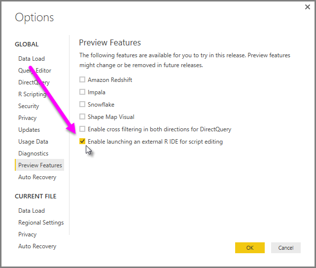
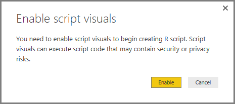
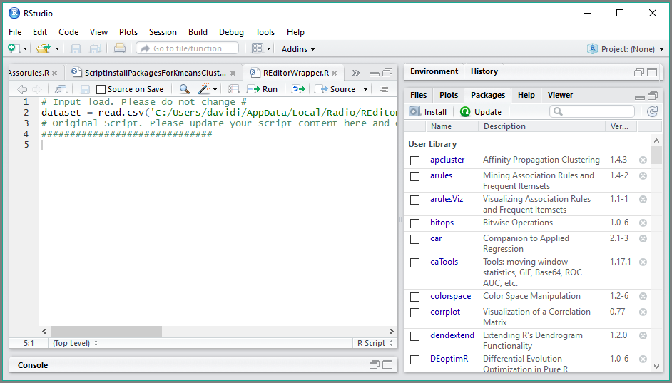

<properties
   pageTitle="Use an external R IDE with Power BI (Preview)"
   description="You can launch and use an external IDE with Power BI"
   services="powerbi"
   documentationCenter=""
   authors="davidiseminger"
   manager="mblythe"
   backup=""
   editor=""
   tags=""
   qualityFocus="no"
   qualityDate=""/>

<tags
   ms.service="powerbi"
   ms.devlang="NA"
   ms.topic="article"
   ms.tgt_pltfrm="NA"
   ms.workload="powerbi"
   ms.date="09/15/2016"
   ms.author="davidi"/>

# Use an external R IDE with Power BI (Preview)

With **Power BI Desktop**, you can use an external R IDE (Integrated Development Environment) to create and refine R scripts, then use those scripts in Power BI.

### Enabling an external R IDE

Prior to release of this feature, you had to use the R script editor in **Power BI Desktop** to create and run R scripts. With this release, you can launch your external R IDE from **Power BI Desktop** and have your data automatically imported and displayed in the R IDE. From there, you can modify the script in that external R IDE, then paste it back into **Power BI Desktop** to create Power BI visuals and reports.

### Requirements

To use this preview feature, you need to enable it as a preview feature. In **Power BI Desktop** go to **File > Options and settings > Options**, then from the left pane select **Preview Features**, then select *Enable launching an external R IDE for script editing*. You'll need to restart **Power BI Desktop** for the change to take effect.

You also must make sure that **.R** files are associated with the external IDE you want **Power BI Desktop** to launch. If no association is defined, **Power BI Desktop** attempts to locate and launch [R Studio](https://www.rstudio.com/) as the default external R IDE.

You must also install an R IDE for **Power BI Desktop** to launch. **Power BI Desktop** does not include, deploy or install the R engine, so you must separately install **R** on your local computer. You can download and install **R** for free from many locations, including the [Revolution Open download page](https://mran.revolutionanalytics.com/download/), and the [CRAN Repository](https://cran.r-project.org/bin/windows/base/).

You can specify R script options, including the R IDE that **Power BI Desktop** will launch, by going to **File > Options and settings > Options**, and in the **Options** page that appears, select the R installation in the **R Scripting** section of the **Options** window, as shown in the following image. In the following image, the path local installation of R is **C:\Program Files\R\R-3.2.0**. Make sure the path it displays properly reflects the local R installation you want **Power BI Desktop** to use.

### Launching an R IDE from Power BI Desktop

To launch an R IDE from *Power BI Desktop, take the following steps.

1.   Load data into **Power BI Desktop**.

2.   Select some fields from the **Fields** pane that you want to work with. If you haven't enabled script visuals yet, you'll be prompted to do so.

   

3.   When script visuals are enabled, you can select an R visual from the **Visualizations** pane, which creates a blank R visual that's ready to display the results of your script. The **R script editor** pane also appears.

   

4.   Now you can select the fields you want to use in your R script. When you select a field, the **R script editor** field automatically creates script code based on the field or fields you select. You can either create (or paste) your R script directly in the **R script editor** pane, your you can leave it empty.

   

   > **Note:** The default aggregation type for R visuals is *do not summarize*.

5.   You can now launch your R IDE directly from **Power BI Desktop**. Select the **Launch R IDE** button, found on the right side of the **R script editor** title bar, as shown below.

   

6.   Your specified R IDE is launched by Power BI Desktop, as shown in the following image (in this image, **RStudio** is the default R IDE).

   

   > **Note:** **Power BI Desktop** adds the first three lines of the script so it can import your data from **Power BI Desktop** once you run the script.

7.   Any script you created in the **R script editor pane** of **Power BI Desktop** appears starting in line 4 in your R IDE. At this point you can create your R script in the R IDE. Once your R script is complete in your R IDE, you need to copy and paste it back into the **R script editor** pane in **Power BI Desktop**, *excluding* the first three lines of the script that **Power BI Desktop** automatically generated. Do not copy the first three lines of script back into **Power BI Desktop**, those lines were only used to import your data to your R IDE from **Power BI Desktop**.

### Known Limitations

Launching an R IDE directly from Power BI Desktop has a few limitations:

-  Automatically exporting your script from your R IDE into **Power BI Desktop** is not supported.

-  **R Client** editor (RGui.exe) is not supported, because the editor itself does not support opening files.

### More Information

Take a look at the following additional information about R in Power BI.

-   [Running R Scripts in Power BI Desktop](powerbi-desktop-r-scripts.md)

-   [Create Power BI visuals using R](powerbi-desktop-r-visuals.md)
