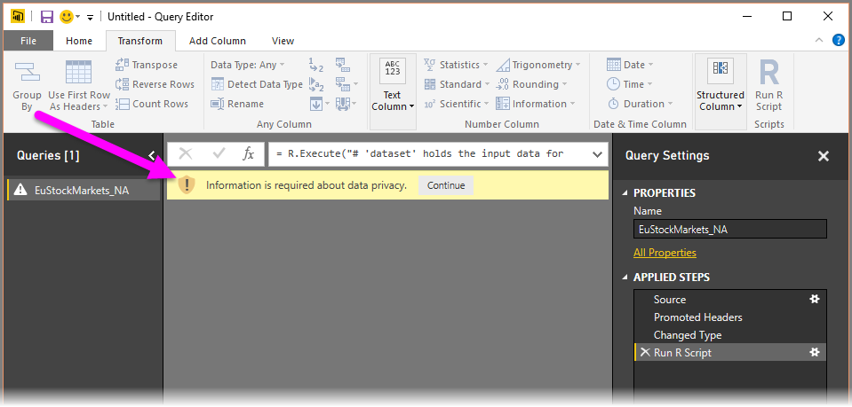
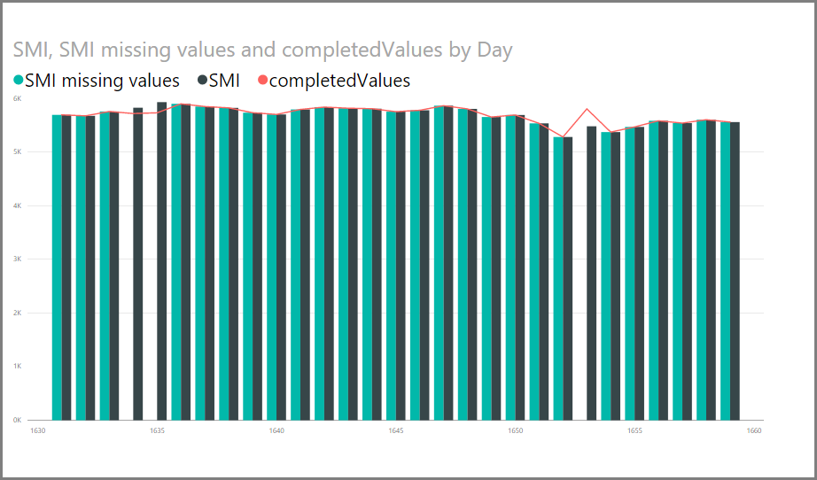
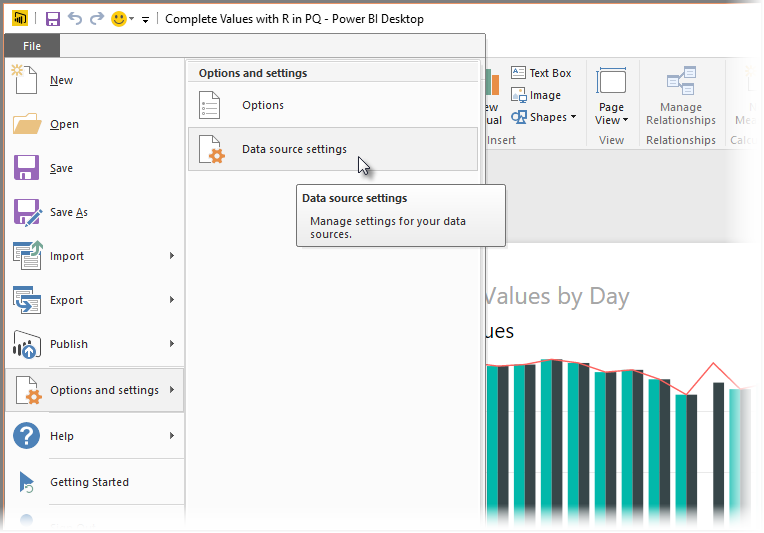

<properties
   pageTitle="Using R in Query Editor"
   description="Use R in Power BI Desktop Query Editor for advanced analytics"
   services="powerbi"
   documentationCenter=""
   authors="davidiseminger"
   manager="mblythe"
   backup=""
   editor=""
   tags=""
   qualityFocus="no"
   qualityDate=""/>

<tags
   ms.service="powerbi"
   ms.devlang="NA"
   ms.topic="article"
   ms.tgt_pltfrm="NA"
   ms.workload="powerbi"
   ms.date="07/20/2016"
   ms.author="davidi"/>

# Using R in Query Editor

You can use **R**, a programming language widely used by statisticians, data scientists, and data analysts, in the Power BI Desktop **Query Editor**. This integration of R into **Query Editor** lets you perform data cleansing using R, and perform advanced data shaping and analytics in datasets, including completion of missing data, predictions, and clustering, just to name a few. **R** is a powerful language, and can be used in **Query Editor** to prepare your data model and create reports.

## Installing R

To use **R** in Power BI Desktop's **Query Editor**, you need to install **R** on your local machine. You can download and install **R** for free from many locations, including the [Revolution Open download page](https://mran.revolutionanalytics.com/download/), and the [CRAN Repository](https://cran.r-project.org/bin/windows/base/).

## Using R in Query Editor

To show how to use **R** in **Query Editor**, we'll use an example from a stock market dataset, based on a .CSV file that you can [download from here] and follow along. The steps for this example are the following:

1.  First, load your data into **Power BI Desktop**. In this example we'll load the *EuStockMarkets_NA.csv* file. Select **Get Data > CSV** from the **Home** ribbon in **Power BI Desktop**.

    

2.  Select the file and select **Open**, and the CSV is displayed in the **CSV file** dialog.

    

3.  Once the data is loaded, you'll see it in the **Fields** pane in Power BI Desktop.

    

4.  Open **Query Editor** by selecting **Edit Queries** from the **Home** tab in **Power BI Desktop**.

    

5.  In the **Transform** tab, select **Run R Script** and the **Run R Script** editor appears (shown in the next step).

    

6.  For this example, we'll enter the following script code:

        library(mice)
        tempData <- mice(dataset,m=1,maxit=50,meth='pmm',seed=100)
        completedData <- complete(tempData,1)
        output <- dataset
        output$completedValues <- completedData$"SMI missing values"

    When put into the **Run R Script** dialog, the code looks like the following:

    

7.  When we select **OK**, **Query Editor** displays a warning about data privacy.

    

8.  Next, we need to set all data sources to *public*.

    

    Once we do so, we see a new column in the **Fields** well called *completedValues*.

    [I ran into an error here, saying I didn't have mice installed - let me know the steps to do that, I'll install and finish the visuals/images]

With just five lines of R script, **Query Editor** filled in the missing values with a predictive model.

## Creating visuals from R script data

Now we can create a visual to see how the R script code using the *mice* library completed the missing values, as shown in the following image.

Once that visual is complete, and any other visuals we might want to create using **Power BI Desktop**, we can save the **Power BI Desktop** file (which saves as a .pbix file) and then use the data model, including the R scripts that are part of it, in the Power BI service.

## Limitations

There are some limitations to queries that include R scripts created in **Query Editor**:

-   All R data source settings must be set to *Public*, and all other steps in a query created in **Query Editor** must also be public. To get to data source settings, in **Power BI Desktop** select **File > Options and settings > Data source settings**

    

    From the **Data Source Settings** dialog, select the the data source(s) and then select **Edit Permissions...** and ensure that the **Privacy Level** is set to *Public*.

        

There are all sorts of things you can do with R and custom queries, so explore and shape your data just the way you want it to appear.
