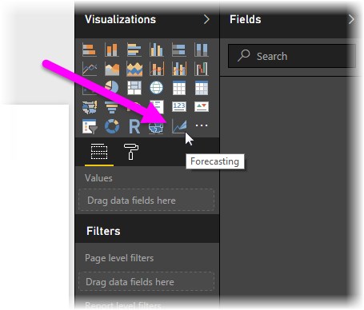

<properties
   pageTitle="Use R-powered custom visuals in Power BI"
   description="Use R-powered custom visuals in Power BI"
   services="powerbi"
   documentationCenter=""
   authors="davidiseminger"
   manager="mblythe"
   backup=""
   editor=""
   tags=""
   qualityFocus="no"
   qualityDate=""/>

<tags
   ms.service="powerbi"
   ms.devlang="NA"
   ms.topic="article"
   ms.tgt_pltfrm="NA"
   ms.workload="powerbi"
   ms.date="11/03/2016"
   ms.author="davidi"/>

# Use R-powered custom visuals in Power BI

With the October 2016 release of **Power BI Desktop**, and in the **Power BI service**, you can use R-powered custom visuals without any knowledge of R, and without any R scripting. This enables you to harness the analytic and visual power of R visuals, and R scripts, without learning R or doing any programming yourself.

To use R-powered custom visuals, you first select and download the R custom visual you're interested in using from the **R-powered visuals** section of the Power BI **custom visuals** gallery.

The following sections describe how to select, load, and use R-powered visuals in **Power BI Desktop**.

### Using R custom visuals

To use R-powered custom visuals, you need to download each visual from the **custom visuals** library, then you can use the visual like any other type of visual in **Power BI Desktop**. Here are the steps:

1.  Navigate to the [custom visuals](http://app.powerbi.com/visuals) library, found at [http://app.powerbi.com/visuals](http://app.powerbi.com/visuals). Select the *R-powered visuals* link, near the top of the page.

    

2.   Select the **R-powered visual** you're interested in using from the gallery. A dialog presenting additional details appears. Select **Download Visual** to download.

    > Note: For authoring in **Power BI Desktop**, you need to have R installed on your local machine. But when users want to view an R-powered visual in the **Power BI service** they do *not* need R installed locally.

    

    You do not need to install R to use R-powered custom visuals in the **Power BI service**, however, if you want to use R-powered custom visuals in **Power BI Desktop** you *must* install R on the local machine. You can download R from the following locations:
    -   [CRAN 3.3.1](https://cran.r-project.org/bin/windows/base/R-3.3.1-win.exe)
    -   [MRO 3.3.1](https://mran.microsoft.com/install/mro/3.3.1/microsoft-r-open-3.3.1.msi)

3.  Once the visual is downloaded (which is like downloading any file from your browser), go to **Power BI Desktop** and right-click the ellipsis (the ...) in the **Visualizations** pane, and select **Import a custom visual**.

    

4.   You're cautioned about importing a custom visuals, as shown in the following image:

    

5.   Navigate to where the visual file was saved, then select the file. **Power BI Desktop** custom visualizations have the .pbiviz extension.

    

6.   When you return to Power BI Desktop, you can see the new visual type in the **Visualizations** pane.

    

7.   When you import the new visual (or open a report that contains a R-powered custom visual), **Power BI Desktop** installs the required R packages. 

    

From there, you can add data to the visual just as you would any other **Power BI Desktop** visual. When complete, you can see your finished visual on the canvas. In the following visual, the **Forecasting** R-powered visual was used with United Nations (UN) birth rate projections (the visual on the left).

Like any other **Power BI Desktop** visual, you can publish this report with its R-powered visuals to the **Power BI service** and share it with others.

Check the [R-powered custom visuals](http://app.powerbi.com/visuals) library often, since new visuals are being added all the time.

### Contributing R-powered custom visuals

If you create your own R visuals for use in your reports, you can share those visual with the world by contributing your custom visual to the **custom visuals gallery**. Contributions are made through GitHub, and the process is outlined in the following location:

-   [Contributing to the R-powered custom visuals gallery](https://github.com/Microsoft/PowerBI-visuals#building-r-powered-custom-visual-corrplot)

### More Information

Take a look at the following additional information about R in Power BI.

-   [Power BI custom visuals gallery](https://app.powerbi.com/visuals/)
-   [Running R Scripts in Power BI Desktop](powerbi-desktop-r-scripts.md)
-   [Create R visuals in Power BI Desktop](powerbi-desktop-r-visuals.md)
-   [Use an external R IDE with Power BI](powerbi-desktop-r-ide.md)
