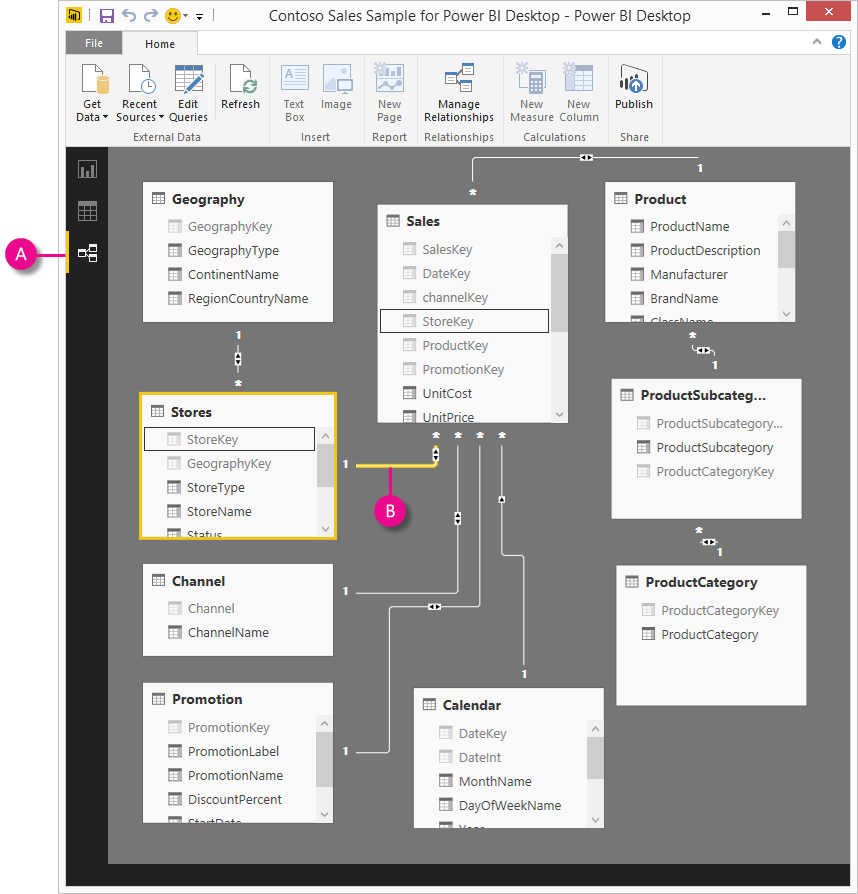

<properties 
   pageTitle="Relationship View in Power BI Desktop"
   description="Relationship View in Power BI Desktop"
   services="powerbi" 
   documentationCenter="" 
   authors="pcw3187" 
   manager="mblythe" 
   editor=""
   tags=""/>
 
<tags
   ms.service="powerbi"
   ms.devlang="NA"
   ms.topic="article"
   ms.tgt_pltfrm="NA"
   ms.workload="powerbi"
   ms.date="10/14/2015"
   ms.author="v-pawrig"/>
# Relationship View in Power BI Desktop

[← Power BI Desktop](https://support.powerbi.com/knowledgebase/topics/68530-power-bi-desktop)

Relationship View shows all of the tables, columns, and relationships in your model. This can be especially helpful when your model has complex relationships between many tables.

Let’s take a look.

**A.**  Relationship View icon – Click to show your model in Relationship View

**B.** Relationship – You can hover your cursor over a relationship to show the columns used. Double-click on a relationship to open it in the Edit Relationship dialog box.  

In the figure above, you can see the Stores table has a StoreKey column that’s related to the Sales table that also has a StoreKey column. We see it’s a Many to One (\*:1) relationship, and the icon in the middle of the line shows the Cross filter direction set to Both. The arrow on the icon shows the direction of the filter context flow.

To learn more about relationships, see [Create and manage relationships in Power BI Desktop](https://support.powerbi.com/knowledgebase/articles/464155-create-and-manage-relationships-in-power-bi-deskto).

