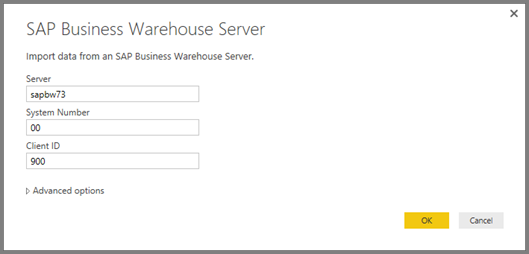

<properties
   pageTitle="Use the SAP BW Connector in Power BI Desktop (Preview)"
   description="Use the SAP BW Connector in Power BI Desktop (Preview)"
   services="powerbi"
   documentationCenter=""
   authors="davidiseminger"
   manager="mblythe"
   backup=""
   editor=""
   tags=""
   qualityFocus="no"
   qualityDate=""/>

<tags
   ms.service="powerbi"
   ms.devlang="NA"
   ms.topic="article"
   ms.tgt_pltfrm="NA"
   ms.workload="powerbi"
   ms.date="03/22/2016"
   ms.author="davidi"/>

# Use the SAP BW Connector (Preview) in Power BI Desktop

With Power BI Desktop, you can now access **SAP BusinessWarehouse (BW)** data.

## Installation of SAP BW Connector (Preview)

To use the **SAP BW Connector**, go through the following installation steps:

1.  Install the **SAP RFCSDK** (version 6.4 or greater) on your local machine. You can get the **SAP RFCSDK** from your SAP administrator, or directly from the SAP Support Portal.

2.  Enable the **SAP BW Connector** Preview feature in Power BI Desktop by going to **File > Options and Settings -> Options -> Global -> Preview Features.** You must restart Power BI Desktop after enabling this feature.

    

3.  After enabling the **SAP BW** Preview feature and restarting Power BI Desktop, the **Get Data** dialog includes an entry for **SAP Business Warehouse Server** in the **Database** category.

    

## SAP BW Connector (Preview) features

The **SAP BW Connector** preview is currently supported only in Power BI Desktop. In the future, we plan to enable end-to-end support to the Power BI service using the Power BI Gateway, but that support is not available in this Preview.

The **SAP BW Connector** preview in Power BI Desktop lets users import data from their **SAP Business Warehouse Server** cubes. After selecting **SAP BW Connector** preview from **Get Data**, you must specify a *Server*, *System Number* and *Client ID* to establish the connection.

You can also specify two additional **Advanced options**: Command timeout in minutes for connecting to the data source, and a custom MDX statement to run against the specified server.

If no MDX statement was specified you are presented with the **Navigator** window, which displays the list of cubes available in the server, the option to drill down and select items from the available cubes, including dimensions and measures.

> **Note:** Hierarchies and variables/parameters are currently not supported in the Preview version of the SAP BW Connector, but we anticipate supporting them in the future.

When you select one or more items from the server, a preview of the output table is created, based on their selection.

The **Navigator** window also provides a few **Display Options** that allow you to do the following:

-	**Display *Only Selected Items* versus *All Items* (default view):** This option is useful for verifying the final set of items selected. An alternative approach to viewing this is to select the *Column Names* in the *Preview* area.

-	**Enable Data Previews (default behavior):** You can also control whether data previews should be displayed in this dialog. Disabling data previews reduces the amount of server calls, since it no longer requests data for the previews.

-	**Technical Names:** SAP BW supports the notion of *technical names* for objects within a cube. Technical names allow a cube owner to expose *user friendly* names for cube objects, as opposed to only exposing the *physical names* for those objects in the cube. Please note that there are some known issues in this **SAP BW Preview** build with *Technical Names* that cause them to display empty names in some cases. We’re aware of this issue, and we are actively working to address it.

After selecting all necessary objects in the **Navigator**, you can decide what to do next, by selecting one of the following buttons on the bottom of the **Navigator** window:

-	Selecting **Load** triggers loading the entire set of rows for the output table into the Power BI Desktop data model, then takes you to **Report** view where you can begin  visualizing the data or making further modifications using the **Data** or **Relationships** views.

-	Selecting **Edit** brings up **Query Editor**, where you can perform additional data transformation and filtering steps before the entire set of rows is brought into the Power BI Desktop data model.

In addition to importing data from **SAP BW** cubes, remember that you can also import data from a wide range of other data sources in Power BI Desktop, and then you can combine them into a single report. This presents all sorts of interesting scenarios for reporting and analytics on top of **SAP BW** data.

## Troubleshooting

This section provides troubleshooting situations (and solutions) for working with this preview version of the **SAP BW** connector.

1.  **Unable to Connect to SAP BW server: Cannot call classic RFC API.**

    On some occasions, you may see the following error when using the **SAP BW Connector** preview:

    

    **Solution:** Make sure you installed the **SAP RFCSDK version 6.4 or greater**; you can check with the SAP Administrator in your organization, or follow these steps:

    1.	Open the **SAP Support Portal**
    2.	Go to **Downloads**
    3.	Go to the **SAP Software Distribution Center**
    4.	Select **Support Packages**
    5.	Select **Search for Support Packages and Patches**
    6.	Search for **RFCSDK**
    7.	Find the 6.40 RFCSDK for Windows (32-bit application) and download it
    8.	Copy the file *LIBRFC32.DLL* included with the download to the c:\windows\system32 directory on all workstations that will be running Power BI Desktop
