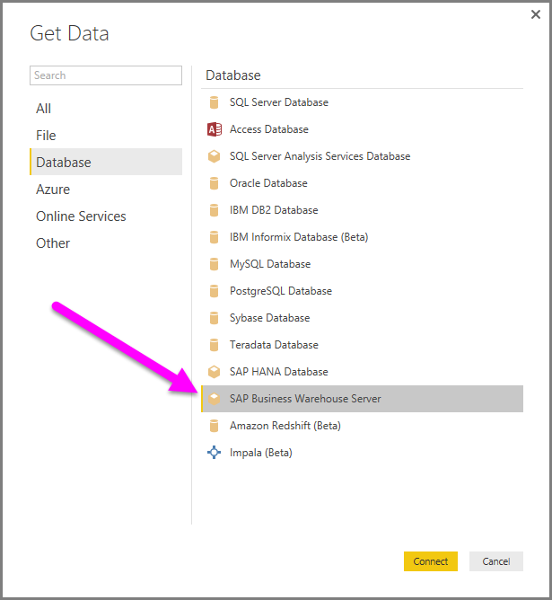
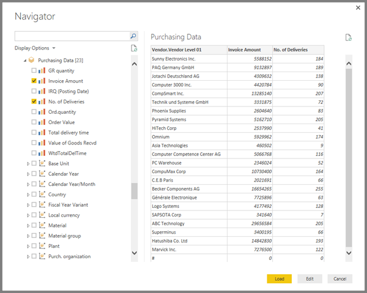

<properties
   pageTitle="Use the SAP BW Connector in Power BI Desktop"
   description="Use the SAP BW Connector in Power BI Desktop"
   services="powerbi"
   documentationCenter=""
   authors="davidiseminger"
   manager="mblythe"
   backup=""
   editor=""
   tags=""
   qualityFocus="no"
   qualityDate=""/>

<tags
   ms.service="powerbi"
   ms.devlang="NA"
   ms.topic="article"
   ms.tgt_pltfrm="NA"
   ms.workload="powerbi"
   ms.date="12/01/2016"
   ms.author="davidi"/>

# Use the SAP BW Connector in Power BI Desktop

With Power BI Desktop, you can access **SAP BusinessWarehouse (BW)** data.

## Installation of SAP BW Connector

To use the **SAP BW Connector**, go through the following installation steps:

1.  Install the **SAP NetWeaver** library on your local machine. You can get the **SAP Netweaver** library from your SAP administrator, or directly from the [SAP Software Download Center](https://support.sap.com/swdc). Since the **SAP Software Download Center** changes its structure frequently, more specific guidance for navigating that site is not available. The **SAP NetWeaver** library is usually included also in the SAP Client Tools installation.

    You may be able to search for *SAP Note #1025361* to get the download location for the most recent version. Make sure the architecture for the **SAP NetWeaver** library (32-bit or 64-bit) matches your **Power BI Desktop** installation, then install all files included in the **SAP NetWeaver RFC SDK** according to the SAP Note.

2.  The **Get Data** dialog includes an entry for **SAP Business Warehouse Server** in the **Database** category.

    

## SAP BW Connector features

The **SAP BW Connector** preview in Power BI Desktop lets users import data from their **SAP Business Warehouse Server** cubes. You must specify a *Server*, *System Number* and *Client ID* to establish the connection.

You can also specify two additional **Advanced options**: Language code, and a custom MDX statement to run against the specified server.

If no MDX statement was specified you are presented with the **Navigator** window, which displays the list of cubes available in the server, the option to drill down and select items from the available cubes, including dimensions and measures. Power BI exposes queries and cubes exposed by the [BW Open Analysis Interface OLAP BAPIs](https://help.sap.com/saphelp_nw70/helpdata/en/d9/ed8c3c59021315e10000000a114084/content.htm).

When you select one or more items from the server, a preview of the output table is created, based on their selection.

The **Navigator** window also provides a few **Display Options** that allow you to do the following:

-	**Display *Only Selected Items* versus *All Items* (default view):** This option is useful for verifying the final set of items selected. An alternative approach to viewing this is to select the *Column Names* in the *Preview* area.

-	**Enable Data Previews (default behavior):** You can also control whether data previews should be displayed in this dialog. Disabling data previews reduces the amount of server calls, since it no longer requests data for the previews.

-	**Technical Names:** SAP BW supports the notion of *technical names* for objects within a cube. Technical names allow a cube owner to expose *user friendly* names for cube objects, as opposed to only exposing the *physical names* for those objects in the cube.

After selecting all necessary objects in the **Navigator**, you can decide what to do next, by selecting one of the following buttons on the bottom of the **Navigator** window:

-	Selecting **Load** triggers loading the entire set of rows for the output table into the Power BI Desktop data model, then takes you to **Report** view where you can begin  visualizing the data or making further modifications using the **Data** or **Relationships** views.

-	Selecting **Edit** brings up **Query Editor**, where you can perform additional data transformation and filtering steps before the entire set of rows is brought into the Power BI Desktop data model.

In addition to importing data from **SAP BW** cubes, remember that you can also import data from a wide range of other data sources in Power BI Desktop, and then you can combine them into a single report. This presents all sorts of interesting scenarios for reporting and analytics on top of **SAP BW** data.

## Troubleshooting

This section provides troubleshooting situations (and solutions) for working with this preview version of the **SAP BW** connector.

1.  **Connectivity for SAP BEx queries**

    You can perform **BEx** queries in Power BI Desktop by enabling a specific property, as shown in the following image:

    
