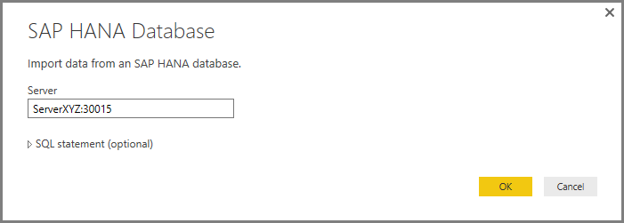

<properties
   pageTitle="Use SAP HANA in Power BI Desktop (Preview Feature)"
   description="Use SAP HANA in Power BI Desktop (Preview Feature)"
   services="powerbi"
   documentationCenter=""
   authors="davidiseminger"
   manager="mblythe"
   editor=""
   tags=""/>

<tags
   ms.service="powerbi"
   ms.devlang="NA"
   ms.topic="article"
   ms.tgt_pltfrm="NA"
   ms.workload="powerbi"
   ms.date="12/08/2015"
   ms.author="davidi"/>

# Use SAP HANA in Power BI Desktop (Preview Feature)  

With Power BI Desktop, you can now access **SAP HANA** databases. To use **SAP HANA**, the SAP HANA ODBC driver must be installed on the local client computer in order for the Power BI Desktop **SAP HANA** data connection to work properly. You can download the SAP HANA ODBC driver from the [SAP download page](https://support.sap.com/swdc).

To connect to a **SAP HANA** database, select **Get Data &gt; Database &gt; SAP HANA Database** as shown in the following image.

When connecting to a SAP HANA database, specify the server name and the port in the format *server:port* - the following image shows an example with a server named ServerXYZ and port 30015.

In this preview release **SAP HANA** in [DirectQuery](use-directquery.md) mode is only supported in Power BI Desktop, and you cannot publish or upload reports that use **SAP HANA** in DirectQuery mode to the Power BI service. When not using **SAP HANA** in DirectQuery mode, you *can* publish and upload reports that use **SAP HANA**.

### Supported features for SAP HANA
This preview release has many capabilities for **SAP HANA**, as shown in the following list.

-   The Power BI connector for **SAP HANA** uses the SAP ODBC driver, to provide the best use experience
-   **SAP HANA** supports both DirectQuery and Import options
-   Power BI supports HANA information models ( such as Analytic and Calc views) and has optimized navigation
-   With **SAP HANA** you can also use the direct SQL feature to connect to Row and Column Tables
-   Includes Optimized Navigation for HANA Models
-   Power BI supports **SAP HANA** Variables and Input parameters

### Limitations of SAP HANA  
There are also a few limitations to using the preview version of **SAP HANA**, shown below.

-   NVARCHAR strings are truncated to maximum length of 4000 Unicode characters
-   SMALLDECIMAL is not supported
-   VARBINARY is not supported
-   Valid Dates are between 1899/12/30 and 9999/12/31. Certain operations such as filtering may produce unexpected results against date values outside the valid range
-   Certain operations such as filtering may produce unexpected results against datetime values with sub-second precision
-   Power BI converts decimal numbers to doubles, and therefor may lose precision
-   If strings have leading spaces, the leading spaces are not shown in Power BI reports

In addition, this release of **SAP HANA** in Power BI Desktop does not support the following:

-   Hierarchies
-   display folders
-   KPI trends
-   translations
-   non-aggregatable attributes

In addition, as mentioned earlier you cannot publish a report created with the preview version of **SAP HANA** to the Power BI Service.
