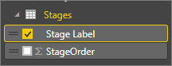
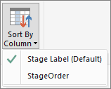

<properties 
   pageTitle="Sort by column in Power BI Desktop"
   description="Sort by column in Power BI Desktop"
   services="powerbi" 
   documentationCenter="" 
   authors="jastru" 
   manager="mblythe" 
   editor=""
   tags=""/>
 
<tags
   ms.service="powerbi"
   ms.devlang="NA"
   ms.topic="article"
   ms.tgt_pltfrm="NA"
   ms.workload="powerbi"
   ms.date="10/15/2015"
   ms.author="jastru"/>

# Sort by column in Power BI Desktop  

With Sort by Column on the Data Tools Modeling tab in Power BI Desktop, you can change how values in a column are sorted in a visualization.

When you add a column to a visualization, the default sort order works well most of the time. But, sometimes a column’s natural sort order isn’t really what you need. Let’s look at an example:

In our Sales Lead funnel report, we want to look at Contract Amount by Stage Label, and we want the order of the stages in the funnel to be in the order our business uses to qualify sales leads.  But, we’re not really getting the result we want because the Stage Label field is sorted alphabetically.

In this case, the data source table for Stage Label (in an Excel worksheet) has another column, StageOrder, which has a numeric order for each stage.

The StageOrder column has the order we want.  So, what we want to do is sort the Stage Label column by the StageOrder column.   

**To sort by a different column**

**1.**  In Report View or Data View, in the Fields list, we select the field we want sorted.  In this case, we select **Stage Label**.  

**2. ** On the ribbon, in the **Data Tools Modeling** tab, we click on **Sort By Column**.  This shows us  a list of columns by which we can sort by. In our case, we see Stage Label is the default.

**3.**  We really want to sort by StageOrder, so we select the **StageOrder** column.  

And, that’s it!  Our funnel chart is now sorted correctly. Anytime we use Stage Label, it’s sorted the way we want, by StageOrder.

