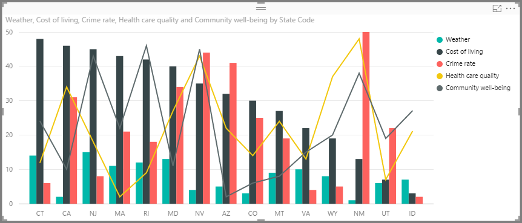
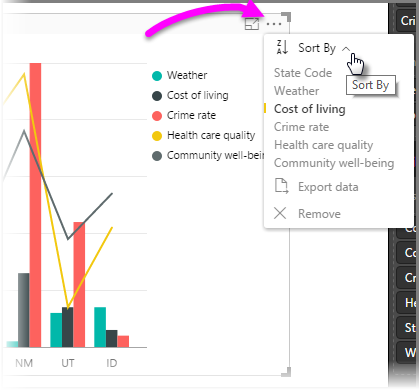

<properties
   pageTitle="Sort by column in Power BI Desktop"
   description="Sort by column in Power BI Desktop"
   services="powerbi"
   documentationCenter=""
   authors="davidiseminger"
   manager="mblythe"
   editor=""
   tags=""
   qualityFocus="monitoring"
   qualityDate="04/29/2016"/>

<tags
   ms.service="powerbi"
   ms.devlang="NA"
   ms.topic="article"
   ms.tgt_pltfrm="NA"
   ms.workload="powerbi"
   ms.date="04/29/2016"
   ms.author="davidi"/>

# Sort by column in Power BI Desktop  

In **Power BI Desktop**, you can easily choose which column is used to sort data in your visualizations. Whether you're using numeric data (such as sales figures) or text data (such as state names), you can sort your visualizations however you want, and make them look like you want them to.

Let's take an example. The following visualization list the top 15 states in terms of weather (most sunny days, ranked from 1 to 50, with 1 having the most sunny days). Here's the visualization as it looks before we do any sorting.

The visual is currently sorted by **Cost of living** - we can tell that by matching the color of the descending bars to the legend, but there's a better way to determine the current sort column: the **Sort by** dialog, available from the ellipses menu (...) in the upper right corner of the visual. When we select the ellipses, we see the following:

There are a couple items to notice in the menu that appears when you select the ellipses:
-   The yellow bar next to **Cost of living**, and the fact that **Cost of living** is in bold
-   The little icon beside the words **Sort By**, which shows **Z/A** (Z above A) and a down arrow.

We'll look at each of those independently in the next two sections.

## Selecting which column to use for sorting

You noticed the yellow bar beside **Cost of living** in the **Sort By** menu, which indicated that the visual was using the **Cost of living** column to sort the visual. Sorting by another column is easy - just select the ellipses to show the **Sort by** menu, then select another column. It's that easy.

In the following image, we selected **Community well-being** as the column by which we want to sort. That column happens to be one of the lines on the visual, rather than one of the bars. Here's what it looks like after we select **Community well-being**.

Notice how the visual has changed. The values now are ordered from highest **Community well-being" value (in this case RI for Rhode Island) for those states included in this visual, down to AZ (for Arizona) which has the lowest value. Remember that the overall chart still only includes the 15 states with the most sunny days - we've just ordered them based on another column included in the visual.

But what if we want to sort ascending, instead of descending? The next section shows just how easy that is.

## Selecting the sort order - smallest to largest, largest to smallest

When we take a closer look at the **Sort By** menu from the previous image, we see that the icon next to **Sort By** shows **Z/A** (Z above A). Take a look:

When **Z/A** is displayed, it means the visual is being sorted by the selected column in order of greatest value to smallest value. Want to change that? No problem - just tap or click that **Z/A** icon, and it changes the sort order to **A/Z** and sorts the visual (based on the selected column) from smallest to greatest value.

Here's our same visual, this time after tapping the **Z/A** icon on the **Sort By** menu to change its ordering. Notice that AZ (Arizona) is now the first state listed, and RI (Rhode Island) is the last - the opposite sorting from before.

You can sort by any column included in the visual - we could easily select Weather as the column by which we want to sort, and select **Z/A** from the **Sort By** menu, to show the states with the most sun first (highest value - Weather equates to days of sunshine in this data model), and still retain the other columns in the visual however they happen to apply to that state. Here's a look at the visual with those settings.

## Getting back to default column for sorting

You can sort by any column you'd like, but there may be times when you want the visual to return to its default sorting column. No problem. For a visual that has a sort column selected (a selected sort column has a yellow bar beside it in the **Sort By** menu, as we learned), simply open the **Sort By** menu and select that column again, and the visualization returns to its default sort column.

For example, here's our previous chart:

When we go back to the menu an select **Weather** again, the visual defaults to being ordered alphabetically by **State Code**, as shown in the following image.

With so many options for sorting your visuals, creating just the chart or image you want is easy.
