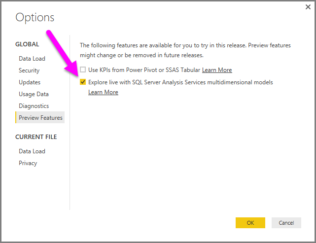

<properties
   pageTitle="Analysis Services Multidimensional data in Power BI Desktop (Preview Feature)"
   description="Analysis Services Multidimensional data in Power BI Desktop (Preview Feature)"
   services="powerbi"
   documentationCenter=""
   authors="davidiseminger"
   manager="mblythe"
   editor=""
   tags=""/>

<tags
   ms.service="powerbi"
   ms.devlang="NA"
   ms.topic="article"
   ms.tgt_pltfrm="NA"
   ms.workload="powerbi"
   ms.date="12/08/2015"
   ms.author="davidi"/>

# Connect to SSAS Multidimensional Models in Power BI Desktop (Preview Feature)  

With Power BI Desktop, you can now access **SSAS Multidimensional models**, commonly referred to as **SSAS MD**. To enable  **SSAS MD** select **File &gt; Options and settings &gt; Options**, then under **GLOBAL**, select **Preview Features** and enable the checkbox as shown in the following image.

**Note:** When you enable **SSAS Multidimensional models**, you're prompted to restart Power BI Desktop for the change to take effect.

To connect to an **SSAS MD** database, select **Get Data &gt; Database &gt; SQL Server Analysis Services Database** as shown in the following image.

In this preview release, **SSAS Multidimensional models** in Explore Live mode are only supported in Power BI Desktop, and you cannot publish or upload reports that use **SSAS Multidimensional models** in Explore Live mode to the Power BI service.

### Limitations of SSAS Multidimensional Models in Power BI Desktop
There are certain limitations to using the preview version of **SSAS MD**:

-   Servers must be running SQL Server 2012 SP1 CU4 or later versions of Analysis Services for the Power BI Desktop SSAS MD connector to work properly
-   Only Enterprise and Business Intelligence editions of SQL Server are supported for MD connectivity
-   Display Folder, Cell level Formatting, KPI Trends, and translation features are not supported in this preview build of SSAS MD. These features will be enabled in upcoming releases of Power BI Desktop.
-   Starting in the December 2015 release of Power BI Desktop, users can consume hierarchies defined in the model, including the entire hierarchy or any levels (parent levels are added automatically). Support for removing intermediate levels and Slicer support is coming in upcoming releases. The workaround for this limitation is to use the page level or report level filtering of a hierarchy.

In addition, as mentioned earlier you cannot publish a report created with the preview version of **SSAS MD** to the Power BI Service.

### Supported Features of SSAS MD in Power BI Desktop
The following features of SSAS MD are supported in Power BI Desktop:

-   Consumption of the following elements are supported in this preview version of **SSAS MD** (you can get [more information](https://msdn.microsoft.com/library/jj969574.aspx) about these features):
    - Default Members
    - Dimension Attributes
    - Dimension Calculated Members (must be a single real member when the dimension has more than one attribute, it cannot be the key attribute of the dimension unless it is the only attribute, and it cannot be a parent-child attribute)
    - Dimension Attribute types
    - Measures (with or without Measure groups)
    - Measures as Variant
    - KPIs
    - ImageUrls
    - Dimension security
