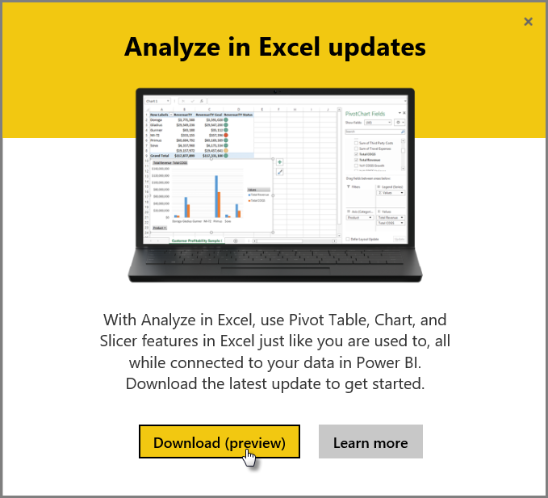
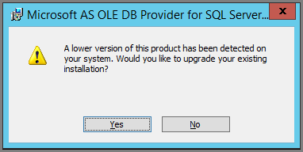

<properties
   pageTitle="Troubleshooting Analyze in Excel"
   description="Solutions to common issues for Analyze in Excel"
   services="powerbi"
   documentationCenter=""
   authors="davidiseminger"
   manager="mblythe"
   backup=""
   editor=""
   tags=""
   qualityFocus=""
   qualityDate=""/>

<tags
   ms.service="powerbi"
   ms.devlang="NA"
   ms.topic="article"
   ms.tgt_pltfrm="NA"
   ms.workload="powerbi"
   ms.date="05/12/2016"
   ms.author="davidi"/>

# Troubleshooting Analyze in Excel

There may be times when using Analyze in Excel that you get an unexpected result, or the feature doesn't work as you expected. This page provides solutions for common issues when using Analyze in Excel.

> **Note:** There's a separate page dedicated to describing and enabling [Analyze in Excel](powerbi-service-analyze-in-excel.md).

> If you encounter a scenario that is not listed below, and it is causing you issues, you can ask for further assistance on the [community site](http://community.powerbi.com/), or you can create a [support ticket](https://powerbi.microsoft.com/support/).

## Update Excel libraries for the OLE DB provider
To use **Analyze in Excel**, your computer must have a current AS OLE DB provider installed. This [community post](http://community.powerbi.com/t5/Service/Analyze-in-Excel-Initialization-of-the-data-source-failed/m-p/30837#M8081) is a great source to verify your installation of the OLE DB provider, or to download a recent version.

The Excel libraries need to match your version of Windows in terms of its bit-level. If you have 64-bit Windows installed, you need to install the 64-bit OLE DB provider.

To download the latest Excel libraries, visit Power BI and select the **down arrow** in the upper right corner of the Power BI service, then select **Analyze in Excel updates**.

In the dialog that appears, select **Download (preview)**.

## Determining whether you need to update your Excel libraries
You can download the most recent version of the Excel OLE DB provider libraries from the links in the previous section. Once you download the appropriate OLD DB provider library and begin installation, checks are performed against your current installed version.

If your Excel OLE DB provider client libraries are up to date, you'll be presented with a dialog that looks like the following:

C:\Users\davidi\Desktop\powerbi-content-pr\articles\media\powerbi-desktop-troubleshooting-analyze-in-excel

Alternatively, if the new version you are installing is newer than the version on your computer, the following dialog appears:

If you see the dialog prompting you to upgrade, you should continue with the installation to get the most recent version of the OLE DB provider installed in your computer.

## Connection cannot be made error
The primary cause for a *connection cannot be made* error is that your computer's OLE DB provider client libraries are not current. For information about how to determine the correct update, and for download links, see **Update Excel libraries for the OLE DB provider** earlier in this article.

## Forbidden error
Some users have more than one Power BI account, and when Excel attempts to connect to Power BI using existing credentials, it may use credentials that do not have access to the dataset or report you want to access.

When this occurs, you may  receive an error titled **Forbidden**, which means you may be signed into Power BI with credentials that do not have permissions to the dataset. After encountering the **forbidden** error, when prompted to enter your credentials, use the credentials that have permission to access the dataset you're trying to use.

If you still run into errors, log into Power BI with the account that has permission, and verify that you can view and access the dataset in Power BI that you're attempting to access in Excel.

## No data models
If you encounter an error that states **Can't find OLAP cube model**, then the dataset you're trying to access has no data model, and therefor cannot be analyzed in Excel.

## Token expired error
If you receive a **token expired** error, it means you haven't recently used the **Analyze in Excel** feature on the computer you're using. Simply re-enter your credentials, or reopen the file, and the error should go away.

## System error when attempting to access on-premises Analysis services
If you're trying to access a dataset that has connections to on-premises Analysis Services data, you may receive a system error. **Analyze in Excel** currently does not support connections to on-premises Analysis Services.

## See Also  

[Analyze in Excel](powerbi-service-analyze-in-excel.md)
