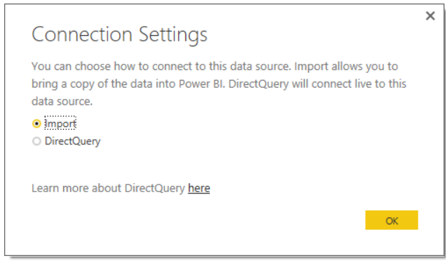

<properties
   pageTitle="Use DirectQuery in Power BI Desktop"
   description="Use DirectQuery in Power BI Desktop"
   services="powerbi"
   documentationCenter=""
   authors="davidiseminger"
   manager="mblythe"
   backup=""
   editor=""
   tags=""
   qualityFocus="no"
   qualityDate=""/>

<tags
   ms.service="powerbi"
   ms.devlang="NA"
   ms.topic="article"
   ms.tgt_pltfrm="NA"
   ms.workload="powerbi"
   ms.date="06/20/2016"
   ms.author="davidi"/>

# Use DirectQuery in Power BI Desktop  

With Power BI Desktop, when you connect to your data source, it is always possible to import a copy of the data into the Power BI Desktop. For some data sources, an alternative approach is available: connect directly to the data source using **DirectQuery**.

### Supported Data Sources  
The following data sources are currently supported:  
-   SQL Server
-   Azure SQL Database
-   Azure SQL Data Warehouse
-   [SAP HANA](powerbi-desktop-sap-hana.md)

### How to Connect using DirectQuery  
When you use **Get Data** to connect to a data source supported by **DirectQuery**, a dialog window appears that asks how you want to connect.  

The differences between selecting **Import** and **DirectQuery** are the following:

**Import** – the selected tables and columns are imported into Power BI Desktop. As you create or interact with a visualization, Power BI Desktop uses the imported data. You must refresh the data, which imports the full data set again, to see any changes that occurred to the underlying data since the initial import or the most recent refresh.

**DirectQuery** – no data is imported or copied into Power BI Desktop. The selected tables and columns appear in your Power BI Desktop **Fields** list. As you create or interact with a visualization, Power BI Desktop queries the underlying data source, which means you’re always viewing current data.

Many data modeling and data transformations are available when using **DirectQuery**, though with some limitations. When creating or interacting with a visualization, the underlying source must be queried and the time necessary to refresh the visualization is dependent on the performance of the underlying data source. When the data necessary to service the request has recently been requested, Power BI Desktop uses recent data to reduce the time required to display the visualization. Selecting **Refresh** from the **Home** ribbon will ensure all visualizations are refreshed with current data.

### Benefits of using DirectQuery  
There are two primary benefits to using **DirectQuery**:

-   **DirectQuery** lets you build visualizations over very large datasets, where it otherwise would be unfeasible to first import all of the data

-   Underlying data changes can require a refresh of data, and for some reports, the need to display current data can require large data transfers, making re-importing data unfeasible. By contrast, **DirectQuery** reports always use current data

### Limitations of DirectQuery
There are currently a few limitations to using **DirectQuery**:

-   All tables must come from a single database

-   If the Query Editor query is overly complex an error will occur. To remedy the error you must: delete the problematic step in Query Editor, or Import the data instead of using **DirectQuery**

-   Relationship filtering is limited to a single direction, rather than both directions

-   By default, limitations are placed on DAX expressions allowed in measures; see the following paragraph for more information

To ensure that queries sent to the underlying data source have acceptable performance, limitations are imposed on measures by default. Advanced users can choose to bypass this limitation by selecting **File > Options** and then **Settings > Options > DirectQuery**, then selecting the option *Allow unrestricted measures in DirectQuery mode**. When that option is selected, any DAX expression that is valid for a measure can be used. Users must be aware, however, that some expressions that perform very well when the data is imported may result in very slow queries to the backend source when in DirectQuery mode.

### Publish to the Power BI service
Reports created using **DirectQuery** can be published to the Power BI Service.

If the data source used is **Azure SQL Database** or **Azure SQL Data Warehouse**, credentials must be provided before the published report will be displayed in the Power BI Service.

You can provide credentials by selecting the **Settings** gear icon in Power BI, then select **Settings**.

Power BI displays the **Settings** window. From there, select the **Datasets** tab and choose the dataset that uses **DirectQuery**, and select **Edit credentials**.

Until credentials are supplied, opening a published report or exploring a dataset created with a **DirectQuery** connection to **Azure SQL Database** or **Azure SQL Data Warehouse** results in an error.

For data sources other than **Azure SQL Database** or **Azure SQL Data Warehouse** that use DirectQuery, and Enterprise Gateway must be installed and the data source must be registered to establish a data connection. You can [learn more about Enterprise Gateway](http://go.microsoft.com/fwlink/p/?LinkID=627094).
