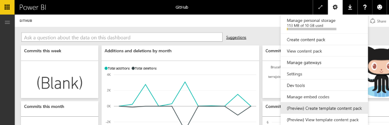
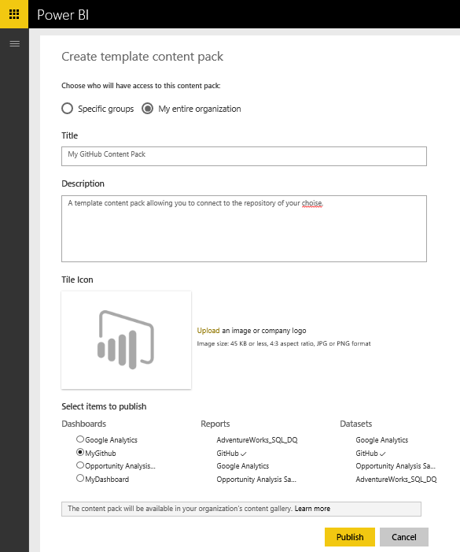

<properties 
   pageTitle="ISV Content Pack Testing"
   description="ISV Content Pack Testing"
   services="powerbi" 
   documentationCenter="" 
   authors="theresapalmer" 
   manager="mblythe" 
   backup=""
   editor=""
   tags=""
   qualityFocus="no"
   qualityDate=""/>
 
<tags
   ms.service="powerbi"
   ms.devlang="NA"
   ms.topic="article"
   ms.tgt_pltfrm="NA"
   ms.workload="powerbi"
   ms.date="05/17/2016"
   ms.author="tpalmer"/>

# ISV Content Pack Testing

>**Note:** Developing ISV content packs is currently in preview and requires initial approval through the [Microsoft Azure Certified](powerbi-developer-content-pack-overview.md/#Nomination) program to access. If you're interested, please submit a nomination.

There are multiple ways to test your content pack before submitting it for publishing.  

## Testing Scheduled Data Refresh
ISV content packs leverage Refresh in PowerBI.com to instantiate a content pack with the customer's data when they connect. Prior to the content pack being publically available, you can test this flow with the Desktop file you've created.

After uploading the file, select the "…" next to the dataset and select Schedule Refresh. Configure credentials for the source. Make sure that your dataset refreshes successfully, try both "Refresh Now" and "Scheduled Refresh". If your refresh hits any failures, check the error message and validate your queries and your end system.

### Additional refresh tips
-	Only one data source should be detected when you try to schedule refresh
-	Test connection should indicate that your user will be able to load the content pack. If that's not the case, ensure your queries handle the additional error cases.

## Testing Templates
>**Note:** Developing ISV content packs is currently in preview and requires initial approval through the [Microsoft Azure Certified](powerbi-developer-content-pack-overview.md/#Nomination) program to access. If you're interested, please submit a nomination.

A template content pack is similar to existing solutions except that it does not include the actual data in the dataset. Instead, when a user consumes or instantiates a template, they are prompted for parameters and credentials in order to connect. Once connected, they'll see their own data in the dashboard, report and datasets.

**Note:** Template content packs can only include 1 dashboard, 1 report and 1 dataset.

### Naming
We suggest naming your dashboard, report and dataset consistently across your content pack. These names are hardcoded and will be the same for all users, so using your product/scenario name can make it easier for your customers to locate.

### Additional template tips
-	Ensure the parameters you specified in the queries are meaningful to your end users
-	Consider how long your end user will be waiting for scheduled refresh to complete

## Submission
**Note:** Developing ISV content packs is currently in preview and requires initial approval through the [Microsoft Azure Certified](powerbi-developer-content-pack-overview.md/#Nomination) program to access. If you're interested, please submit a nomination.

The submission process will provide Power BI with access to the template you've created as well as the original PBIX file.

### Before submission
-	Review the authoring tips for each of the artifacts within the content pack
-	Test and connect with various accounts and data conditions
-	Review all visuals, look carefully for misspelled items
-	Ensure the content pack responds well to Q&A, we suggest testing at least 30 varied questions across the data model

### Submission
Provide all the artifacts required in the publishing portal. Review your Azure Certified nomination for more details. 

The Power BI team will review your submission and ensure all the artifacts meets the submission requirements. In addition to being complete, we'll also validate the quality of the dashboard and reports provided ensuring they meet the business scenario described in the application.

### Updates
Updating your content pack follows a similar flow to the original submission. Return to your offer in the Publishing Portal, provide the new artifacts and submit for staging.

