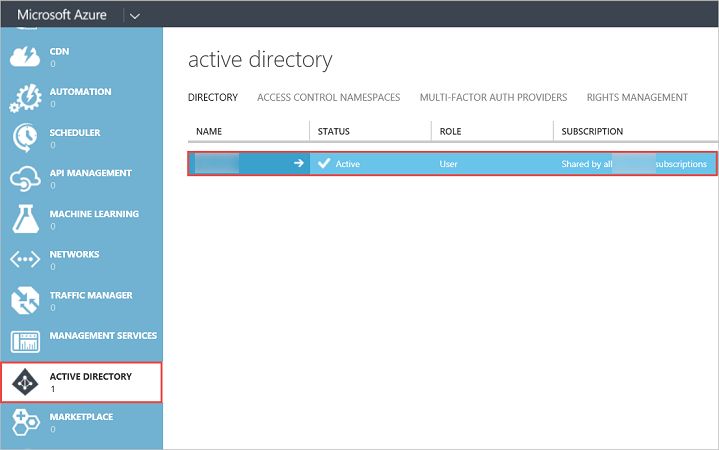
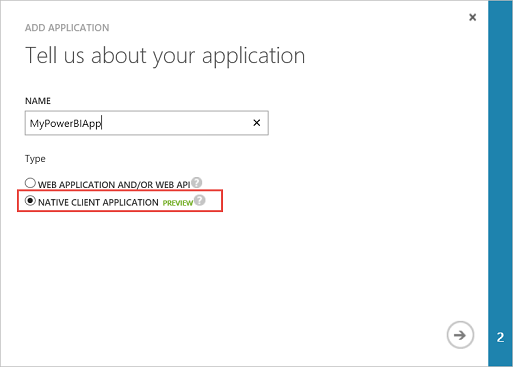
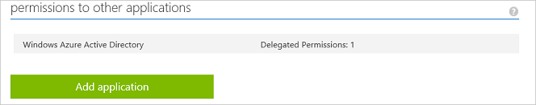
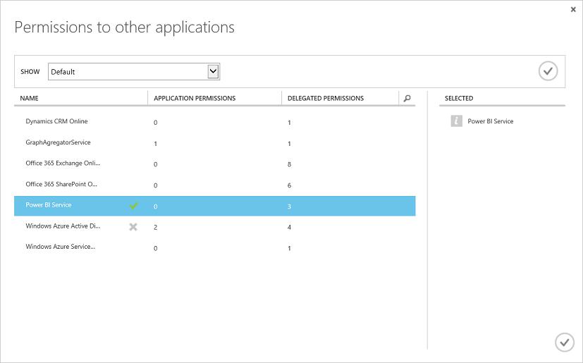

<properties
   pageTitle="Register a client app"
   description="Register a client app"
   services="powerbi"
   documentationCenter=""
   authors="derrickv"
   manager="mblythe"
   editor=""
   tags=""/>

<tags
   ms.service="powerbi"
   ms.devlang="NA"
   ms.topic="article"
   ms.tgt_pltfrm="NA"
   ms.workload="powerbi"
   ms.date="11/1/2015"
   ms.author="derrickv"/>

# Register a client app

This article shows you how to register a Power BI client app in **Azure Active Directory (Azure AD)**. You register your client app with Azure AD to allow your application access to the Power BI REST API. This will allow you to establish an identity for your application and specify permissions to Power BI REST resources. For a list of Power BI permissions, see [Power BI permissions](Power+BI+Permissions.md).

**Important** Before you register a Power BI app you need an [Azure Active Directory tenant and an organizational user](Create+an+Azure+Active+Directory+tenant.md), and a [Power BI service account](Sign+up+for+Power+BI+service.md).
There are two ways to register your client app: with the Power BI App Registration Tool or on Azure Management Portal. The Power BI App Registration Tool is the easiest option since there are just a few fields to fill in. However, with this tool, you will need to use Azure Management Portal to manage your app settings.
### In this article

- [Register a client app with Power BI App Registration Tool](#clientTool)
- [Register a client app with Azure Management Portal](#client)
- [How to get a client id in Azure Management Portal](#clientID)

## Register a client app with Power BI App Registration Tool
You need to register your client app in **Azure Active Directory** to establish an identity for your application and specify permissions to Power BI REST resources. When you register a client app, such as a console app, you receive a **Client ID**.  The **Client ID** is used by the application to identify themselves to the users that they are requesting permissions from.

Here's how to register your client app with the **Power BI App Registration Tool**:

1. Go to www.powerbi.com/apps.
2. In the Power BI App Registration Tool, follow the four steps.

**Step 1** - Choose **Login in** to login to your Azure AD account. You will see your name in the Welcome line.

**Step 2** – Enter information about your app.
 
1. **App Name**: The name of your app.
2. **App Type**: Choose Native app.
3. **Redirect URI**: For a native client app, a redirect uri gives AAD more details on the specific application that it will authenticate. For a native client app, you can use this Uri: https://login.live.com/oauth20_desktop.srf.

**Step 3** – Choose APIs to access. For more information about Power BI access permissions, see [Power BI Permissions](Power+BI+permissions.md).

**Step 4** - To register your app, click **Register App**. After the app is registered in Azure AD, you will get a **Client ID**. Make sure you copy the Client ID. You can get the Client ID later in the **Azure Management Portal**. See [How to get a client id in Azure Management Portal](#clientID).

You can now use your Client ID for your app. The next section shows how to register a client app with **Azure Management Portal**.

## Register a client app with Azure Management Portal
You need to register your client app in **Azure Active Directory** to establish an identity for your application and specify permissions to Power BI REST resources. When you register a client app, such as a console app, you receive a **Client ID**.  The **Client ID** is used by the application to identify themselves to the users that they are requesting permissions from.

To learn how to authenticate a client app using an Azure AD **Client ID**, see [Authenticate a client app](Authenticate+a+client+app.md).

### Register a client app

Here's how to register a client app:
1. Accept the [Microsoft Power BI API Terms](https://powerbi.microsoft.com/en-us/api-terms).
2. Sign into your Microsoft Azure subscription at https://manage.windowsazure.com.
3. In the left service panel, choose **ACTIVE DIRECTORY**.
4. Click the active directory that you belong to.

    

5. Click **APPLICATIONS**.

    

6. Click **ADD**.

    

7. In **Tell us about your application**, enter a **NAME**, and choose **NATIVE CLIENT APPLICATION** for the type, and click **Next** icon..

    

8. In **Application information**, enter a **REDIRECT URI**. For a client app, a redirect uri gives AAD more details on the specific application that it will authenticate. For a client app, you can use this Uri: https://login.live.com/oauth20_desktop.srf.

9.	Click the **Complete** icon.
10.	In the application page, choose **CONFIGURE**. You will see your **CLIENT ID**.
11.	In the **CONFIGURATION** page, under permissions to other applications, click **Add Application**.

    

12. In **Permissions to other applications**, choose **Power BI Service**.

    

      **Important** If you do not see **Power BI Service** in the **Permissions to other applications** list, you need to sign up for the [Power BI Service](https://www.powerbi.com/). To sign up for the Power BI Service, you need at least one organizational user in your Azure Active Directory (AAD) tenant. If you do not have an Azure Active Directory (AAD) tenant, see [Setup Azure Active Directory](Setup+Azure+Active+Directory.md) to create an Azure AD tenant and an organizational user in your Azure AD tenant.

13. Click **Complete** icon.
14. In the **permissions to other applications** group, choose all **Delegated Permissions**, and chooses one or more permissions. For more information about Power BI permissions, see [Power BI Permissions](Power+BI+permissions.md).

    

15. Click **Save**.

## How to get a client app id
When you register a client app, such as a console app, you receive a **Client ID**.  The **Client ID** is used by the application to identify themselves to the users that they are requesting permissions from.

Here's how to get a client id:

1. Sign into your Microsoft Azure subscription at https://manage.windowsazure.com.
2. In the left service panel, choose **ACTIVE DIRECTORY**.
3. Click the active directory that you belong to.
4. Click **APPLICATIONS**.
5. Choose an application.
6. In the application page, choose **CONFIGURE**.
7. In the **CONFIGURE** page, copy the **CLIENT ID**.

    

## Next steps to create a Power BI app
- [Create your Power BI app](powerbi-developer-introduction-to-creating-a-power-bi-app.md)
- [Learn how to Authenticate with Azure AD](powerbi-developer-authenticate-to-power-bi-service.md)
