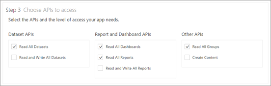

<properties
   pageTitle="Register an app to embed Power BI content"
   description="Learn how to register an application within Azure Active Directory for use with embedding Power BI content."
   services="powerbi"
   documentationCenter=""
   authors="guyinacube"
   manager="erikre"
   backup=""
   editor=""
   tags=""
   qualityFocus="no"
   qualityDate=""/>

<tags
   ms.service="powerbi"
   ms.devlang="NA"
   ms.topic="article"
   ms.tgt_pltfrm="NA"
   ms.workload="powerbi"
   ms.date="06/12/2017"
   ms.author="asaxton"/>

# Register an app to embed Power BI content

Learn how to register an application within Azure Active Directory (Azure AD) for use with embedding Power BI content.

You register your application with Azure AD to allow your application access to the Power BI REST APIs. This will allow you to establish an identity for your application and specify permissions to Power BI REST resources.

> [AZURE.IMPORTANT] Before you register a Power BI app you need an [Azure Active Directory tenant and an organizational user](powerbi-developer-create-an-azure-active-directory-tenant.md). If you haven't signed up for Power BI with a user in your tenant, the App registration will not complete successfully.

There are two ways to register your application. The first is with the Power BI App Registration Tool or you can do it directly within the Azure Portal. The Power BI App Registration Tool is the easiest option since there are just a few fields to fill in. If you want to make changes to your app, this can be done through the Azure Portal.

## Register with the Power BI App Registration Tool

You need to register your application in **Azure Active Directory** to establish an identity for your application and specify permissions to Power BI REST resources. When you register an application, such as a console app or a web site, you receive an identifier which is used by the application to identify themselves to the users that they are requesting permissions from.

Here's how to register your application with the Power BI App Registration Tool:

1. Go to [dev.powerbi.com/apps](https://dev.powerbi.com/apps).

2. Select **Sign in with your existing account**.

3. Provide an **App Name**.

4. The App type selection will depend on the type of application you are using.

    * Use **Server-side Web app** for web apps or web APIs.
    * Use **Native app** for apps that run on client devices. *You will also choose **Native app** if you are embedding content for non-Power BI users regardless of what the actual application is.*

5. Enter a value for **Redirect URL** and **Home Page URL**. Any valid URL will work.

    > [AZURE.NOTE] **Home Page URL** is only available if you choose **Server-side Web app** for the applciation type.

6. Choose the APIs that this application will have access to. For more information about Power BI access permissions, see [Power BI Permissions](powerbi-developer-power-bi-permissions.md).

    

7. Select **Register App**. 

    You will then be provided with a **Client ID**. If you selected **Server-side Web app**, you will also receive a **Client Secret**. These can be retrieved from the Azure portal, at a later time, if needed.

You can now used the registered application as part of your custom application to interact with the Power BI service.

## Register with the Azure portal

Your other option for registering your application is to do so directly in the Azure portal. To register your application, follow these steps.

1. Accept the [Microsoft Power BI API Terms](https://powerbi.microsoft.com/api-terms).

2. Sign into the [Azure portal](https://portal.azure.com).

3. Choose your Azure AD tenant by selecting your account in the top right corner of the page.

4. In the left-hand navigation pane, choose **More Services**, select **App Registrations**, and select **New application registration**.

    

5. Follow the prompts and create a new application.

    * For Web Applications, provide the Sign-On URL, which is the base URL of your app, where users can sign in e.g http://localhost:12345.
    * For Native Applications, provide a Redirect URI, which Azure AD uses to return token responses. Enter a value specific to your application, .e.g http://MyFirstAADApp

For more information about how to register applications in Azure Active Directory, see [Integrating applications with Azure Active Directory](https://docs.microsoft.com/azure/active-directory/develop/active-directory-integrating-applications)

## How to get the client id

When you register an application, you receive a **Client ID**.  The **Client ID** is used by the application to identify themselves to the users that they are requesting permissions from.

Here's how to get a client id:

1. Sign into the [Azure portal](https://portal.azure.com).

2. Choose your Azure AD tenant by selecting your account in the top right corner of the page.

3. In the left-hand navigation pane, choose **More Services** and select **App Registrations**.

4. Select the application that you want to retrieve the client id for.

5. You will see **Application ID** listed with a GUID. This is the client id for the application.

## Next steps

[Embedding with Power BI](powerbi-developer-embedding.md)  
[How to embed your Power BI dashboards, reports and tiles](powerbi-developer-embedding-content.md)  
[Power BI permissions](powerbi-developer-power-bi-permissions.md)  
[Create an Azure Active Directory tenant](powerbi-developer-create-an-azure-active-directory-tenant.md)  

More questions? [Try asking the Power BI Community](http://community.powerbi.com/)