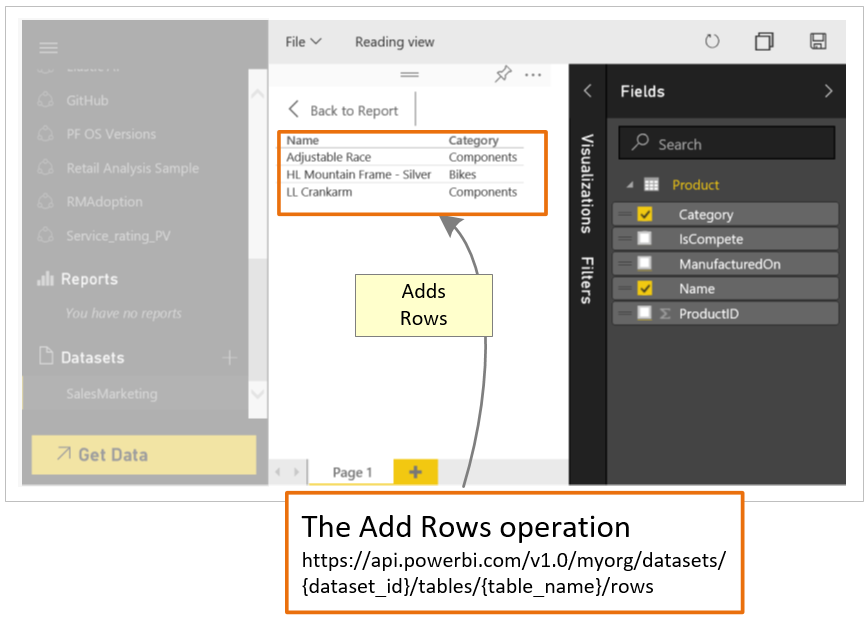

<properties
   pageTitle="Walkthrough to push data - Add rows to a Power BI table"
   description="Walkthrough to push data - Add rows to a Power BI table"
   services="powerbi"
   documentationCenter=""
   authors="dvana"
   manager="mblythe"
   editor=""
   tags=""/>

<tags
   ms.service="powerbi"
   ms.devlang="NA"
   ms.topic="get-started-article"
   ms.tgt_pltfrm="NA"
   ms.workload="powerbi"
   ms.date="02/21/2016"
   ms.author="derrickv"/>

<a name="push_step5"/>
# Step 5 - [Walkthrough to push data](powerbi-developer-walkthrough-to-push-data.md) > Add rows to a Power BI table

In **step 4** of Walkthrough to push data, [Get a dataset to add rows into a Power BI table](powerbi-developer-walkthrough-push-data-get-datasets.md), you used the [Get Datasets](https://msdn.microsoft.com/library/mt203567.aspx) operation and Newtonsoft.Json to get a dataset id. In this step, you use the dataset id with the [Add Rows](https://msdn.microsoft.com/library/mt203561.aspx) operation to add rows to a Power BI dataset.

When you call the [Add Rows](https://msdn.microsoft.com/library/mt203561.aspx) operation, you add rows to a dataset in your dashboard.

Here's how to add rows to a dataset using the Power BI API.

**NOTE**
Before you get started, make sure to [setup your app environment in Azure Active Directory (Azure AD)](powerbi-developer-what-you-need-to-create-an-app.md).

1. In Program.cs, add the code below.
2. Run the Console App, and login to your Power BI account. You should see **Rows Added** in the Console Window. You can also login to your Power BI dashboard to see the rows added to the dataset.

** Sample push data into a dashboard **

Add this code into Program.cs.

- In static void Main(string[] args):

       {
         ...

         //Add rows to a Power BI table
         AddRows(datasetId, "Product");
       }

- Add an AddRows() method:

      #region Add rows to a Power BI table
      private static void AddRows(string datasetId, string tableName)
      {
          string powerBIApiAddRowsUrl = String.Format("https://api.powerbi.com/v1.0/myorg/datasets/{0}/tables/{1}/rows", datasetId, tableName);

          //POST web request to add rows.
          //To add rows to a dataset in a group, use the Groups uri: https://api.powerbi.com/v1.0/myorg/groups/{group_id}/datasets/{dataset_id}/tables/{table_name}/rows
          //Change request method to "POST"
          HttpWebRequest request = System.Net.WebRequest.Create(powerBIApiAddRowsUrl) as System.Net.HttpWebRequest;
          request.KeepAlive = true;
          request.Method = "POST";
          request.ContentLength = 0;
          request.ContentType = "application/json";

          //Add token to the request header
          request.Headers.Add("Authorization", String.Format("Bearer {0}", token));

          //JSON content for product row
          string rowsJson = "{\"rows\":" +
              "[{\"ProductID\":1,\"Name\":\"Adjustable Race\",\"Category\":\"Components\",\"IsCompete\":true,\"ManufacturedOn\":\"07/30/2014\"}," +
              "{\"ProductID\":2,\"Name\":\"LL Crankarm\",\"Category\":\"Components\",\"IsCompete\":true,\"ManufacturedOn\":\"07/30/2014\"}," +
              "{\"ProductID\":3,\"Name\":\"HL Mountain Frame - Silver\",\"Category\":\"Bikes\",\"IsCompete\":true,\"ManufacturedOn\":\"07/30/2014\"}]}";

          //POST web request
          byte[] byteArray = System.Text.Encoding.UTF8.GetBytes(rowsJson);
          request.ContentLength = byteArray.Length;

          //Write JSON byte[] into a Stream
          using (Stream writer = request.GetRequestStream())
          {
              writer.Write(byteArray, 0, byteArray.Length);

              var response = (HttpWebResponse)request.GetResponse();

              Console.WriteLine("Rows Added");

              Console.ReadLine();
          }
      }

      #endregion

## See also
- [What you need to create an app](powerbi-developer-what-you-need-to-create-an-app.md)
- [Add Rows](https://msdn.microsoft.com/library/mt203561.aspx)
- [Power BI REST API reference](https://msdn.microsoft.com/library/mt147898.aspx)
- [Overview of Power BI REST API](powerbi-developer-overview-of-power-bi-rest-api.md)
