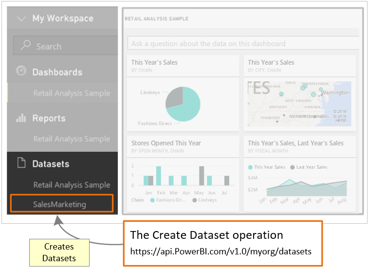

<properties
   pageTitle="Walkthrough - Push data into a dashboard - Create a dataset in a Power BI dashboard"
   description="Walkthrough - Push data into a dashboard - Create a dataset in a Power BI dashboard"
   services="powerbi"
   documentationCenter=""
   authors="dvana"
   manager="mblythe"
   editor=""
   tags=""/>

<tags
   ms.service="powerbi"
   ms.devlang="NA"
   ms.topic="get-started-article"
   ms.tgt_pltfrm="NA"
   ms.workload="powerbi"
   ms.date="02/21/2016"
   ms.author="derrickv"/>

# Step 3 - [Walkthrough - Push data into a dashboard](powerbi-developer-walkthrough-to-push-data.md) > Create a dataset in a Power BI dashboard

In **step 2** of Walkthrough - Push data into a dashboard, [Get an authentication access token](powerbi-developer-walkthrough-push-data-get-token.md), you got a token to authenticate to **Azure AD**. In this step, you use the token to call the [Create Dataset](https://msdn.microsoft.com/library/mt203562.aspx) operation.

To make a call to a REST resource, you use a url that locates the resource, and you send a JavaScript Object Notation (JSON) string, which describes the dataset, to the Power BI service resource. A REST resource identifies the part of the Power BI service you want to work with. To push data into the dashboard, the target resource is a **Dashboard Dataset**. The URL that identifies a dataset is https://api.PowerBI.com/v1.0/myorg/datasets. If you are pushing data within a group, the url is https://api.PowerBI.com/v1.0/myorg/groups/{group_id}/datasets.

To authenticate a Power BI REST operation, you add the token you got in [Get an authentication access token](powerbi-developer-walkthrough-push-data-get-token.md) to a request header:

    //Add token to the request header
    request.Headers.Add("Authorization", String.Format("Bearer {0}", token));

When you call the [Create Dataset](https://msdn.microsoft.com/library/mt203562.aspx) operation, a new dataset is created in your dashboard.

Here's how to push data into a dashboard using the Power BI API.

**NOTE**
Before you get started, make sure to [setup your app environment in Azure Active Directory (Azure AD)](powerbi-developer-what-you-need-to-create-an-app.md).

1. In the Console Application project you created in [Step 2 - Get an authentication access token](powerbi-developer-walkthrough-push-data-get-token.md), add **using System.Net**, and **using System.IO** to Program.cs.
2. In Program.cs, add the code below.
3. Run the Console App, and login to your Power BI account. You should see **Dataset Created** in the Console Window. Also, login to your dashboard, and you should see the new dataset.

** Sample push data into a dashboard **

Add this code into Program.cs.

- In static void Main(string[] args):

     {
       ...

       //Create a dataset in a Power BI dashboard
       CreateDataset();
     }

- Add a CreateDataset() method:

      #region Create a dataset in a Power BI dashboard
      private static void CreateDataset()
      {
          //TODO: Add using System.Net and using System.IO

          //Push data into a Power BI dashboard

          string powerBIDatasetsApiUrl = "https://api.powerbi.com/v1.0/myorg/datasets";
          //POST web request to create a dataset.
          //To create a Dataset in a group, use the Groups uri: https://api.PowerBI.com/v1.0/myorg/groups/{group_id}/datasets
          HttpWebRequest request = System.Net.WebRequest.Create(powerBIDatasetsApiUrl) as System.Net.HttpWebRequest;
          request.KeepAlive = true;
          request.Method = "POST";
          request.ContentLength = 0;
          request.ContentType = "application/json";

          //Add token to the request header
          request.Headers.Add("Authorization", String.Format("Bearer {0}", token));

          //Create dataset JSON for POST request
          string datasetJson = "{\"name\": \"SalesMarketing\", \"tables\": " +
              "[{\"name\": \"Product\", \"columns\": " +
              "[{ \"name\": \"ProductID\", \"dataType\": \"Int64\"}, " +
              "{ \"name\": \"Name\", \"dataType\": \"string\"}, " +
              "{ \"name\": \"Category\", \"dataType\": \"string\"}," +
              "{ \"name\": \"IsCompete\", \"dataType\": \"bool\"}," +
              "{ \"name\": \"ManufacturedOn\", \"dataType\": \"DateTime\"}" +
              "]}]}";

          //POST web request
          byte[] byteArray = System.Text.Encoding.UTF8.GetBytes(datasetJson);
          request.ContentLength = byteArray.Length;

          //Write JSON byte[] into a Stream
          using (Stream writer = request.GetRequestStream())
          {
              writer.Write(byteArray, 0, byteArray.Length);

              var response = (HttpWebResponse)request.GetResponse();

              Console.WriteLine(string.Format("Dataset {0}", response.StatusCode.ToString()));

              Console.ReadLine();
          }
      }
      #endregion

The [next step](powerbi-developer-walkthrough-push-data-get-datasets.md) shows you how to get a dataset to add rows into a Power BI table.

## See also
- [What you need to create an app](powerbi-developer-what-you-need-to-create-an-app.md)
- [Get an authentication access token](powerbi-developer-walkthrough-push-data-get-token.md)
- [Create Dataset](https://msdn.microsoft.com/library/mt203562.aspx)
- [Power BI REST API reference](https://msdn.microsoft.com/library/mt147898.aspx)
- [Overview of Power BI REST API](powerbi-developer-overview-of-power-bi-rest-api.md)
