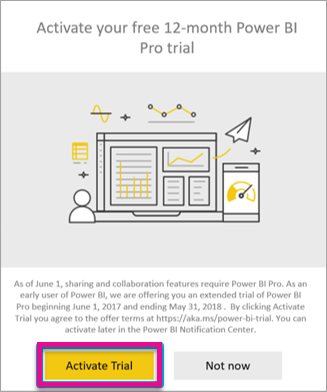
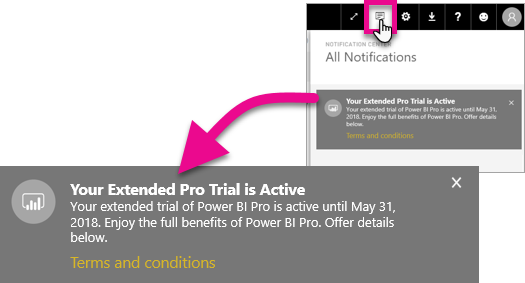

<properties
   pageTitle="Extended Pro Trial activation"
   description="Starting on June 1, 2017, all eligible users will be able to opt-in to the Extended Pro Trial for the Power BI service."
   services="powerbi"
   documentationCenter=""
   authors="guyinacube"
   manager="erikre"
   backup=""
   editor=""
   tags=""
   qualityFocus="no"
   qualityDate=""/>

<tags
   ms.service="powerbi"
   ms.devlang="NA"
   ms.topic="article"
   ms.tgt_pltfrm="NA"
   ms.workload="powerbi"
   ms.date="05/26/2017"
   ms.author="asaxton"/>

# Extended Pro Trial activation

Starting on June 1, 2017, all eligible users will be able to opt-in to the Extended Pro Trial for the Power BI service.

While the free service is intended for personal use and Power BI Pro enables collaboration, we’ve received feedback that functional differences between them have created confusion for users. Going forward, we will improve free to have the same functionality as Power BI Pro, but will restrict sharing and collaboration features to only Power BI Pro users. Free users will benefit from access to all data sources, higher workspace storage limits, and higher refresh and streaming rates. These changes will be effective June 1, 2017.

For existing users of the free service who have been active within the past year, we’re offering a free, 12-month extended trial of Power BI Pro. The offer will let you take advantage of the full capabilities of Power BI Pro for the next year as a sign of our appreciation for your continued support. Using the trial will also give you time to adjust how you use the service. The extended Power BI Pro trial will be available beginning June 1. Watch for an email from us, and check your notifications the next time you sign into the service for instructions on how to access the offer. Please also refer to the full [ terms and conditions](https://aka.ms/power-bi-trial) for details. 

## Eligibility for Extended Pro Trial

Your account must meet the following requirements in order to be eligible for the Extended Pro Trial offer.

* Power BI free users active between May 3, 2016 and May 2, 2017 are eligible for an Extended Pro Trial.
* The Extended Pro Trial runs through May 31, 2018 for all eligible users.
* Users that have previously used or are currently on the *60-day in-product Pro trial* are still eligible for the Extended Pro Trial.

> [AZURE.NOTE] Users that have licenses assigned from the Power BI Pro or Power BI Pro Trial subscriptions, within Office 365, are excluded from this offer.

## How to activate

There are two ways to activate the Extended Pro Trial. The first is when you sign into Power BI. If you had dismissed that, you will also see an option within the notification area.

> [AZURE.NOTE] The in product communications are not controlled by the admin and will go out to eligible users.

### Experience at sign in

When you sign in to the Power BI service, and are eligible, you will get a pop-up notice. Selecting **Activate Trial** will begin the Extended Pro Trial. No further action will be needed.

You will then have the ability to access all existing shared dashboards and reports for the duration of the trial.

If you selected **Not Now**, the Extended Pro Trial can be activated any time until the end of the trial period on May 31, 2018.

### Activation at a later date

If you dismissed the pop-up by selecting **Not Now**, the Extended Pro Trial can be activated any time until the end of the trial period on May 31, 2018. This can be done in the **Notification center**.

Within the notification center, you will see a notification regarding the Extended Pro Trial. The notification will be available until the user dismisses it.

Within the notification, you can select **Activate Trial** to begin the trial. No further action will be needed.

You will then have the ability to access all existing shared dashboards and reports for the duration of the trial.

## After activation

After activation, you will receive a confirmation in the **Notification center**. This is just a notification message and no action is needed on your part. There will be up to a 2 day lag on receiving this notification.

This notification will have a link to the [Extended Pro Trial offer terms and conditions](https://aka.ms/power-bi-trial).

## Frequently Asked Questions

**What happens to new users who signed up after May 3, 2017?**

Users who signed up to Power BI (free) on or after May 3, 2017 are not eligible for the Extended Pro Trial. However, they are eligible for the standard 60-day Pro Trial.

**How do I find out who in my organization is eligible for the Extended Pro Trial?**

You can view th4e Azure Active Directory Integrated Applications report for Power BI to see who are active users within your organization. Those active users in the eligibility period, and who are on free licenses, will receive the pop-up notification. For more information, see [Find Power BI users that have signed in](powerbi-admin-access-usage.md).

## Next steps

[Extended Pro Trial offer terms and conditions](https://aka.ms/power-bi-trial)  
[Power BI Premium announcement](https://aka.ms/pbipremium-announcement)  

More questions? [Try asking the Power BI Community](https://community.powerbi.com/)
