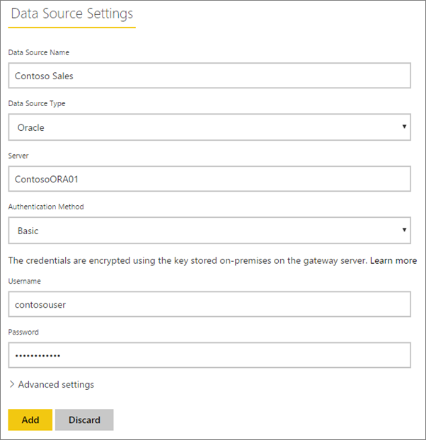

<properties
pageTitle="Manage your enterprise data source - Import/Scheduled Refresh"
description="How to manage the enterprise gateway and data sources that belong to that gateway. This article is specific to data sources that can be used with import/scheduled refresh."
services="powerbi"
documentationCenter=""
authors="guyinacube"
manager="mblythe"
backup=""
editor=""
tags=""
qualityFocus="monitoring"
qualityDate="05/12/2016"/>

<tags
ms.service="powerbi"
ms.devlang="NA"
ms.topic="article"
ms.tgt_pltfrm="na"
ms.workload="powerbi"
ms.date="05/12/2016"
ms.author="asaxton"/>
# Manage your enterprise data source - Import/Scheduled Refresh

Once you have installed the Power BI Gateway - Enterprise, you will need to add data sources that can be used with the gateway. This article will look at how to work with gateways and data sources that are used for scheduled refresh as opposed to DirectQuery or live connections.

## Add a gateway

To add a Gateway, simply [download](https://go.microsoft.com/fwlink/?LinkId=698863) and install the enterprise gateway on a server in your environment. After you have installed the gateway, it will show in the lists of gateways under **Manage gateways**.

> NOTE: **Manage gateways** will not show up until you are the admin of at least one gateway. This can happen either by being added as an admin or you installing and configuring a gateway.

## Remove a gateway

Removing a gateway will also delete any data sources under that gateway.  This will also break any dashboards and reports that rely on those data sources.

1.	Select the gear icon  in the upper-right corner > **Manage gateways**.

2.	Gateway > **Remove**

    

## Add a data source

You can add a data source by either selecting a gateway and click **Add data source**, or go to Gateway > **Add data source**.

You can then select the **Data Source Type** from the list. All of the data sources listed can be used for scheduled refresh with the enterprise gateway. Analysis Services, SQL Server and SAP HANA can be used for either scheduled refresh, or DirectQuery/live connections.

You will then want to fill in the information for the data source which includes the source information and credentials used to access the data source.

> NOTE: Access to the data source will be made using these credentials. [Learn more](powerbi-gateway-enterprise.md#credentials)

You can click **Add** after you have everything filled in.  You can now use this data source for scheduled refresh with your on-premises data. You will see *Connection Successful* if it succeeded.

### List of available data source types

The following data sources are available for scheduled refresh.

- SQL Server
- Analysis Services
- SAP HANA
- File
- Folder
- Oracle
- Teradata
- SharePoint list (on-premises)

### Advanced settings

You can configure the privacy level for your data source. This controls how data can be mashed up. This is only used for scheduled refresh. [Learn more](https://support.office.com/article/Privacy-levels-Power-Query-CC3EDE4D-359E-4B28-BC72-9BEE7900B540)

## Remove a data source

Removing a data source will break any dashboards or reports that rely on the given data source.  

To remove a Data Source, go to the Data Source > **Remove**.

## Manage administrators

On the Administrators tab, for the gateway, you can add, and remove, users that can administer the gateway. You can only add users at this time. Security groups cannot be added.

## Manage users

On the Users tab, for the data source, you can add, and remove, users, or security groups, that can use this data source.

> NOTE: The users list only controls who are allowed to publish reports. The report owners can create dashboards, or content packs, and share those with other users.

## Using the data source for scheduled refresh

After you have created the data source, it will be available to use with either DirectQuery connections, or through scheduled refresh. 

> **Note**: Server and database name have to match between Power BI Desktop and the data source within the enterprise gateway!

The link between your dataset and the data source within the enterprise gateway is based on your server name and database name. These have to match. For example, if you supply an IP Address for the server name, within Power BI Desktop, you will need to use the IP Address for the data source within the enterprise gateway configuration. If you use *SERVER\INSTANCE*, in Power BI Desktop, you will need to use the same within the data source configured for the enterprise gateway.

If you are listed in the **Users** tab of the data source configured within the enterprise gateway, and the server and database name match, you will see the enterprise gateway as an option to use with scheduled refresh.

## See Also

[Power BI Gateway – Enterprise](powerbi-gateway-enterprise.md)

[Power BI Gateway - Enterprise in-depth](powerbi-gateway-enterprise-indepth.md)

[Troubleshooting the Power BI Gateway - Enterprise](powerbi-gateway-enterprise-tshoot.md)

[Tools for troubleshooting refresh issues](powerbi-refresh-tools-for-troubleshooting-issues.md)