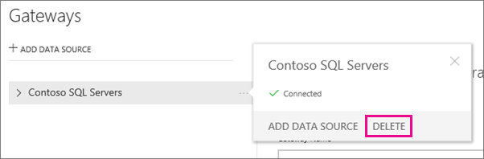
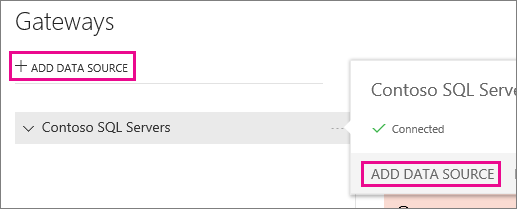
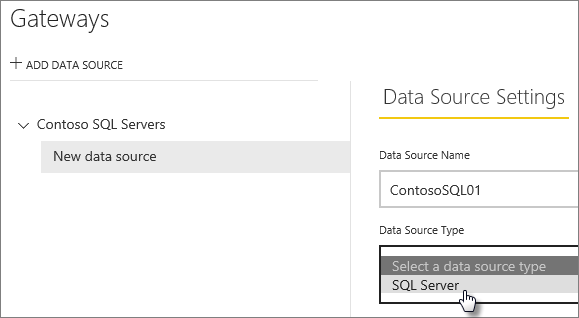
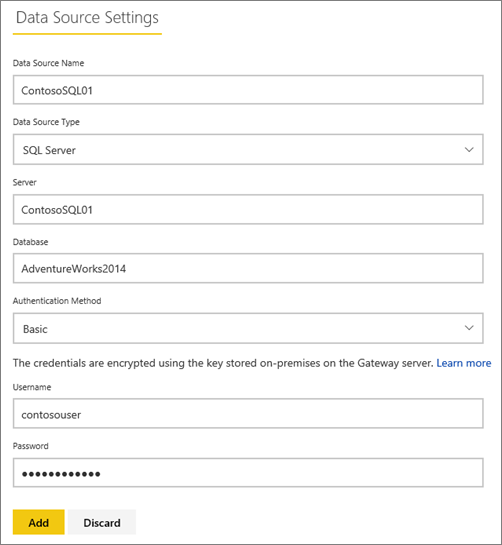
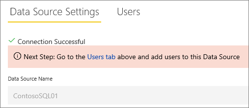
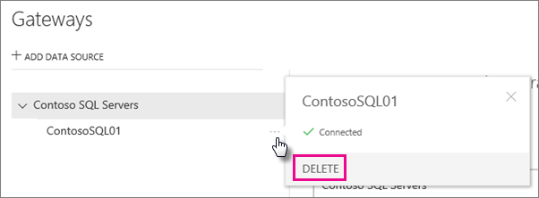

<properties
pageTitle="Manage your enterprise data source - SQL"
description="How to manage the enterprise gateway and data sources that belong to that gateway."
services="powerbi"
documentationCenter=""
authors="guyinacube"
manager="mblythe"
editor=""/>

<tags
ms.service="powerbi"
ms.devlang="NA"
ms.topic="article"
ms.tgt_pltfrm="na"
ms.workload="powerbi"
ms.date="12/01/2015"
ms.author="asaxton"/>
# Manage your enterprise data source - SQL Server

Once you have installed the Power BI Gateway - Enterprise (Preview), you will need to add data sources that can be used with the gateway. This article will look at how to work with gateways and data sources.

## Add a gateway

To add a Gateway, simply [download](https://go.microsoft.com/fwlink/?LinkId=698863) and install the enterprise gateway on a server in your environment. After you have installed the gateway, it will show in the lists of gateways under **Manage gateways**.

## Delete a gateway

Deleting a gateway will also delete any data sources under that gateway.  This will also break any dashboards and reports that rely on those data sources.

1.	Select the gear icon  in the upper-right corner > **Manage gateways**.

2.	Gateway > **Delete**

    

## Add a data source

You can add a data source by either selecting a gateway and click **Add data source**, or go to Gateway > **Add data source**.

You can then select the **Data Source Type** from the list. Currently, only SQL Server is available.

You will then want to fill in the information for the data source which includes the **Server** and the **Database**.  

You will also need to choose an **Authentication Method**.  This can either be **Windows** or **Basic**.  You would want to choose **Basic** if you are going to use SQL Authentication instead of Windows Authentication. Then enter the credentials that will be used for this data source.

> NOTE: All queries to the data source will run using these credentials. [Learn more](powerbi-gateway-enterprise.md#credentials)

You can click **Add** after you have everything filled in.  You can now use this data source for DirectQuery against a SQL Server that is on-premises. You will see *Connection Successful* if it succeeded.

## Delete a data source

Deleting a data source will break any dashboards or reports that rely on the given data source.  

To delete a Data Source, go to the Data Source > **Delete**.

## Manage administrators

On the Administrators tab, for the gateway, you can add, and remove, users that can administer the gateway. You can only add users at this time. Security groups cannot be added.

## Manage users

On the Users tab, for the data source, you can add, and remove, users that can use this gateway. You can only add users at this time. Security groups cannot be added.

## See Also

[Power BI Gateway – Enterprise (Preview)](powerbi-gateway-enterprise.md)

[Troubleshooting the Power BI Gateway - Enterprise (Preview)](powerbi-gateway-enterprise-tshoot.md)

[Tools for troubleshooting refresh issues](powerbi-refresh-tools-for-troubleshooting-issues.md)