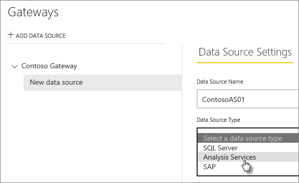
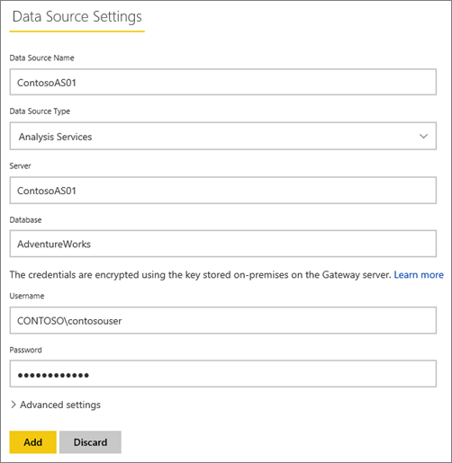

<properties
pageTitle="Manage your enterprise data source - Analysis Services"
description="How to manage the enterprise gateway and data sources that belong to that gateway. This is for Analysis Services in both Multidimensional and Tabular mode."
services="powerbi"
documentationCenter=""
authors="guyinacube"
manager="mblythe"
editor=""/>

<tags
ms.service="powerbi"
ms.devlang="NA"
ms.topic="article"
ms.tgt_pltfrm="na"
ms.workload="powerbi"
ms.date="02/09/2016"
ms.author="asaxton"/>
# Manage your enterprise data source - Analysis Services

Once you have installed the Power BI Gateway - Enterprise, you will need to add data sources that can be used with the gateway. This article will look at how to work with gateways and data sources. You can use the Analysis Services data source either for scheduled refresh or for live connections.

## Add a gateway

To add a Gateway, simply [download](https://go.microsoft.com/fwlink/?LinkId=698863) and install the enterprise gateway on a server in your environment. After you have installed the gateway, it will show in the lists of gateways under **Manage gateways**.

> NOTE: **Manage gateways** will not show up until you are the admin of at least one gateway. This can happen either by being added as an admin or you installing and configuring a gateway.

## Remove a gateway

Removing a gateway will also delete any data sources under that gateway.  This will also break any dashboards and reports that rely on those data sources.

1.	Select the gear icon  in the upper-right corner > **Manage gateways**.

2.	Gateway > **Remove**

    

## Add a data source

You can add a data source by either selecting a gateway and click **Add data source**, or go to Gateway > **Add data source**.

You can then select the **Data Source Type** from the list. Select Analysis Services if you are connecting to either a Multidimensional or Tabular server.

You will then want to fill in the information for the data source which includes the **Server** and the **Database**.  

The **Username** and **Password** that you enter will be used by the gateway to connect to the Analysis Services instance. 

> NOTE: The Windows account you enter must have Server Administrator permissions for the instance you are connecting to. If this account’s password is set to expire, users could get a connection error if the password isn’t updated for the data source. [Learn more](powerbi-gateway-enterprise.md#credentials)

You can click **Add** after you have everything filled in.  You can now use this data source for scheduled refresh, or live connections, against an Analysis Services instance that is on premises.  You will see *Connection Successful* if it succeeded.

### Advanced settings

You can configure the privacy level for your data source. This controls how data can be mashed up. This is only used for scheduled refresh. It does not apply to live connections. [Learn more](https://support.office.com/article/Privacy-levels-Power-Query-CC3EDE4D-359E-4B28-BC72-9BEE7900B540)

## 'Get Data' experience for Analysis Services in Power BI site

We haven’t yet integrated data sources from the enterprise gateway into the *Get Data* experience for Analysis Services from Power BI web. This will be coming soon.

To make use of data sources for Analysis Services, you can create a report within Power BI Desktop. Be sure that you select live data for Analysis Services. Then publish it to Power BI and it will make use of the enterprise gateway.

### Usernames with Analysis Services

Each time a user interacts with a report connected to Analysis Services, the effective username is passed to the gateway and then onto your on-premises Analysis Services server. The email address, that you sign into Power BI with, is what we will pass to Analysis Services as the effective user. This is passed in the connection property [EffectiveUserName](https://msdn.microsoft.com/library/dn140245.aspx#bkmk_auth). This email address should match a defined UPN within the local Active Directory Domain. The UPN is a property of an Active Directory account. That Windows account then needs to be present in an Analysis Services role. If a match cannot be found, in Active Directory, the login will not be successful. [Learn more](https://msdn.microsoft.com/library/ms677605.aspx)

## Remove a data source

Removing a data source will break any dashboards or reports that rely on the given data source.  

To remove a Data Source, go to the Data Source > **Remove**.

## Manage administrators

On the Administrators tab, for the gateway, you can add, and remove, users that can administer the gateway. You can only add users at this time. Security groups cannot be added.

## Manage users

On the Users tab, for the data source, you can add, and remove, users, or security groups, that can use this data source.

> NOTE: The users list only controls who are allowed to publish reports. The report owners can create dashboards, or content packs, and share those with other users.

## See Also

[Power BI Gateway – Enterprise](powerbi-gateway-enterprise.md)

[Power BI Gateway - Enterprise in-depth](powerbi-gateway-enterprise-indepth.md)

[Upgrading the Analysis Services Connector to the Power BI Gateway - Enterprise](powerbi-gateway-enterprise-upgrade-as-connector.md)

[Troubleshooting the Power BI Gateway - Enterprise](powerbi-gateway-enterprise-tshoot.md)

[Tools for troubleshooting refresh issues](powerbi-refresh-tools-for-troubleshooting-issues.md)