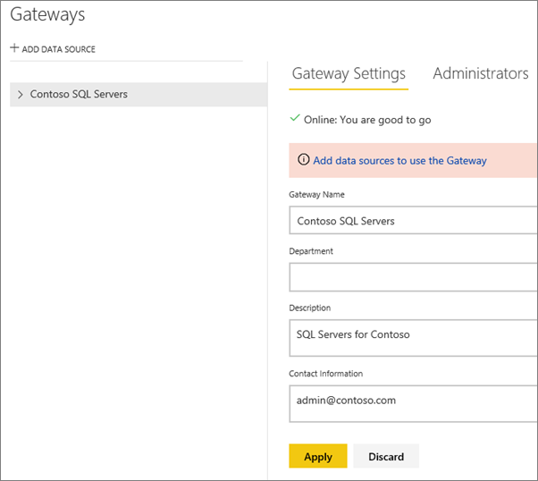

<properties
pageTitle="Power BI Gateway - Enterprise"
description="Description and setup for the Power BI Gateway - Enterprise"
services="powerbi"
documentationCenter=""
authors="guyinacube"
manager="mblythe"
editor=""
tags=""
qualityFocus="no"
qualityDate=""/>

<tags
ms.service="powerbi"
ms.devlang="NA"
ms.topic="article"
ms.tgt_pltfrm="na"
ms.workload="powerbi"
ms.date="02/19/2016"
ms.author="asaxton"/>
# Power BI Gateway - Enterprise

The Power BI Gateway - Enterprise enables IT departments to deploy and manage central gateways to serve a large group of users. It is the successor to the Data Management Gateway in Power BI for Office 365. Instead of each employee installing and configuring a Power BI Gateway - Personal, IT can configure, manage and maintain a group of gateways to transparently refresh data uploaded to Power BI for users requiring up-to-date data. 

With the enterprise gateway, IT can centrally manage the set of users who have access to the underlying data sources. IT departments can gain visibility into gateway usage, such as most commonly accessed data sources, and the users accessing them.

Anyone can install or manage an enterprise gateway. However, to view content that makes use of the gateway is only available with a [Power BI Pro](powerbi-power-bi-pro-content-what-is-it.md) subscription. While you can install this gateway on any machine, it is intended to be installed on a server within your organization.  It installs and runs as a windows service.

Data transfer between the Power BI service and the gateway is secured through [Azure Service Bus](https://azure.microsoft.com/en-us/documentation/services/service-bus/). The Service Bus creates a secure channel between the Power BI service and your computer.  Because the gateway starts this secure connection, there’s usually no need to open a port in your firewall because it is an outbound connection.

For more detailed information about how the connector works, be sure to see [Power BI Gateway - Enterprise in-depth](powerbi-gateway-enterprise-indepth.md).

Before we go into details about the enterprise gateway, let’s look at some terms used in Power BI:

A *dataset* is data uploaded into the Power BI service from an online or on-premises data source. You create a dataset when you use Get Data to connect to and upload data. Datasets appear in the left navigation pane. When you create reports and pin tiles to your dashboards, you’re looking at data from your datasets.

A *data source* is where the data actually comes from. It can be just about anything; a database, Excel worksheet, Web service, etc. With Excel workbooks, you can create a simple worksheet with rows of data, and that is considered a data source. You can also use Power Query or Power Pivot in Excel to connect to and query data from both online and on-premises data sources, all in the same workbook. With Power BI Desktop, you use Get Data to connect to and query data from both online and on-premises data sources.

The *gateway* is different from a *data source*. The gateway is more of the proxy between on-premises and the cloud. When you configure a data source for a gateway, you are providing the connection information that the gateway will use to connect to the data source.  An example of a data source would be a SQL Server deployed in your on-premises environment.

*DirectQuery* always gets the latest data using the credentials that were setup for the Data Source by the Gateway Admin.

## Do I need the Power BI Gateway - Enterprise?

Before you install the gateway, it’s important to know whether or not use you really need it.  It really depends on your data source and your organization needs.

The gateway allows for the use of DirectQuery to an on-premises SQL Server or SAP HANA, as well as a live connection to Analysis Services. You can use a live connection to either a tabular or multidimensional model in Analysis Services. The enterprise gateway can also be used with scheduled refresh for data that you have imported into Power BI.

### List of available data source types

The following data sources are available for scheduled refresh.

- SQL Server
- Analysis Services
- SAP HANA
- File
- Folder
- Oracle
- Teradata
- SharePoint list (on-premises)

## Setting up the Power BI Gateway - Enterprise for the first time

Setting up a gateway for the first time is a three step process.

1.	[Download and install the gateway](#download-and-install-the-power-bi-gateway---enterprise)

2.	[Configure the gateway on the server it was installed to](#configure-the-gateway)

3.	[Manage the gateway](#manage-the-power-bi-gateway---enterprise)

## Download and install the Power BI Gateway - Enterprise

To download the gateway, click on Power BI gateways under the Downloads menu. Download the Power BI Gateway – Enterprise.

It is recommended that you install this gateway on a server that is running the data source you will be connecting to. While you can install it on a different machine, you reduce potential network latency by having it on the same machine.

There’s really not much to installing a gateway. You’ll select a location to install to, and read and agree to the license agreement. 

> **Note**: The enterprise and personal gateways can be installed on the same machine. You can also install on either Windows Server or desktop.

> **Note**: Installing the enterprise gateway on a domain controller is not supported.

## Configure the gateway
After you install the gateway, it will prompt you to sign in to Power BI.  

After you sign in, you will need to provide some information about the gateway. This includes a **name**, **description** and a **recovery key**. The **recovery key** is used to recover a gateway if needed. Be sure to document what the key is and keep that in a safe place.

Selecting **Configure** will register the gateway with the Power BI Service for your account. After it is configured, you can select **Close & Add Data Sources** to go to the Power BI service.

## Manage the Power BI Gateway - Enterprise

You can manage the gateway by going to the Power BI service and selecting the gear icon  in the upper-right corner > **Manage gateways**. From here you can delete gateways that you are an administrator for. 

> **Note**: **Manage gateways** will not show up until you are the admin of at least one gateway. This can happen either by being added as an admin or you installing and configuring a gateway.

You can review the information you supplied during install. You can also add a data source by selecting **Add data source**.

[Learn more](powerbi-gateway-enterprise-manage-sql.md) about managing your gateway for SQL Server.

<a name="credentials">
## Storing encrypted credentials in the cloud

When you add a data source to the gateway, you need to provide credentials for that data source. All queries to the data source will run using these credentials. The credentials are encrypted securely, using asymmetric encryption so that they cannot be decrypted in the cloud, before they are stored in the cloud. The credentials are sent to the machine, running the gateway, on-premises where they are decrypted when the data sources are accessed.

## Service account
The gateway is configured to use *NT SERVICE\PBIEgwService* for the windows service log on credential. By default, it has the right of *Log on as a service*.

## Ports
The gateway creates an outbound connection to Azure Service Bus. It communicates on outbound ports: TCP 443 (default), 5671, 5672, 9350 thru 9354.  The gateway does not require inbound ports. [Learn more](https://azure.microsoft.com/documentation/articles/service-bus-fundamentals-hybrid-solutions/)

|Domain names|Outbound ports|Description|
|---|---|---|
|*.powerbi.com|443|HTTPS|
|*.analysis.windows.net|443|HTTPS|
|*.login.windows.net|443|HTTPS|
|*.servicebus.windows.net|5671-5672|Advanced Message Queuing Protocol (AMQP)|
|*.servicebus.windows.net|443, 9350-9354|Listeners on Service Bus Relay over TCP (requires 443 for Access Control token acquisition)|
|*.frontend.clouddatahub.net|443|HTTPS|
|*.core.windows.net|443|HTTPS|
|login.microsoftonline.com|443|HTTPS|
|login.windows.net|443|HTTPS|

If you need to white list IP addresses instead of the domains, you can download and use the Microsoft Azure Datacenter IP ranges list. [Download](https://www.microsoft.com/download/details.aspx?id=41653)

## Troubleshooting
If you’re having trouble when installing and configuring a gateway, be sure to see [Troubleshooting the Power BI Gateway - Enterprise].

## See also

[Manage your enterprise data source - Analysis Services](powerbi-gateway-enterprise-manage-ssas.md)

[Manage your enterprise data source - SAP HANA](powerbi-gateway-enterprise-manage-sap.md)

[Manage your enterprise data source - SQL Server](powerbi-gateway-enterprise-manage-sql.md)

[Manage your enterprise data source - Import/Scheduled refresh](powerbi-gateway-enterprise-manage-scheduled-refresh.md)

[Power BI Gateway - Enterprise in-depth](powerbi-gateway-enterprise-indepth.md)

[Upgrading the Analysis Services Connector to the Power BI Gateway - Enterprise](powerbi-gateway-enterprise-upgrade-as-connector.md)

[Troubleshooting the Power BI Gateway - Enterprise](powerbi-gateway-enterprise-tshoot.md)
