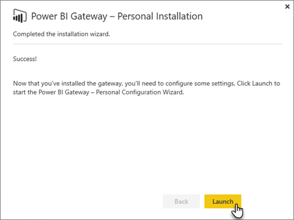
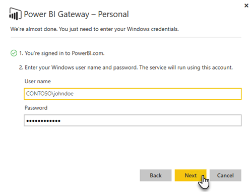

<properties
pageTitle="On-premises data gateway"
description="This is an overview of the On-premises data gateway for Power BI. You can use this gateway to work with DirectQuery data sources. You can also use this gateway to refresh cloud datasets with on-premises data."
services="powerbi"
documentationCenter=""
authors="guyinacube"
manager="mblythe"
backup=""
editor=""
tags=""
qualityFocus="no"
qualityDate=""/>

<tags
ms.service="powerbi"
ms.devlang="NA"
ms.topic="article"
ms.tgt_pltfrm="na"
ms.workload="powerbi"
ms.date="07/05/2016"
ms.author="asaxton"/>
# On-premises data gateway

The on-premises data gateway acts as a bridge, providing quick and secure data transfer between on-premises data (data that is not in the cloud) and the Power BI, Microsoft Flow, Logic Apps, and PowerApps services.

You can use a single gateway with different services at the same time. If you are using Power BI, as well as PowerApps, a single gateway and be used for both. It is dependent on the account you sign in with.

<!-- Shared Requirements Include -->
[AZURE.INCLUDE [gateway-onprem-requirements-include](../includes/gateway-onprem-requirements-include.md)]

### Limitations of Analysis Services live connections

You can use a live connection against tabular or multidimensional instances.

|**Server version**|**Required SKU**|
|---|---|
|2012 SP1 CU4 or later|Business Intelligence and Enterprise SKU|
|2014|Business Intelligence and Enterprise SKU|
|2016|Standard SKU or higher|

- Cell level Formatting and translation features are not supported.
- Actions and Named Sets are not exposed to Power BI, but you can still connect to multidimensional cubes that also contain Actions or Named sets and create visuals and reports.

## List of available data source types

|**Data source**|**Live/DirectQuery**|**User configured manual or scheduled refresh**|
|---|---|---|---|
|Analysis Services Tabular|Yes|Yes|
|Analysis Services Multidimensional|Yes|Yes|
|SQL Server|Yes|Yes|
|SAP HANA|Yes|Yes|
|Oracle|Yes|Yes|
|Teradata|Yes|Yes|
|File|No|Yes|
|Folder|No|Yes|
|SharePoint list (on-premises)|No|Yes|
|Web|No|Yes|
|OData|No|Yes|
|IBM DB2|No|Yes|
|MySQL|No|Yes|
|Sybase|No|Yes|
|SAP BW|No|Yes|
 
## Download and install the On-premises data gateway

To download the gateway, select **Data Gateway** under the Downloads menu. Download the [On-premises data gateway](https://go.microsoft.com/fwlink/?LinkId=698863).

<!-- Shared Install steps Include -->
[AZURE.INCLUDE [gateway-onprem-install-include](../includes/gateway-onprem-install-include.md)]

## Install the gateway in personal mode 

> **Note:** Personal will only work with Power BI.

After the personal gateway is installed, you will need to launch the **Power BI Gateway - Personal Configuration Wizard**.

You will then need to sign into Power BI to register the gateway with the cloud service.

You will also need to supply the windows user name and password that the windows service will run as. You can specify a different Windows account from your own. The gateway service will run using this account.

After the installation is complete, you will need to go to your datasets within Power BI and make sure credentials are entered for your on-premises data sources.

<!-- Shared Requirements Include -->
[AZURE.INCLUDE [gateway-onprem-requirements-include](../includes/gateway-onprem-accounts-ports-more.md)]

<!-- Shared Requirements Include -->
[AZURE.INCLUDE [gateway-onprem-requirements-include](../includes/gateway-onprem-how-it-works.md)]

## Troubleshooting

If you’re having trouble when installing and configuring a gateway, be sure to see [Troubleshooting the Power BI Gateway - Enterprise](powerbi-gateway-enterprise-tshoot.md). If you think you are having an issue with your firewall, see the [firewall or proxy](powerbi-gateway-enterprise-tshoot.md#firewall-or-proxy) section in the troubleshooting article.

If you think you are encountering proxy issues, with the gateway, see [Configuring proxy settings for the Power BI Gateways](powerbi-gateway-proxy.md).

## See also

[Manage your enterprise data source - Analysis Services](powerbi-gateway-enterprise-manage-ssas.md)

[Manage your enterprise data source - SAP HANA](powerbi-gateway-enterprise-manage-sap.md)

[Manage your enterprise data source - SQL Server](powerbi-gateway-enterprise-manage-sql.md)

[Manage your enterprise data source - Import/Scheduled refresh](powerbi-gateway-enterprise-manage-scheduled-refresh.md)

[On-premises Data Gateway in-depth](powerbi-gateway-onprem-indepth.md)

[Troubleshooting the On-premises Data Gateway](powerbi-gateway-onprem-tshoot.md)

[Configuring proxy settings for the On-Premises Data Gateway](powerbi-gateway-proxy.md)
