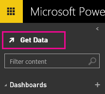

<properties 
        pageTitle="page title" 
        description="description" 
        services="powerbi" 
        documentationCenter="" 
        authors="mgblythe" />

# Getting Started with Power BI

Microsoft Power BI helps you stay up to date with the information that matters to you.  With Power BI, **dashboards** help you keep a finger on the pulse of your business.  Your dashboards display **tiles** that you can click to explore further with **reports**.  Connect to multiple **datasets** to bring all of the relevant data together in one place.

Need help understanding the building blocks that make up Power BI Preview?  See [Power BI Preview - Basic Concepts](). 

**Note**: This article is about the new Power BI Preview experience, rather than the current experience, Power BI for Office 365. Read more about [which Power BI experience is right for me]().

Prefer to watch instead of read?  Watch our getting started video:

[TODO: Add video]

## Step 1: Get data

[Sign in to Power BI](http://powerbi.microsoft.com). Don’t have an account? You can try out the [new Power BI Preview for free](http://powerbi.microsoft.com).

If you have important data in an Excel spreadsheet on your computer, you can create a Power BI dashboard to stay informed anywhere and share with others.  Are you a Salesforce user?  Get a head start by [connecting to Salesforce]() to automatically create a dashboard from that data.

1. Click the **plus** sign  next to Dashboards to create a new dashboard.

2. Give your dashboard a name and press Enter to create it.
3. Click the **Get data** icon.

4. The default option is to get data from an Excel spreadsheet.  Click **Connect** to continue.
5. Click **Browse** to find the Excel spreadsheet that contains the data you want on your dashboard, then click OK. *Want to continue this tutorial with sample data? [Download this sample Excel spreadsheet](http://go.microsoft.com/fwlink/?LinkID=521962).*

6. Once you've selected your spreadsheet, click **Connect**.
7. Your new dataset appears in the navigation pane.

## Step 2: Explore your dataset

Now that you have connected to data, explore to find insights.  When you've found something you want to monitor, you can create a dashboard to keep up-to-date with changes.

[TODO: Finish article]