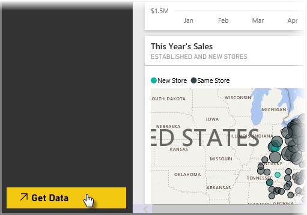
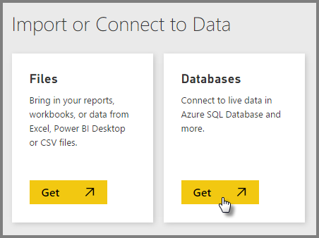
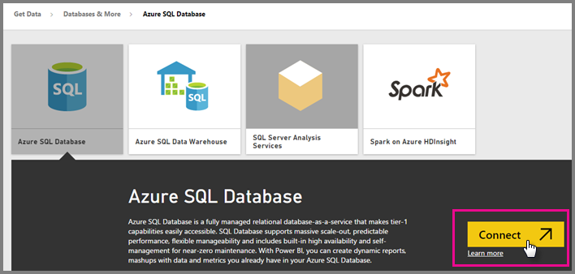
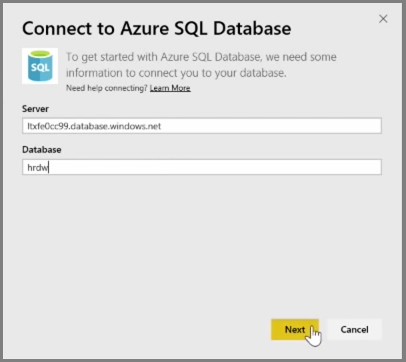
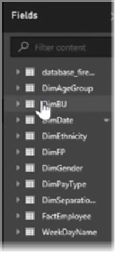
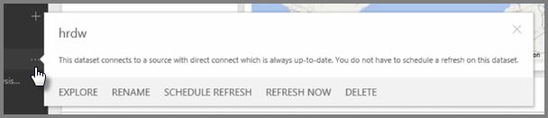

<properties
   pageTitle="Create a direct (live) connection to Azure SQL Database"
   description="Create a live connection between an Azure SQL database and Power BI."
   services="powerbi"
   documentationCenter=""
   authors="davidiseminger"
   manager="mblythe"
   editor=""
   tags=""
   featuredVideoId="TJ71od0SbAg"
   featuredVideoThumb=""
   courseDuration=""/>

<tags
   ms.service="powerbi"
   ms.devlang="NA"
   ms.topic="article"
   ms.tgt_pltfrm="NA"
   ms.workload="powerbi"
   ms.date="03/20/2016"
   ms.author="davidi"/>

# Create a Direct Connection to Azure SQL

*Watch and learn how to create a live connection between an Azure SQL Database and Power BI*

People can use Azure SQL Database for a whole range of different things. In this topic, we look at a database that has some HR information and add that to the existing information that was uploaded into the sample dashboard we've been using, the VanArsdel Sales Dashboard.

To create a direct connection to Azure SQL Database, select **Get Data** in the Power BI service.

One of the options on the **Get Data** screen is to *connect to live data in Azure SQL Database* and other databases. Select **Get** in the Databases tile.

You're presented with a few options, and in this case we select **Azure SQL Database**. This brings up a description box for **Azure SQL Database**, and after reading through all of that, you can select **Connect**.

From there, you enter the *Server* and *Database* that you are connecting to, and select **Next**.

On the next screen, enter the Username and Password for the server and select Sign in.

A notification appears in the upper right corner of the screen, stating that Power BI is importing the data. It’s not *actually* importing any data... since this is a **live** connection, at this point Power BI is getting the definition of the database, or its *schema*, that’s sitting in Azure, to present to you.

Once the dataset is ready, it shows up in the **Datasets** list in the left pane of the service. When you select that dataset, the tables to which you're connected appear in the **Fields** pane, on the right.

At this point, you can drag fields onto the report canvas and create visualizations, just like you would with any other data source in Power BI. The same goes for the Power BI report - you work with exactly the same as you would with any other data source. There are some important differences in how the data is shared, however, which we'll discuss in an upcoming topic.

When you create a visualization, here's what happens: Power BI sends a query to Azure to get the associated data. When working with live data, it may take a little longer to display the visualization compared to working with data that has been loaded and is cached in Power BI. That's because the queries are going back and forth between Power BI and SQL Azure database.

With live data connections, as with cached data, you can **pin** visualization to your dashboard, and just like you can mix visuals from different cached datasets, you can mix-and-match visualizations from different data sources that are either live connections or imported.

When data in the Azure SQL Database is updated, your reports and visualizations are automatically updated, too. If you look at the menu options of the dataset, it lets you know that the data source is always up-to-date.

With **live** connections, you don’t need to setup scheduled refresh - they're always updated with the most recent data from the live data source.
