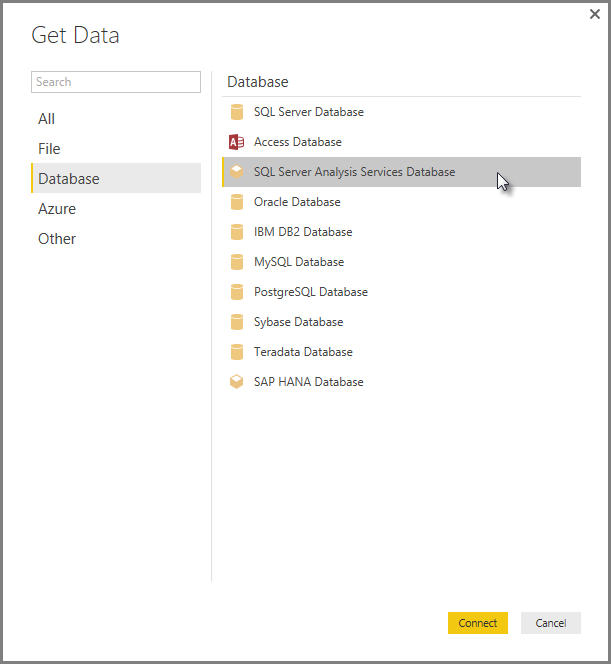
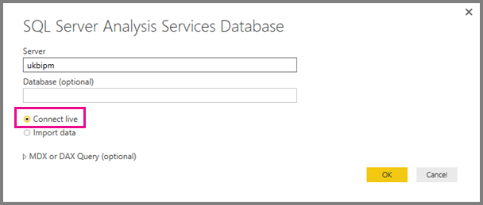
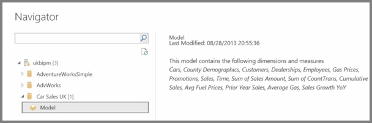
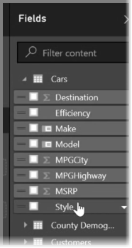

<properties
   pageTitle="Connect SQL Server Analysis Services and Power BI Desktop"
   description="Create a live connection between SQL Server Analysis Services and Power BI Desktop."
   services="powerbi"
   documentationCenter=""
   authors="davidiseminger"
   manager="mblythe"
   editor=""
   tags=""
   featuredVideoId="ZpxJRQLiXGY"
   featuredVideoThumb=""
   courseDuration=""/>

<tags
   ms.service="powerbi"
   ms.devlang="NA"
   ms.topic="article"
   ms.tgt_pltfrm="NA"
   ms.workload="powerbi"
   ms.date="02/20/2016"
   ms.author="v-jescoo"/>

# Connect SQL Server Analysis Services and Power BI Desktop

*Watch and learn how to create a live connection between SQL Server Analysis Services and Power BI Desktop*

Let's look at how you can use SQL Server Analysis Services (commonly referred to as **SSAS**) as a data source for your Power BI reports. SSAS is a powerful data source that supports more complex security requirements, including role-based security where different departments in your organization have permission to access different pieces of data. When you connect to Analysis Services using Power BI, all of your security policies are observed, and the users only get to see the data that they are allowed to access. This is equally true whether the user is creating a visual in Power BI Desktop, or viewing a report that has been published to the Power BI service.

To create a direct connection to SQL Server Analysis Services in Power BI Desktop, first select **Get Data** and then choose **SQL Server Analysis Services Database** from the sources list, and select **Connect**.

In the next screen you enter the Server name, and you can also enter the name of the database, if you know it. You also select either **Connect live** or **Import data**. Selecting **Connect live** makes use of live connections, as discussed in this topic. The alternative is to **Import data**, which means Power BI connects to SSAS and imports a copy of the data into Power BI Desktop. Note that Power BI Desktop can only support one live connection at a time.

Use the **Navigator** to browse through the available models, and select the model you want to use.

When you select **OK**, Power BI connects to the data source using the credentials you supplied, and you see the tables and fields that are available within that model. The data has not been imported into the Power BI Desktop file. Power BI Desktop is issuing live queries to the server. Keep in mind that your queries are being processed by Power BI Desktop in real-time, and so they may take a few moments to complete.

The tables and columns from that model that you can access appear in the **Fields** pane. You can use those tables and columns as you would with any other data in Power BI Desktop, and build visuals and reports.

After creating your report, you can publish it to the Power BI service, and work with it like you would any other report. We cover working with these live connection reports and visuals in the next topic.
