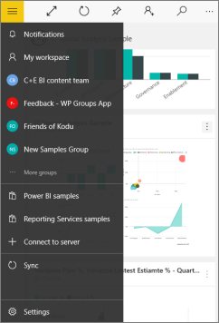

<properties 
   pageTitle="Adjust settings for the Power BI mobile app for Windows 10"
   description="Adjust settings for the Power BI mobile app for Windows 10"
   services="powerbi" 
   documentationCenter="" 
   authors="maggiesMSFT" 
   manager="mblythe" 
   backup=""
   editor=""
   tags=""
   qualityFocus="no"
   qualityDate=""/>
 
<tags
   ms.service="powerbi"
   ms.devlang="NA"
   ms.topic="article"
   ms.tgt_pltfrm="NA"
   ms.workload="powerbi"
   ms.date="06/20/2016"
   ms.author="maggies"/>

# Adjust settings for the Power BI mobile app for Windows 10

You can view and adjust the settings for the [Power BI mobile app for Windows 10](powerbi-mobile-win10phone-app-get-started.md).

1. In the Power BI mobile app for Windows 10, tap the navigation icon , then tap **Settings**.

    

2. Here you can:

 -   Turn on Microsoft Surface Hub presentation mode.
 -   See the version of the app, terms of use, and privacy information. 
 -   Configure options such as your consent to send Microsoft generic telemetry data (not your personal information).
 -   [Get help for the Power BI mobile app for Windows 10](powerbi-mobile-win10phone-app-get-started.md).
 -   [Contact the Power BI mobile apps community](http://community.powerbi.com/t5/Mobile-Apps/bd-p/power-bi-mobile).
 -   [Send feedback about the Power BI mobile apps](https://ideas.powerbi.com/forums/265200-power-bi/category/105939-mobile).

### See also

[Download the Power BI mobile app for Windows 10](http://go.microsoft.com/fwlink/?LinkID=526478) from the Windows Store  
[Get started with the Power BI mobile app for Windows 10](powerbi-mobile-win10phone-app-get-started.md)  
[Get started with Power BI](powerbi-service-get-started.md)

