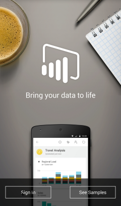

<properties 
   pageTitle="Get started with the Power BI for Android app"
   description="Get started with the Power BI for Android app"
   services="powerbi" 
   documentationCenter="" 
   authors="v-anpasi" 
   manager="mblythe" 
   editor=""
   tags=""/>
 
<tags
   ms.service="powerbi"
   ms.devlang="NA"
   ms.topic="article"
   ms.tgt_pltfrm="NA"
   ms.workload="powerbi"
   ms.date="09/28/2015"
   ms.author="v-anpasi"/>
# Get started with the Power BI for Android app

The Android app for Microsoft Power BI brings Power BI to your pocket, with up-to-date, touch-enabled mobile access to your business information. View and interact with your company dashboards from anywhere.

Maybe a colleague sent you a link to a dashboard? Now you can view it on your Android phone.

Bring your own data together and create dashboards and reports on the [Power BI service](http://go.microsoft.com/fwlink/?LinkID=513879 "Power BI to sign up"). Then explore your dashboards and share them with the Android app for Power BI.

### First things first

-   **Get the app**  [Get the Power BI for Android app](https://support.powerbi.com/knowledgebase/articles/577785) from Google play.

-   **Start with samples**    Even without signing up or signing in, after you download the app you can view the samples. Or go back to the samples whenever you want from the dashboards home page.

### Now what?

What else you can do in the Android phone app for Power BI?

-   View your [dashboards](https://support.powerbi.com/knowledgebase/articles/608316).

-   Explore the [tiles on your dashboards](https://support.powerbi.com/knowledgebase/articles/608319).

-   Pick out [favorites](https://support.powerbi.com/knowledgebase/articles/608328).

-   [Annotate and share tiles](https://support.powerbi.com/knowledgebase/articles/608340).

-   Share [dashboards](https://support.powerbi.com/knowledgebase/articles/608337).

### See Also

[Download the Android app](http://go.microsoft.com/fwlink/?LinkID=544867) from the Android app store.

[Get started with Power BI](http://support.powerbi.com/knowledgebase/articles/430814-get-started-with-power-bi-preview)

