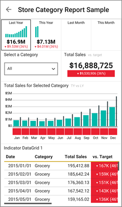

<properties 
   pageTitle="View SQL Server mobile reports and KPIs in the Android app"
   description="View SQL Server mobile reports and KPIs in the Android app for Power BI"
   services="powerbi" 
   documentationCenter="" 
   authors="maggiesMSFT" 
   manager="mblythe" 
   editor=""
   tags=""
   qualityFocus="no"
   qualityDate=""/>
 
<tags
   ms.service="powerbi"
   ms.devlang="NA"
   ms.topic="article"
   ms.tgt_pltfrm="NA"
   ms.workload="powerbi"
   ms.date="04/08/2016"
   ms.author="maggies"/>

# View SQL Server mobile reports and KPIs in the Android app for Power BI  

The Android app for Power BI offers live, touch-enabled mobile access to your important on-premises business information. 

[Create SQL Server mobile reports](https://msdn.microsoft.com/library/mt652547.aspx) with the SQL Server Mobile Report Publisher and publish them to the [Reporting Services web portal](https://msdn.microsoft.com/en-us/library/mt637133.aspx). Create KPIs right in the web portal. Organize them in folders and mark your favorites, so you can find them easily. 

Then in the Android app for Power BI, view the mobile reports and KPIs, organized in folders or collected as favorites. 

## Explore samples without an SSRS server

Even if you don't have access to a Reporting Services web portal, you can still explore the features of SQL Server mobile reports. 

-  Tap the options icon  in the upper-left corner, scroll down and tap SQL Server RS Samples.

Browse the samples to interact with KPIs and mobile reports.

## Connect to a server to view SQL Server mobile reports 

1.  In your Android phone, open the Power BI app.
  
3. Tap the options icon  in the upper-left corner, and tap **Connect to SSRS server**.

4. Fill in the server address and your user name and password, in this format:

    

    >**Note**: Include **http** or **https** in front of the connection string. For example, http://*servername*.com/reports.

    Tap **Advanced option** to give the server a name, if you'd like.

3. Tap the check mark in the upper-right corner.

5.  Now you see the server in the left navigation bar.

    

>**Tip**: Tap the options icon  anytime to go between your SQL Server mobile reports and your dashboards in the Power BI service. 

## View SQL Server KPIs and mobile reports in the Power BI app

SQL Server KPIs and mobile reports are displayed in the same folders they're in on the Reporting Services web portal. 

- Tap a KPI to see it in focus mode &#151; then tip your phone to see it in landscape mode.

    

- Tap a mobile report to open and interact with it in the Power BI app.

    

## View your favorite KPIs and reports

You can mark KPIs and favorites on your Reporting Services web portal, and then view them in one convenient folder on your phone.

-  Tap **Favorites**.

    
   
    Your favorites from the web portal are all on this page.

    

## Remove a connection to a report server

You can only be connected to one report server at a time from your Android app. If you want to connect to a different server, you need to disconnect from the current one.

1. At the bottom of the left navigation bar, tap **Settings**.
2. Tap the ellipsis (**...**) next to the server name you don't want to be connected to.
3. Tap **Remove Connection**.

## Create SQL Server mobile reports and KPIs

- [Create your own SQL Server mobile reports](https://msdn.microsoft.com/library/mt652547.aspx) and publish them to the Reporting Services web portal.
- Create [KPIs on the Reporting Services web portal](https://msdn.microsoft.com/en-US/library/mt683632.aspx)

### See also  
[Get started with the Android app for Power BI](powerbi-mobile-android-app-get-started.md)  
[Get started with Power BI](powerbi-service-get-started.md)  
