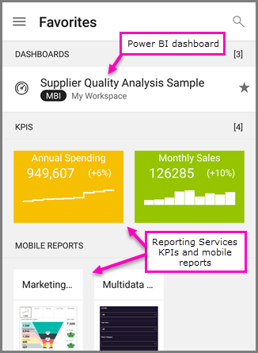

<properties 
   pageTitle="View on-premises reports and KPIs in the Android app"
   description="The Android app for Power BI offers live, touch-enabled mobile access to your important on-premises business information in Power BI Report Server and SQL Server Reporting Services."
   services="powerbi" 
   documentationCenter="" 
   authors="maggiesMSFT" 
   manager="erikre" 
   backup=""
   editor=""
   tags=""
   qualityFocus="no"
   qualityDate=""/>
 
<tags
   ms.service="powerbi"
   ms.devlang="NA"
   ms.topic="article"
   ms.tgt_pltfrm="NA"
   ms.workload="powerbi"
   ms.date="05/14/2017"
   ms.author="maggies"/>

# View on-premises reports and KPIs in the Android app

Applies to:

|  |  |
|:------------------------|:----------------------------|
| Android phones | Android tablets |

The Android app for Power BI delivers live, touch-enabled mobile access to your on-premises business information in Power BI Report Server and SQL Server 2016 Reporting Services (SSRS).

*Reporting Service KPIs and mobile reports in the Power BI app on an Android tablet*

## First things first

**The mobile apps are where you view Power BI content, not where you create it.**

-  You and other report creators in your organization create Power BI reports with Power BI Desktop, then publish them to the Power BI Report Server web portal. 
-  You [create Reporting Services mobile reports](https://msdn.microsoft.com/library/mt652547.aspx) with SQL Server 2016 Enterprise Edition Mobile Report Publisher and publish them to the [Reporting Services web portal](https://msdn.microsoft.com/library/mt637133.aspx).  
-   You create [KPIs right in the web portal](https://msdn.microsoft.com/library/mt683632.aspx), organize them in folders, and mark your favorites so you can find them easily. 

Then in the Android app for Power BI, connect to up to five Power BI Report Server report servers to view the Power BI reports and KPIs, organized in folders or collected as favorites. 

## Explore samples without a server connection

Even if you don't have access to a Reporting Services web portal, you can still explore the features of Reporting Services mobile reports. 

-  Tap the options icon  in the upper-left corner, scroll down and tap SQL Server RS Samples.

Browse the samples to interact with KPIs and mobile reports.

## Connect to a server to view Reporting Services mobile reports 

1.  In your Android device, open the Power BI app.
  
3. Tap the options icon  in the upper-left corner, and tap **Settings**.

     

4.  Tap **Connect to server**.

5. Fill in the server address and your user name and password. Use a fully qualified domain name for both the server and your user name,  in this format:

     `http://<servername>.<domainname>/reports`

     Or

     `https://<servername>.<domainname>/reports`
     
     >**Note**: Include **http** or **https** at the beginning of the connection string.

    Tap **Advanced option** to give the server a name, if you'd like.

3. Tap the check mark in the upper-right corner.

5.  Now you see the server in the left navigation bar.

    

>**Tip**: Tap the options icon  anytime to go between your Power BI Report Server and Reporting Services reports and your dashboards in the Power BI service. 

## View Power BI Report Server and Reporting Services KPIs and reports in the Power BI app

Power BI Report Server and Reporting Services KPIs and reports are displayed in the same folders they're in on the web portal. 

- Tap a KPI to see it in focus mode &#151; then tip your device to see it in landscape mode.

    

- Tap a mobile report to open and interact with it in the Power BI app.

    

## View your favorite KPIs and reports

You can mark KPIs and mobile reports as favorites on your web portal, and then view them in one convenient folder on your device, along with your Power BI favorite dashboards and reports.

-  Tap **Favorites**.

    
   
    Your favorites from the web portal are all on this page.

    

## Remove a connection to a report server

You can only be connected to one report server at a time from your Android app. If you want to connect to a different server, you need to disconnect from the current one.

1. At the bottom of the left navigation bar, tap **Settings**.
2. Tap the ellipsis (**...**) next to the server name you don't want to be connected to.
3. Tap **Remove Connection**.

## Next steps 
- [Get started with the Power BI app for Android phones](powerbi-mobile-android-app-get-started.md)  
- [Get started with the Power BI app for Android tablets](powerbi-mobile-android-tablet-app-get-started.md)
- [Get started with Power BI](powerbi-service-get-started.md)  
- Questions? [Try asking the Power BI Community](http://community.powerbi.com/)
