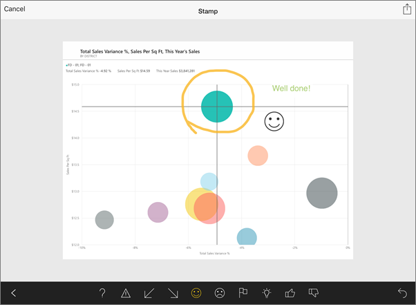
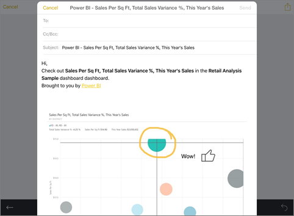

<properties 
   pageTitle="Annotate and share a tile, report, or visualization from the Power BI mobile app for iOS"
   description="Read about sharing tiles, reports, and visualizations from the Microsoft Power BI app for iOS. You can send snapshots to anyone, not just colleagues."
   services="powerbi" 
   documentationCenter="" 
   authors="maggiesMSFT" 
   manager="erikre" 
   backup=""
   editor=""
   tags=""
   qualityFocus="no"
   qualityDate=""/>
 
<tags
   ms.service="powerbi"
   ms.devlang="NA"
   ms.topic="article"
   ms.tgt_pltfrm="NA"
   ms.workload="powerbi"
   ms.date="12/16/2016"
   ms.author="maggies"/>

# Annotate and share a tile, report, or visualization from the Power BI mobile app for iOS

When you share a tile, report, or visualization from the Power BI mobile app for iOS, you're sharing a snapshot of it. Your recipients see it exactly as it was when you sent the mail, plus a link. You can send snapshots of tiles to anyone — not just colleagues in the same email domain. If you've already shared the dashboard or report with them, then they can click the link and go straight to that tile, report, or visualization. 

You can add annotations — lines, text, or stamps — before you share it.

1.  To send a tile, tap the tile to open it in focus mode.

    To send a report, tap the tile again to open the report. 

    

2.  Tap the share icon  in the upper-right corner of the tile.

3.  To annotate the tile, in the Edit window:  
    

    -   To draw lines of different colors and thicknesses, tap the paintbrush icon, then tap the arrow in the lower-left corner.  

    -   To type comments, tap the **A**, then tap the arrow on the left end of the black bar at the center.  

    -   To paste stamps (like emoticons) on the tile, tap the smiley face, then tap the arrow in the lower-left corner.   
        

    -   After annotating, to send it tap the share icon  in the upper-right corner again.

4.  Tap the Mail icon, type the recipients' names, and modify the message, if you want.  

    

5.  Tap **Send**.

### See also  
[Get started with the iPad app](powerbi-mobile-iphone-app-get-started.md) (Power BI for iOS)  
[Share dashboards from the iPad app](powerbi-mobile-share-dashboards-from-the-ipad-app.md)
