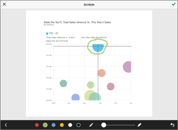
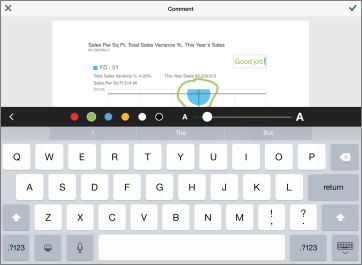
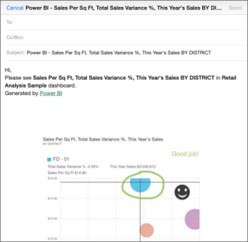

<properties pageTitle="Annotate and share a snapshot of a tile from the iPad app (Power BI for iOS)" description="Annotate and share a snapshot of a tile from the iPad app (Power BI for iOS)" services="powerbi" documentationCenter="" authors="v-anpasi" manager="mblythe" editor=""/>
<tags ms.service="powerbi" ms.devlang="NA" ms.topic="article" ms.tgt_pltfrm="NA" ms.workload="powerbi" ms.date="06/26/2015" ms.author="v-anpasi"/>
# Annotate and share a snapshot of a tile from the iPad app (Power BI for iOS)

[← iPad app (Power BI for iOS)](https://support.powerbi.com/knowledgebase/topics/77999-ipad-app-power-bi-for-ios-preview)

When you share a tile from the [iPad app for Microsoft Power BI](http://support.powerbi.com/knowledgebase/topics/69272-ipad-app-for-power-bi) for iOS, you're sharing a snapshot of the tile. Your recipients see the tile exactly as it was when you sent the mail. They can't open the dashboard. You can send snapshots of tiles to anyone — not just colleagues in the same email domain.

You can add annotations — lines, text, or stamps — to a tile before you share a snapshot.

1.  Tap a tile to interact with it.

2.  Tap **Share snapshot**  in the lower-left corner of the tile.

3.  To annotate the tile, in the Edit window:

    

    -   Tap the pencil icon to draw lines of different colors and thicknesses.
    
        

    -   Tap the text balloon to type comments.
    
        

    -   Tap the smiley face to paste stamps (like emoticons) on the tile.  
    
        

4.  After annotating, tap the green checkmark in the upper-right corner.

5.  Tap the **Mail** icon, type the recipients' names, and modify the message, if you want.
    

6.  Tap **Send**.

## See also

[Get started with the iPad app](http://support.powerbi.com/knowledgebase/articles/467172-the-ipad-app-for-power-bi-preview) (Power BI for iOS)  
[Share dashboards from the iPad app](http://support.powerbi.com/knowledgebase/articles/467181-share-dashboards-from-the-ipad-app-power-bi-for-i)