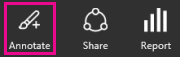
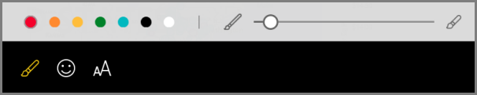
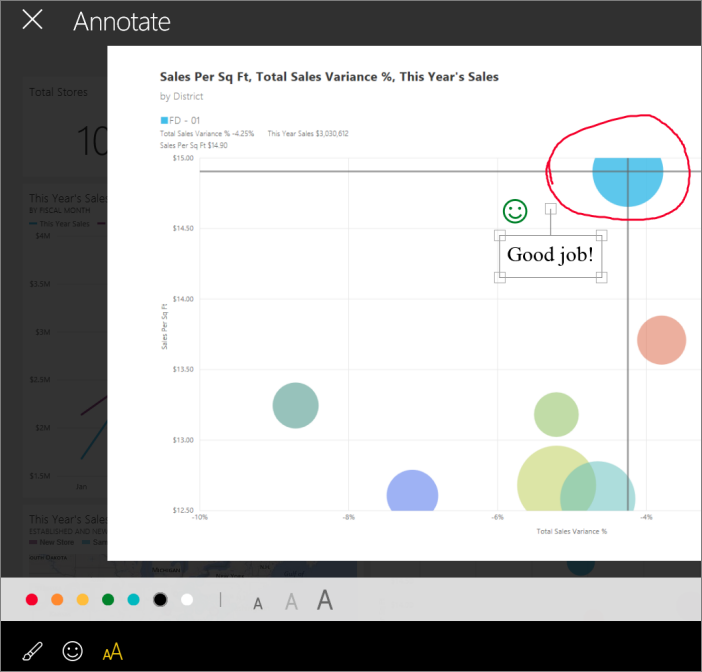
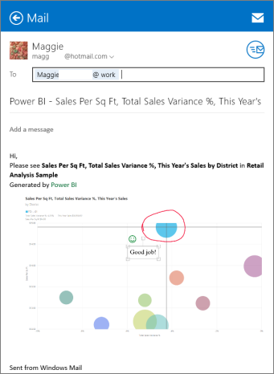

<properties 
   pageTitle="Annotate and share a snapshot of a tile from the Power BI for Windows app"
   description="Annotate and share a snapshot of a tile from the Power BI for Windows app"
   services="powerbi" 
   documentationCenter="" 
   authors="pcw3187" 
   manager="mblythe" 
   editor=""
   tags=""/>
 
<tags
   ms.service="powerbi"
   ms.devlang="NA"
   ms.topic="article"
   ms.tgt_pltfrm="NA"
   ms.workload="powerbi"
   ms.date="10/14/2015"
   ms.author="v-pawrig"/>
# Annotate and share a snapshot of a tile from the Power BI for Windows app

[← Power BI app for Windows](https://support.powerbi.com/knowledgebase/topics/75729-power-bi-app-for-windows)

When you share a tile from the Windows app for Power BI, you're sharing a snapshot of the tile. Your recipients see the tile exactly as it was when you sent the mail. They can't open the dashboard. You can send snapshots of tiles to anyone — not just colleagues in the same email domain.

You can add annotations — lines, text, or stamps — to a tile before you share a snapshot. You can't save the annotations in the dashboard. They only show up with the tile you send in email.

### Annotate a snapshot

1.  On a dashboard, tap a tile to interact with it.

2.  To annotate a tile before you send it, tap the annotation icon in the upper-right corner of the app:

    

    Annotation options for a tile in Power BI

    

-   Tap the pencil icon to draw lines of different colors and thicknesses.

-   Tap the smiley face to paste stamps (like emoticons) on the tile.

-   Tap the letter A to type comments.

-   Tap the X in the upper-left corner to close without sharing.

-   Tap the share snapshot icon to share .

### Share the snapshot

1.  Tap the share snapshot icon  in the upper-right corner of the app.

2.  In your mail app, type the recipients' email names, and modify the message if you want.

    

3.  Tap **Send**.

    The recipient can see the annotated image of the tile, but can't open the report

## See also

More about the [Power BI for Windows app](http://support.powerbi.com/knowledgebase/articles/510917-get-started-with-the-power-bi-for-windows-app).

[Share dashboards](http://support.powerbi.com/knowledgebase/articles/510955-share-dashboards-from-the-power-bi-for-windows-app) from the Power BI for Windows app

