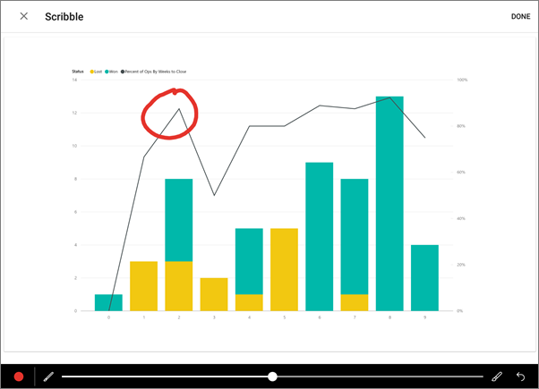

<properties 
   pageTitle="Annotate and share a tile from the Power BI app for Android tablets"
   description="Read about sharing snapshots of tiles from the Android app for Microsoft Power BI. The snapshot shows the tile exactly as it was when you sent the mail."
   services="powerbi" 
   documentationCenter="" 
   authors="maggiesMSFT" 
   manager="erikre" 
   backup=""
   editor=""
   tags=""
   qualityFocus="no"
   qualityDate=""/>
 
<tags
   ms.service="powerbi"
   ms.devlang="NA"
   ms.topic="article"
   ms.tgt_pltfrm="NA"
   ms.workload="powerbi"
   ms.date="11/17/2016"
   ms.author="maggies"/>
# Annotate and share a tile from the Power BI app for Android tablets

When you share a snapshot of a tile from the [Android app for Microsoft Power BI](powerbi-mobile-android-tablet-app-get-started.md), the snapshot shows the tile exactly as it was when you sent the mail. The recipients can't open the dashboard. You can send snapshots of tiles to anyone — not just colleagues in the same email domain.

You can add annotations — lines, comments, or stickers — to a tile before you share a snapshot.

1. Open a [dashboard in the Android app](powerbi-mobile-dashboards-in-the-android-tablet-app.md) for Power BI.

	Need to [download the Android app](http://go.microsoft.com/fwlink/?LinkID=544867) first?

2. Tap a tile to open it in focus mode.

3. Tap the share icon  in the upper-right corner of the tile.

4. To annotate the tile, tap an icon in the lower bar in the Edit window.

	

	-   Tap the paintbrush to draw lines of different colors and thicknesses, then tap **Done**.

	-   Tap the smiley face to add stickers (like emoticons) on the tile, then tap **Done**.

	-   Tap the **AA** to type comments, then tap **Done**.

	-   Tap the microphone to record a message, which is displayed as text on your tile. Then tap **Done**.

5. After annotating, tap **Share** in the upper-right corner and send, using any sharing app you have on your Android phone.

## See also

-  [Download the Android app](http://go.microsoft.com/fwlink/?LinkID=544867) from Google play
-  [Share a dashboard from the Android app](powerbi-mobile-share-a-dashboard-from-the-android-tablet-app.md)
-  [Get started with the Android app for Power BI](powerbi-mobile-android-tablet-app-get-started.md)
-  [Get started with Power BI](powerbi-service-get-started.md)
- Questions? [Try asking the Power BI Community](http://community.powerbi.com/)
